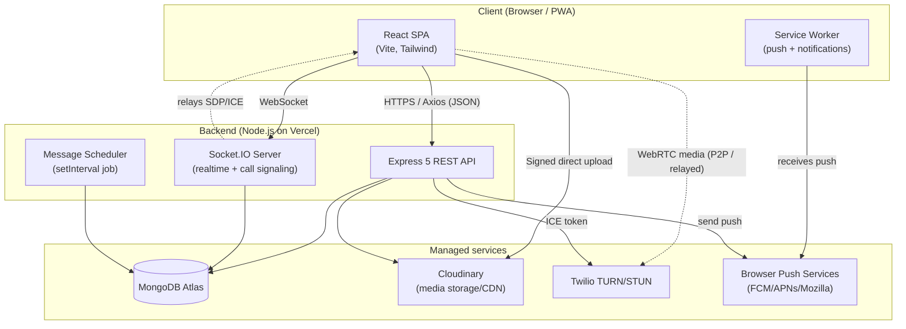
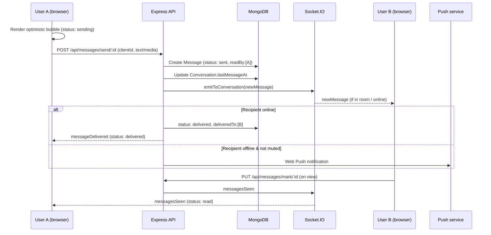

# 01 — Project Overview

[← Back to index](./README.md)

---

## 1. What is quickCHAT?

quickCHAT is a **full-stack, real-time messaging platform**. It started life as a polished 1:1 messenger and has since grown into a multi-party chat product with groups, calling, scheduled/disappearing messages, push notifications, and a hardened security baseline.

It is built on the **MERN** stack (MongoDB, Express, React, Node.js) augmented with:

- **Socket.IO** for bidirectional, low-latency real-time events (messages, presence, typing, receipts, reactions, call signaling).
- **WebRTC** for peer-to-peer audio/video calls (with Twilio TURN relay fallback).
- **Cloudinary** for media storage and delivery (images, files, voice notes, video).
- **Web Push + a Service Worker** for native-style notifications and PWA installability.

The application is a single deployable frontend SPA talking to a single backend API + realtime server, both designed to run on serverless/edge hosting (Vercel) backed by MongoDB Atlas.

---

## 2. Purpose

The purpose of quickCHAT is to provide a **fast, elegant, and trustworthy real-time communication experience** comparable to consumer-grade messengers (WhatsApp, Telegram, Slack) while remaining a comprehensible, single-repository codebase that a small team can own end-to-end.

Concretely, the project aims to deliver:

1. **Instant, reliable messaging** — messages appear immediately (optimistic UI), never silently vanish on flaky networks (retry + failure affordance), and carry accurate delivery state (sent / delivered / read).
2. **Conversation depth** — both 1:1 and group conversations, with mentions, threads, replies, reactions, editing, and soft deletion.
3. **Rich media** — first-class images, files, voice notes, and video with efficient direct-to-cloud uploads and progress feedback.
4. **Presence & awareness** — online/offline status, "last seen", and typing indicators across devices.
5. **Productivity & organization** — pinning, archiving, muting, starring, forwarding, and powerful search (in-conversation and global).
6. **Reach** — push notifications when the app is closed, and installable PWA behavior.
7. **Real-time voice/video** — 1:1 calling built on WebRTC.
8. **Trust & safety** — blocking, reporting, rate limiting, two-factor authentication, and a defense-in-depth security posture.

---

## 3. Business goals & value proposition

| Goal | How quickCHAT addresses it |
|------|----------------------------|
| **Engagement & retention** | Real-time delivery, push notifications, PWA install, sound cues, and presence keep users coming back. |
| **Trust** | TOTP 2FA, HTTP-only cookie sessions, rate limiting, blocking/reporting, and SSRF-hardened link unfurling create a credible safety baseline. |
| **Communication completeness** | Groups, calls, threads, mentions, media, scheduling, and disappearing messages cover the breadth users expect. |
| **Operational simplicity** | One frontend, one backend, managed data/media/TURN providers, serverless hosting — minimal infra to run. |
| **Extensibility** | Conversation-centric domain model and layered backend make new features (workspaces, more media types, etc.) incremental rather than rewrites. |
| **Cost efficiency** | Direct-to-Cloudinary signed uploads bypass server bandwidth; cursor pagination + virtualization bound query and render cost. |

### Target use cases

- **Personal / social messaging** — friends and family chatting 1:1 or in groups, sharing photos, voice notes, and calling.
- **Small team / community collaboration** — group conversations with mentions, threads, pinning, and search.
- **Portfolio / reference implementation** — a comprehensive example of a modern real-time app for learning and extension.
- **White-label foundation** — a base to build a branded messenger, given the tokenized design system and modular features.

---

## 4. Core features & functionality

The following is the complete, current feature catalogue. Each feature links to the document where it is explained in depth.

### 4.1 Authentication & account
- **Email/password signup & login** with bcrypt-hashed passwords. ([Security](./09-security.md), [API](./06-api-reference.md))
- **JWT sessions** delivered via HTTP-only cookie (with header/bearer fallback for transition), 7-day expiry.
- **Two-factor authentication (TOTP)** — enroll via QR code, verify on login. ([Security](./09-security.md))
- **Profile management** — display name, bio, avatar (Cloudinary, old avatar cleaned up).
- **Logout** clearing cookie + local state + socket + push subscription.

### 4.2 Conversations
- **Direct (1:1) conversations** auto-created on first interaction.
- **Group conversations** with name, avatar, participants, admin/member roles, add/remove/leave.
- **Per-user conversation preferences** — pin, archive, mute (until timestamp).
- **Sidebar** with last-message preview, unseen counts, presence, search, and archived view.

### 4.3 Messaging
- **Text, image, file, audio (voice note), and video** messages.
- **Optimistic send** with automatic retry/backoff and explicit `failed` state + retry/discard.
- **Delivery status**: `sending → sent → delivered → read` (and `failed`), with ticks in the UI.
- **Read receipts** — per-user `readBy`, plus the legacy `seen` boolean for direct chats.
- **Replies**, **threads** (`threadRoot` + `replyCount`), and **@mentions** (with mention notifications).
- **Reactions** (emoji), **editing** (text), **soft delete** (content removed + media destroyed).
- **Markdown rendering** (sanitized) and **link unfurling** with preview cards.
- **Scheduled messages** (`sendAt`) and **disappearing messages** (`disappearAfterMs` → `expiresAt`).
- **Starring**, **forwarding** (to multiple targets), **in-conversation search**, and **global search**.
- **Cursor pagination** + **"load older"** + **"jump to message"** (around-mode) with **virtualized rendering**.

### 4.4 Real-time & presence
- **Online/offline presence** with multi-device socket fan-out (`Map<userId, Set<socketId>>`).
- **Typing indicators** per conversation.
- **Persistent last-seen** stored on disconnect.
- **Delivery-on-reconnect** — messages received while offline are marked delivered when you reconnect.

### 4.5 Calling
- **1:1 audio & video calls** over WebRTC. ([Real-Time & Calling](./08-realtime-and-calls.md))
- Socket.IO **signaling** (invite/accept/reject/busy/cancel/end, offer/answer/ICE).
- **Twilio TURN** with STUN fallback for NAT traversal; ICE config endpoint.
- Ring timeouts, busy/unavailable handling, mute/camera toggles, in-call duration.

### 4.6 Notifications & PWA
- **Web Push** notifications (VAPID) delivered when recipients are offline.
- **Service worker** handling push display + notification clicks.
- **PWA manifest** for "add to home screen" / standalone install.
- **In-app browser notifications** when the tab is hidden, plus sound cues.

### 4.7 Trust & safety
- **Block / unblock** users (bidirectional enforcement on messaging and calling).
- **Report** users and messages with reasons.
- **Rate limiting** on auth, messaging, unfurl, block, report, and call setup.

### 4.8 Experience & accessibility
- **Tokenized glassmorphism design system** (Tailwind v4) with **light/dark themes**.
- **Internationalization** scaffolding (English + Arabic with RTL) via a custom i18n runtime.
- **Reduced-motion** support, focus-visible outlines, ARIA roles, keyboard-friendly modals.
- **Skeletons**, animations, and responsive layout from mobile to ultra-wide.

---

## 5. High-level system overview

At the highest level, quickCHAT has three planes: a **client**, a **server** (HTTP + realtime), and **managed external services**.

### How a message flows (the canonical path)

For the full set of flows (auth, pagination, calling, scheduling), see [Architecture](./02-architecture.md) and [Real-Time & Calling](./08-realtime-and-calls.md).

---

## 6. Where to go next

- **Understand the design:** [Architecture](./02-architecture.md) → [System Design](./03-system-design.md)
- **Run it locally:** [Development Guide](./12-development-guide.md)
- **Integrate or call the API:** [API Reference](./06-api-reference.md)
- **Operate it in production:** [DevOps & Infrastructure](./10-devops-and-infrastructure.md) + [Maintenance Guide](./13-maintenance-guide.md)
