# 02 — Architecture

[← Back to index](./README.md) · Related: [System Design](./03-system-design.md) · [Backend](./04-backend.md) · [Frontend](./07-frontend.md) · [Real-Time & Calling](./08-realtime-and-calls.md)

---

## 1. Architectural goals

quickCHAT's architecture is shaped by five priorities, in rough order of importance:

1. **Real-time correctness** — events (messages, presence, receipts) must propagate quickly and consistently, even across multiple devices per user and across reconnects.
2. **Perceived performance** — the UI must feel instant (optimistic updates), bounded in cost (pagination + virtualization), and resilient (retry on failure).
3. **Operational simplicity** — a small team should be able to run the whole thing: one SPA, one backend, managed data/media/TURN providers, serverless hosting.
4. **Security by default** — authenticated sockets, HTTP-only cookies, rate limits, sanitized rendering, SSRF-hardened outbound fetches.
5. **Extensibility** — a conversation-centric domain model and a layered backend so new features are additive.

---

## 2. The 30,000-foot view

quickCHAT is a **client–server web application** with a **managed-service periphery**. There is no microservice mesh: the backend is a single Node.js process exposing both a **stateless REST API** and a **stateful Socket.IO realtime server**, plus an in-process **background scheduler**.

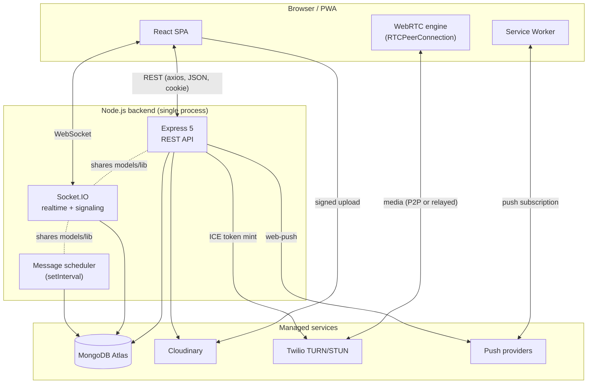

### Why a single backend process (a "modular monolith")?

A microservice split (separate auth, messaging, presence, calling services) was deliberately **not** chosen. Reasons:

- **Shared state**: Presence and Socket.IO rooms live in process memory (`userSocketMap`). Splitting services would force an external pub/sub (Redis) + sticky sessions immediately — a big jump in operational cost for a product at this scale.
- **Shared domain**: Messaging, conversations, and calls all read/write the same Mongo collections and helper libraries. Keeping them co-located avoids network hops and distributed transactions.
- **Deploy simplicity**: One artifact, one set of env vars, one log stream.

The codebase is nonetheless **internally modular** (controllers / routes / models / lib), so a future split along those seams is feasible. See [Scalability](#9-scalability-considerations).

---

## 3. Architectural patterns in use

| Pattern | Where | Why |
|---------|-------|-----|
| **Layered (n-tier) backend** | `routes → middleware → controllers → models/lib` | Clear separation of transport, auth, business logic, and persistence. |
| **Modular monolith** | Whole `server/` | Single deployable, internally bounded by domain modules. |
| **MVC-ish** | Mongoose models + Express controllers + React views | Familiar separation of data, logic, and presentation. |
| **Event-driven / pub-sub** | Socket.IO rooms & events | Decouples producers (a sender) from consumers (participants, other devices). |
| **Optimistic UI + reconciliation** | `ChatContext` send flow | Instant feedback; server response reconciles the temp message via `clientId`. |
| **Provider/Context (DI for the UI)** | React context tree | Cross-cutting state (auth, chat, calls, locale) injected without prop drilling. |
| **Repository-ish helpers** | `lib/conversationHelpers`, `lib/blockHelpers` | Encapsulate recurring data access/derivation patterns. |
| **Background worker / scheduler** | `lib/messageScheduler` | Time-based side effects (release scheduled, expire disappearing) decoupled from request lifecycles. |
| **Claim-based job processing** | scheduler `resetStale → release → expire` | Safe-ish concurrency control for the scheduled-message queue. |
| **Idempotency key** | message `clientId` | De-duplicates retried sends. |
| **Cursor pagination** | message history | Stable, scalable paging over large histories. |
| **Signed direct upload** | Cloudinary signature endpoint | Offloads media bytes from the server. |
| **Feature flag** | `CALLS_ENABLED`, `MESSAGE_SCHEDULER_ENABLED` | Toggle subsystems without code changes. |
| **Defense in depth** | helmet + cookies + rate limit + sanitize + SSRF guard | Multiple independent safety layers. |

---

## 4. Component architecture

### 4.1 Backend component map

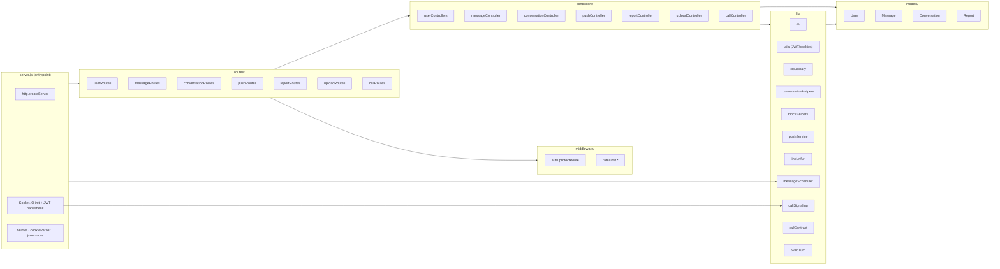

Each module is documented in detail in [Backend Reference](./04-backend.md) and [Code Reference](./14-code-reference.md).

### 4.2 Frontend component map

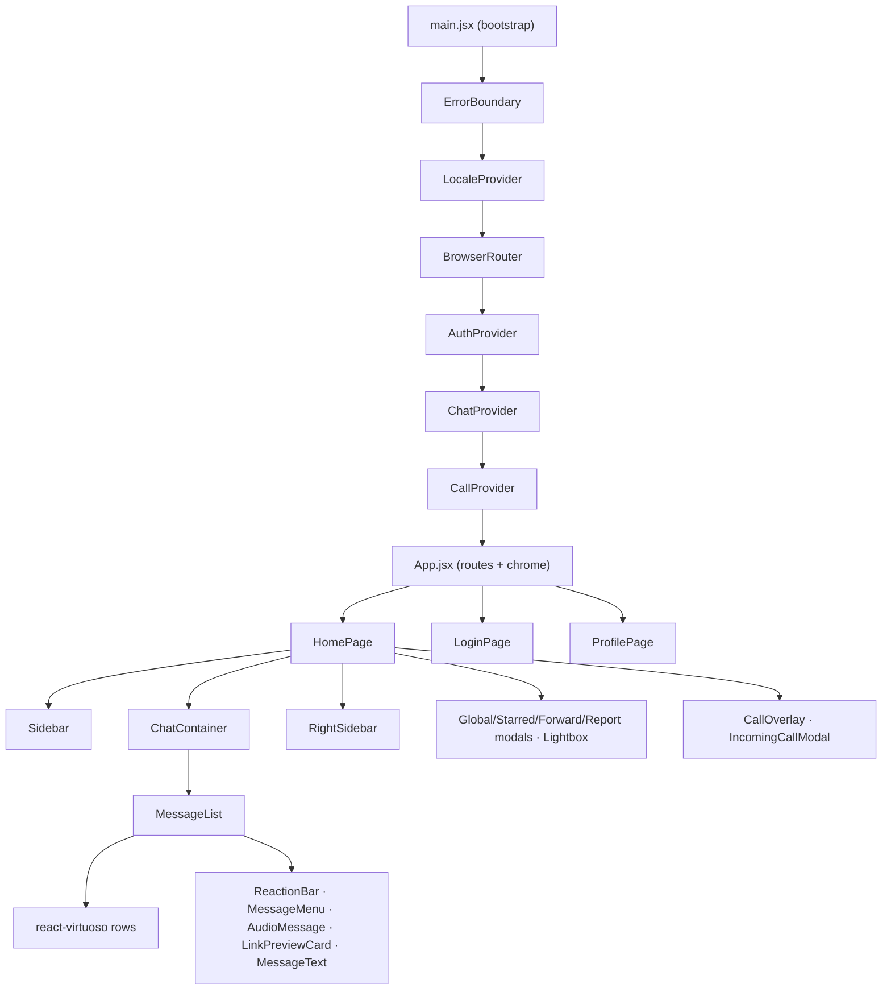

Full hierarchy and props in [Frontend Reference](./07-frontend.md).

---

## 5. Service interactions & responsibilities

| Plane | Responsibility | Notes |
|-------|----------------|-------|
| **React SPA** | Rendering, optimistic state, local reconciliation, media capture/upload, WebRTC peer connection | Holds auth token in `localStorage`; sets it on axios + socket handshake. |
| **Express REST API** | CRUD + commands (auth, profile, messages, conversations, reports, push, upload signatures, ICE) | Stateless per request; relies on JWT for identity. |
| **Socket.IO server** | Realtime fan-out: presence, typing, receipts, reaction/edit/delete relays, call signaling | Stateful: keeps `userSocketMap` and room membership in memory. |
| **Message scheduler** | Release due scheduled messages, expire disappearing messages, reset stale claims | In-process `setInterval`, single-flight guarded. |
| **MongoDB** | System of record for users, messages, conversations, reports | Indexed for the read/write patterns below. |
| **Cloudinary** | Media storage + CDN; deletion via `public_id` | Direct signed uploads from the browser. |
| **Twilio** | TURN/STUN credentials for NAT traversal | Short-lived ICE tokens minted server-side. |
| **Push providers** | Deliver Web Push to offline users | Per-subscription; failed subscriptions are pruned. |

### Authentication's dual role

A single JWT secures **both** transports:

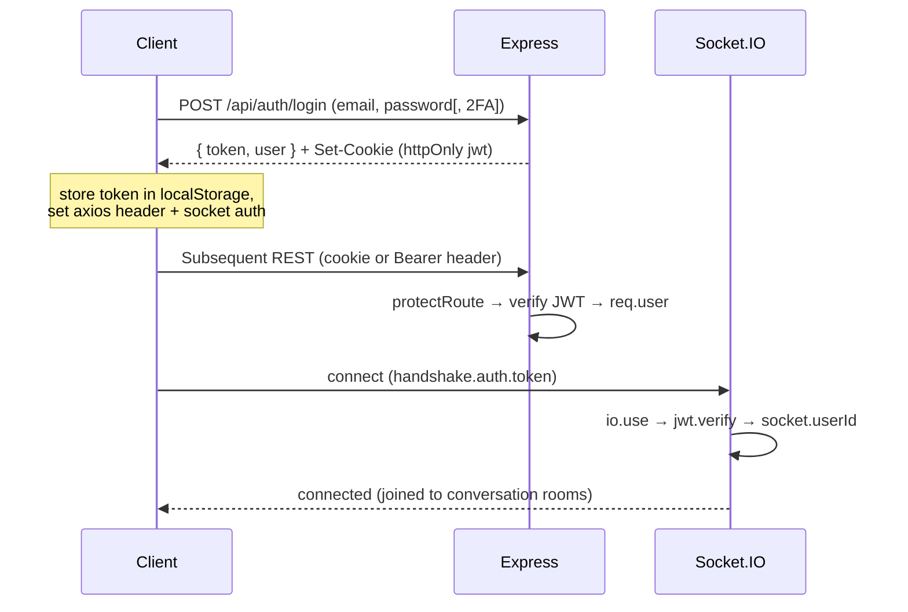

---

## 6. Request/response flows

### 6.1 REST request lifecycle

Most controllers return a normalized envelope: `{ success: boolean, message?: string, ...data }`. Errors are mapped to appropriate HTTP status codes — see [API Reference](./06-api-reference.md#error-codes).

### 6.2 Realtime event lifecycle

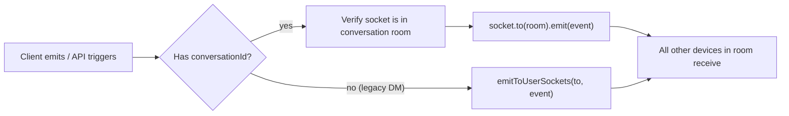

Note the **authorization check on relays**: before relaying typing/seen/edit/delete/reaction to a conversation room, the server verifies `socket.rooms.has(roomName)`. A client cannot spoof events into a room it has not joined.

---

## 7. End-to-end data flows

### 7.1 Sending a message (with media, receipts, push)

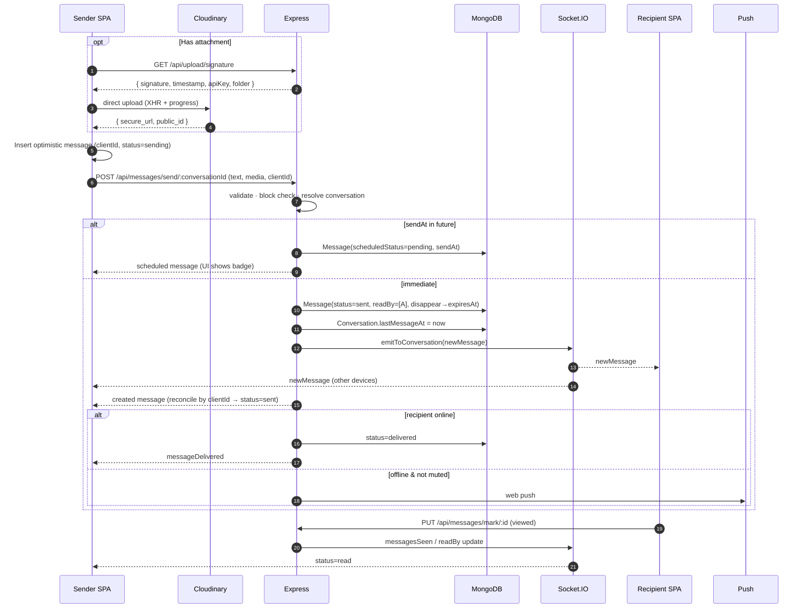

### 7.2 Scheduled & disappearing messages (background job)

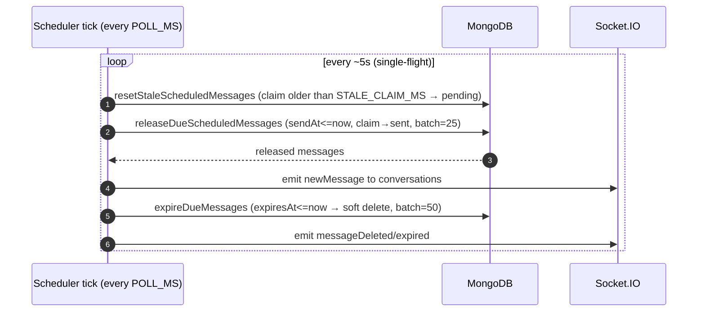

Design rationale: a **claim/lease** model (set `scheduledStatus=processing` with a timestamp, reset stale claims) prevents a crashed tick from permanently stranding messages, and bounds work per tick with batch sizes. See [Backend](./04-backend.md#scheduler) and [Database](./05-database.md#scheduling-fields).

### 7.3 Media upload (direct, signed)

```mermaid
graph LR
  A["User picks file"] --> B["Client validates type/size"]
  B --> C["GET /api/upload/signature"]
  C --> D["Server signs params with API secret"]
  D --> E["Browser uploads bytes directly to Cloudinary"]
  E --> F["Cloudinary returns secure_url + public_id"]
  F --> G["Client sends message referencing URL + public_id"]
  G --> H["On delete: server destroys asset by public_id"]
```

Why: base64-through-the-API uploads inflate payloads ~33% and consume serverless bandwidth/time. Signed direct upload keeps large bytes off the API path while the server retains deletion authority via `public_id`.

### 7.4 Authentication & 2FA

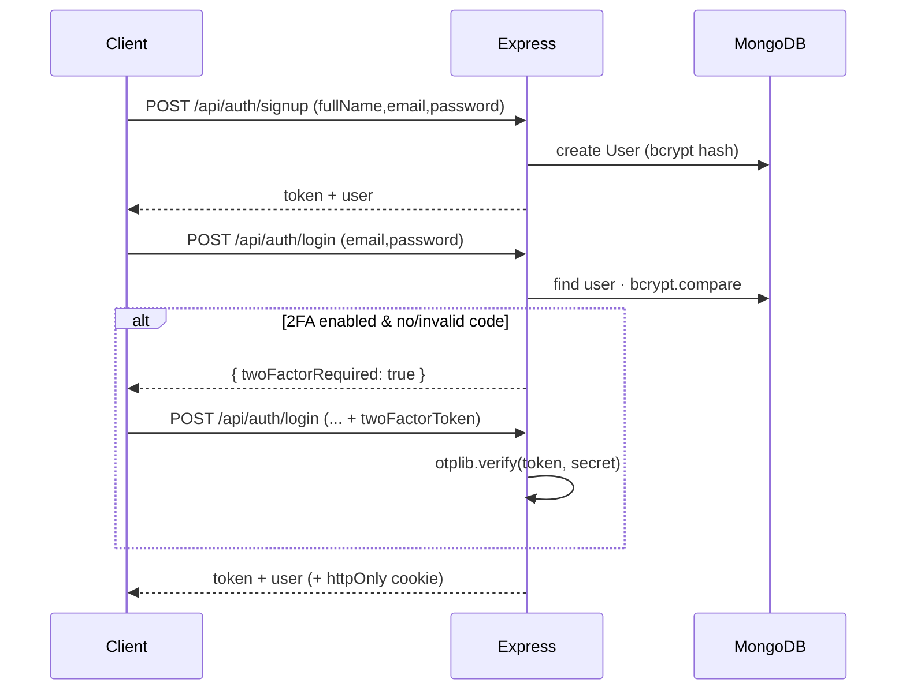

Full detail in [Security](./09-security.md).

### 7.5 Calling (WebRTC) — signaling overview

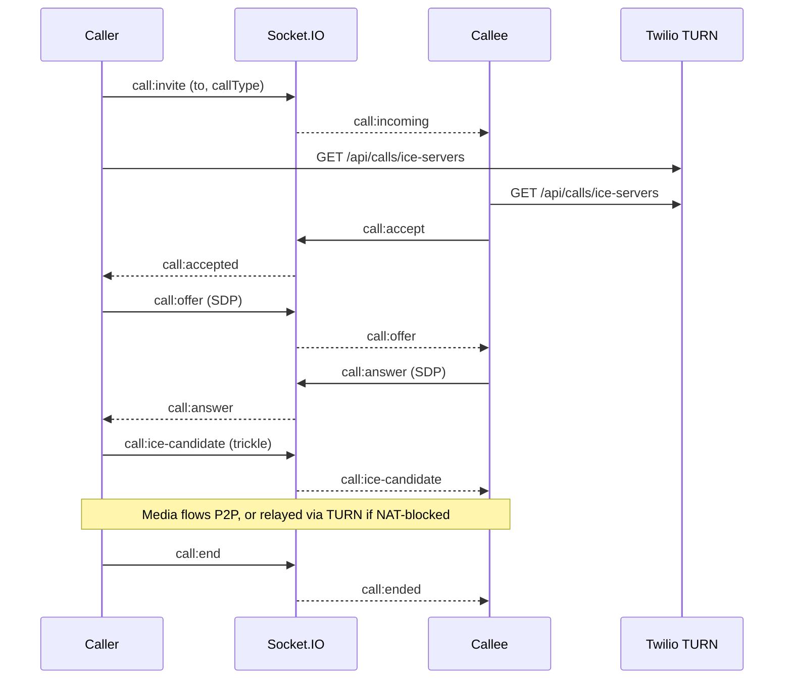

Complete state machine and error/end reasons in [Real-Time & Calling](./08-realtime-and-calls.md).

---

## 8. Design decisions & rationale

| Decision | Alternatives considered | Why this choice |
|----------|------------------------|-----------------|
| **MERN + Socket.IO** | Phoenix/Elixir, Go + gRPC, Firebase | One language (JS) across the stack; Socket.IO gives robust reconnection/fallbacks; huge ecosystem. |
| **Conversation-centric model** | Pure message-pair model | Unifies 1:1 and group under one abstraction; per-participant prefs and rooms become natural. |
| **JWT in httpOnly cookie + localStorage token** | Sessions in DB, cookie-only | Cookie protects against XSS token theft for REST; localStorage token enables the socket handshake and cross-origin Bearer fallback during transition. (Trade-off discussed in [Security](./09-security.md).) |
| **In-memory presence map** | Redis pub/sub | Zero extra infra at current scale; explicitly the first thing to externalize when scaling horizontally. |
| **Signed direct Cloudinary uploads** | Proxy through API; S3 | Saves bandwidth/time; CDN delivery; server keeps deletion control. |
| **In-process scheduler** | Cron service, queue (BullMQ/SQS) | Simplest thing that works; claim/lease gives basic safety. Externalize for multi-instance. |
| **Optimistic UI w/ clientId idempotency** | Pessimistic (wait for server) | Instant feel; idempotency avoids duplicate sends on retry. |
| **Cursor pagination + virtualization** | Offset pagination, render-all | Stable under inserts; bounded memory/DOM for long histories. |
| **Sanitized markdown (`rehype-sanitize`)** | Raw HTML, plain text | Rich text without XSS. |
| **SSRF-guarded unfurl** | Naive fetch | Prevents link previews from probing internal networks. |
| **Vercel serverless** | Long-lived VM/container, k8s | Cheap, zero-ops hosting. Trade-off: ephemeral instances complicate in-memory presence + scheduler (see DevOps). |

---

## 9. Scalability considerations

quickCHAT today is optimized for a **single backend instance**. The scaling path is well understood:

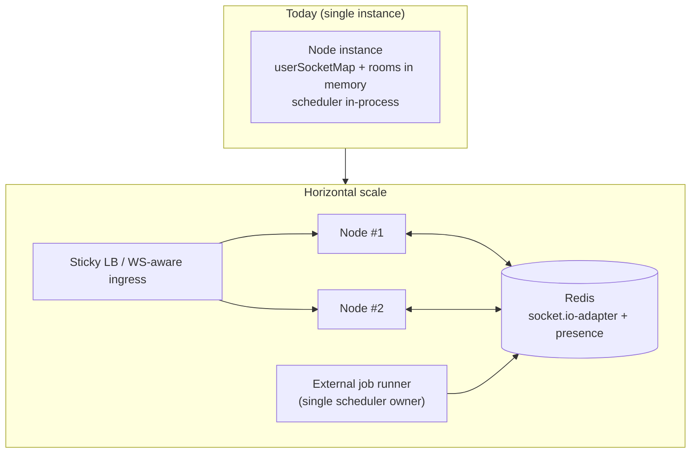

**What scales already:**
- REST API is stateless (modulo DB) → trivially horizontally scalable.
- MongoDB indexes target the hot paths (conversation history, search, scheduling). See [Database](./05-database.md#indexing-strategy).
- Media is offloaded to Cloudinary's CDN; the API never streams media bytes.
- Pagination + virtualization bound per-client and per-query cost.

**What must change to scale out horizontally:**
1. **Socket.IO across instances** → add the Redis adapter so rooms/broadcasts span instances; presence must move to Redis (or be derived from adapter room membership).
2. **Scheduler ownership** → only one instance (or an external worker / leader election) should run the release/expire job, or claims must be globally coordinated (the claim/lease model already helps).
3. **Sticky sessions / WS-aware routing** so a socket stays on one instance for its lifetime.
4. **CORS/cookie domains** consolidated to a stable apex domain.

**Vertical/throughput levers available now:**
- Scheduler batch sizes and poll interval are env-tunable (`MESSAGE_SCHEDULER_*`).
- JSON body cap (`8mb`) and rate limits bound abusive load.
- `.lean()` reads and projections keep query payloads small.

---

## 10. Reliability & fault tolerance

| Concern | Mechanism |
|---------|-----------|
| **Flaky client networks** | Socket.IO auto-reconnect; on reconnect, `markPendingDelivered` flips queued `sent` messages to `delivered` and notifies senders; rooms re-joined on connect. |
| **Lost/failed sends** | Optimistic message marked `failed` with retry/discard affordance; `clientId` idempotency prevents duplicates on retry. |
| **Multi-device consistency** | `userSocketMap` is `Map<userId, Set<socketId>>`; events fan out to all of a user's sockets; self-echo keeps other tabs/devices in sync. |
| **Crashed scheduler tick** | `resetStaleScheduledMessages` reclaims messages stuck in `processing` beyond `STALE_CLAIM_MS`; single-flight guard avoids overlapping ticks. |
| **Push delivery failures** | Expired/invalid subscriptions are detected and pruned from the user document. |
| **TURN/calls misconfig** | `CALLS_ENABLED` flag; ICE endpoint returns `503` (with STUN-only fallback path) when Twilio creds are missing, instead of failing opaquely. |
| **Render-time exceptions** | React `ErrorBoundary` catches render errors and offers reload instead of a white screen. |
| **Malicious/oversized input** | Rate limiters per route family; body size cap; markdown sanitization; SSRF guard on unfurl. |
| **Data durability** | MongoDB Atlas (replica set, backups) as system of record; soft deletes preserve audit/threading integrity. |
| **Graceful degradation** | If push/calls/unfurl are unavailable, core messaging continues to function. |

### Known reliability caveats (be honest)

- **In-memory presence + in-process scheduler** assume a single instance. On Vercel's serverless model these are best-effort; see [DevOps](./10-devops-and-infrastructure.md) and [Maintenance → Known limitations](./13-maintenance-guide.md#known-limitations).
- **No message broker**: realtime fan-out is direct; a dropped instance loses its in-flight in-memory state (but never persisted data).

---

## 11. Cross-cutting concerns

| Concern | Approach | Reference |
|---------|----------|-----------|
| **AuthN/AuthZ** | JWT (cookie + bearer), `protectRoute`, room membership checks, block enforcement | [Security](./09-security.md) |
| **Validation** | Per-controller input checks; Mongoose schema constraints | [API](./06-api-reference.md) |
| **Rate limiting** | `express-rate-limit` families (auth, send, unfurl, block, report, calls) | [Backend](./04-backend.md#rate-limiting) |
| **Error handling** | Normalized JSON envelopes + status codes; client `getErrorMessage`; `ErrorBoundary` | [Backend](./04-backend.md) · [Frontend](./07-frontend.md) |
| **Observability** | `console` logging (scheduler, sockets, errors) | [DevOps](./10-devops-and-infrastructure.md#monitoring--logging) |
| **i18n / RTL** | Custom runtime + locale JSON (en, ar), `dir` switching | [Frontend](./07-frontend.md#internationalization) |
| **Theming** | Tailwind v4 CSS variables, `data-theme` light/dark | [Frontend](./07-frontend.md#styling-system) |
| **Config / flags** | Env-driven (`CALLS_ENABLED`, `MESSAGE_SCHEDULER_*`, `CLIENT_ORIGINS`) | [DevOps](./10-devops-and-infrastructure.md#environment-configuration) |

---

## 12. Where to go next

- The concrete module/domain breakdown and design patterns at code level: [System Design](./03-system-design.md).
- Per-module backend internals: [Backend Reference](./04-backend.md).
- The realtime/calling protocols in depth: [Real-Time & Calling](./08-realtime-and-calls.md).
