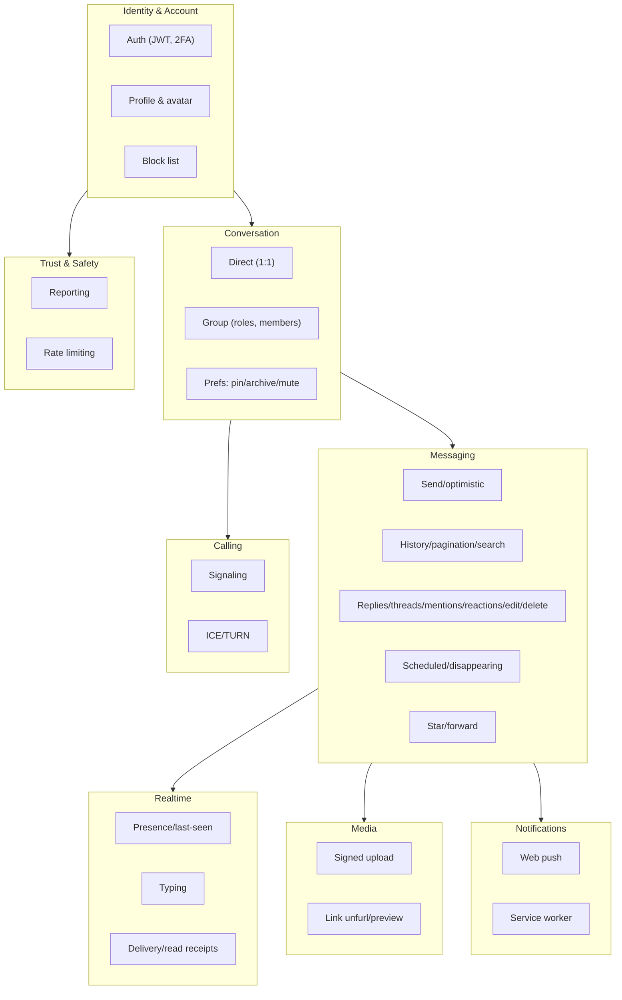
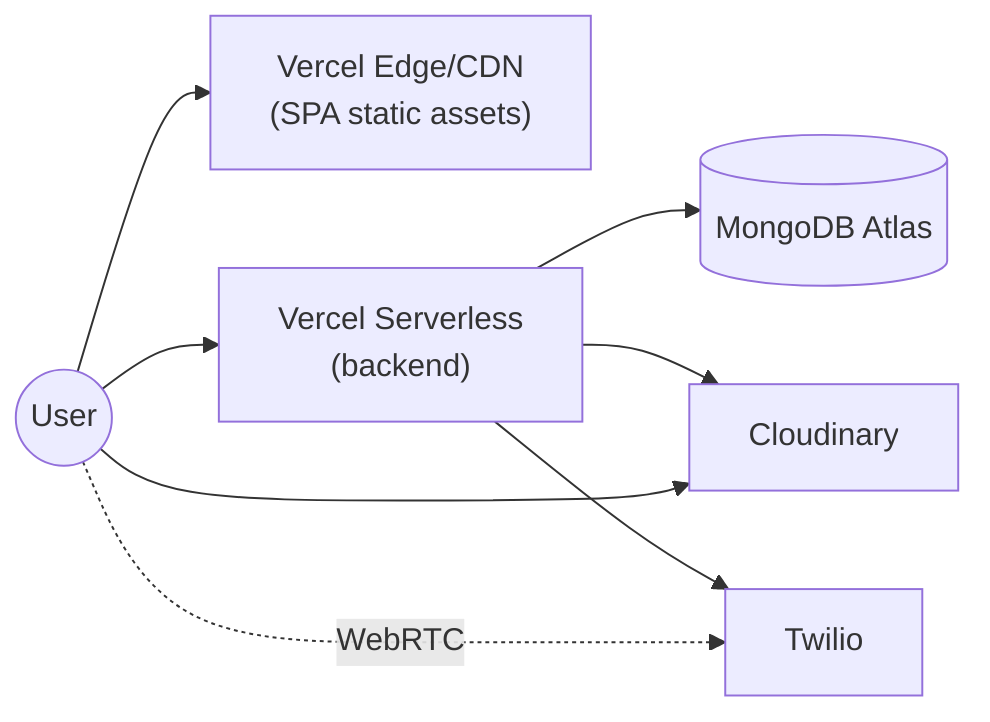
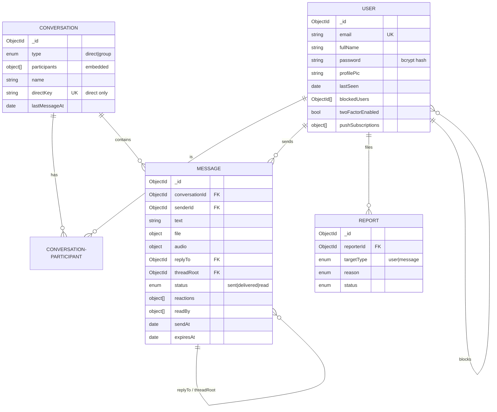
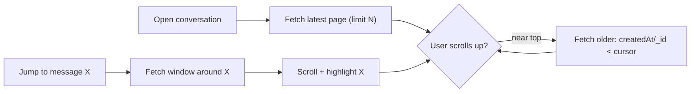
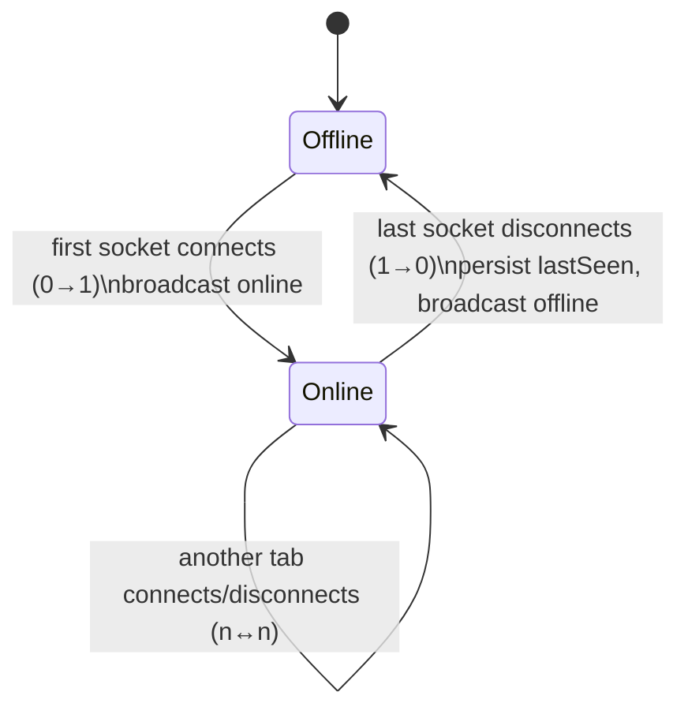
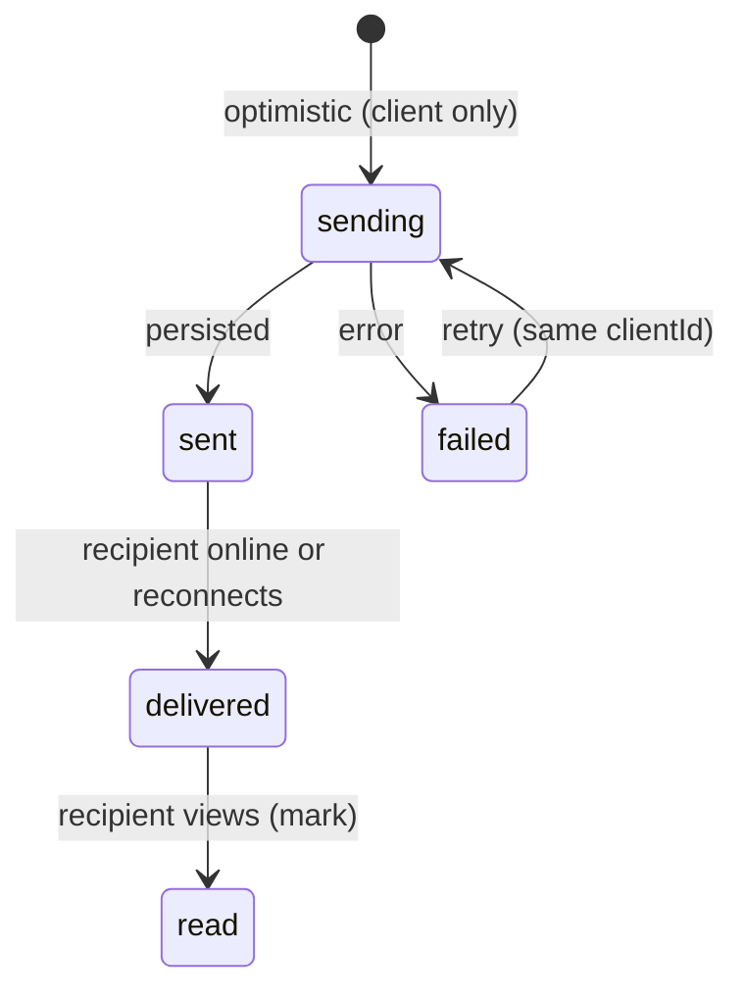
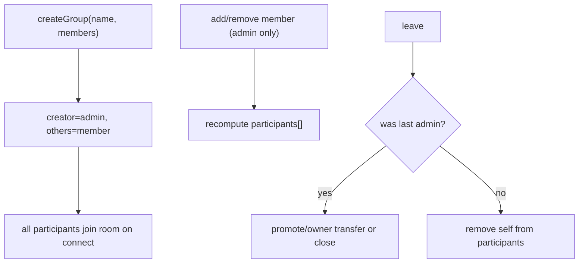

# 03 — System Design (HLD & LLD)

[← Back to index](./README.md) · Related: [Architecture](./02-architecture.md) · [Database](./05-database.md) · [Backend](./04-backend.md)

This document moves from the high-level design (HLD) — the major subsystems and how they collaborate — down to the low-level design (LLD) — module decomposition, domain model, and the algorithms that make the tricky features (optimistic send, pagination, scheduling, presence) correct.

---

## Part A — High-Level Design (HLD)

### A.1 Subsystem decomposition

quickCHAT decomposes into eight cooperating subsystems. Each owns a slice of behavior and a set of data.



### A.2 Subsystem responsibilities & boundaries

| Subsystem | Owns (data) | Key operations | Talks to |
|-----------|-------------|----------------|----------|
| Identity & Account | `User` (credentials, 2FA, blocked list, push subs) | signup, login(+2FA), profile update, block/unblock | Cloudinary (avatar), all others (identity) |
| Conversation | `Conversation` (participants, prefs, directKey) | create direct/group, add/remove/leave, set prefs | Messaging, Realtime, Calls |
| Messaging | `Message` | send, edit, delete, react, star, forward, paginate, search, schedule | Conversation, Realtime, Media, Notifications |
| Realtime | in-memory `userSocketMap`, rooms | presence, typing, receipts, relays | Messaging, Conversation, Calls |
| Media | (none persistent; Cloudinary) | sign upload, unfurl URLs | Messaging |
| Notifications | `User.pushSubscriptions` | subscribe, send push | Messaging |
| Calling | in-memory call state | signaling, ICE minting | Realtime, Twilio |
| Trust & Safety | `Report` | report, rate-limit | Identity, Messaging |

### A.3 Technology selection rationale (HLD level)

See [Architecture §8](./02-architecture.md#8-design-decisions--rationale) for the decision table. At HLD level the key choices are:

- **One process, two transports (REST + WS)**: messaging needs both request/response (history, send) and push (delivery, presence). Co-locating them shares models, auth, and helpers.
- **Document database (MongoDB)**: messages and conversations are naturally documents with embedded sub-arrays (reactions, receipts, participants, prefs). Embedding avoids joins on the hot path; references are used where cardinality is unbounded (messages → users).
- **Managed periphery (Cloudinary/Twilio/Push)**: undifferentiated heavy lifting (CDN, TURN relays, push fan-out) is delegated to specialists.

### A.4 Deployment topology (HLD)



Details and caveats (serverless + websockets + in-memory state) in [DevOps](./10-devops-and-infrastructure.md).

---

## Part B — Domain Model

### B.1 Entity-relationship overview



Full field-by-field schema documentation is in [Database](./05-database.md).

### B.2 Core domain concepts

- **Conversation as the aggregate root for messaging.** Every message belongs to a conversation. A *direct* conversation is a special case with exactly two participants and a deterministic `directKey` (sorted participant ids), enforced unique to prevent duplicate 1:1 threads. A *group* has 2+ participants, a name/avatar, an owner (`createdBy`), and roles.
- **Participant is an embedded value object** carrying both membership (`role`, `joinedAt`) and per-user preferences (`lastReadAt`, `isPinned`, `isArchived`, `mutedUntil`). Embedding is correct because preferences are owned by the conversation membership and have bounded cardinality (group sizes are small).
- **Message is the richest entity**, modeling content (text/image/file/audio), relationships (`replyTo`, `threadRoot`, `mentions`), lifecycle (`status`, `readBy`, `deliveredTo`, `seen`, `isDeleted`, `editedAt`), timing (`sendAt`, `releasedAt`, `expiresAt`, `disappearAfterMs`, `scheduledStatus`), engagement (`reactions`, `starredBy`), enrichment (`preview`), and idempotency (`clientId`).
- **User identity** carries auth material (password hash, 2FA secrets — `select:false`), social graph (`blockedUsers`), reachability (`pushSubscriptions` — `select:false`), and presence (`lastSeen`).

### B.3 Dual-model legacy bridge (important)

Messages carry **both** a `conversationId` **and** legacy `senderId`/`receiverId`/`seen` fields. This is intentional: the product began as a pure 1:1 messenger keyed on sender/receiver and migrated to a conversation-centric model. The dual fields let:

- Old 1:1 messages keep working (legacy DM socket paths use `to`/`receiverId`).
- New code key on `conversationId` and `readBy`/`deliveredTo` receipts.
- A migration script ([`migrate-dm-to-conversations.js`](../server/scripts/migrate-dm-to-conversations.js)) backfill conversations and receipts.

This is a deliberate **transitional trade-off** — see [Maintenance → Technical debt](./13-maintenance-guide.md#technical-debt).

---

## Part C — Low-Level Design (LLD)

This section documents the non-trivial algorithms. Each includes the problem, the design, and the rationale.

### C.1 Optimistic send + reconciliation + retry

**Problem:** Sending must feel instant, survive flaky networks, and never produce duplicates.

**Design:**

```mermaid
sequenceDiagram
  participant UI as ChatContext (client)
  participant API as POST /messages/send/:id
  participant DB as MongoDB

  UI->>UI: temp = {clientId, status:"sending", ...}
  UI->>UI: insert temp into messages[] (render immediately)
  UI->>API: send(payload incl. clientId)
  alt success
    API->>DB: findOne({senderId, clientId}) // idempotency
    DB-->>API: none → create; or existing → return it
    API-->>UI: saved message (has real _id, status:"sent")
    UI->>UI: replace temp (match by clientId) with saved
  else network/server error
    UI->>UI: mark temp status:"failed"
    UI->>UI: offer Retry (re-send same clientId) / Discard
  end
```

**Why a `clientId`:** It is a client-generated unique key sent with the message. The server uses a sparse unique-ish index (`{senderId, clientId}` / `{conversationId, senderId, clientId}`) and a `findOne` guard so a **retried** send returns the *same* stored message instead of creating a duplicate. This makes the send operation **idempotent** from the client's perspective.

**Why optimistic:** Perceived latency dominates UX. Reconciliation by `clientId` (not array index) is robust to interleaving with inbound messages.

### C.2 Cursor pagination + "jump to message" (around mode)

**Problem:** Histories can be huge. Offset pagination is unstable under inserts and expensive deep in the list. We also need to *center* the view on a specific message (search result / reply jump).

**Design:**
- **Backward paging** (load older): query `conversationId` with `createdAt`/`_id` **less than** the oldest loaded cursor, sorted descending, limit N, then reverse for display. The compound index `{conversationId, createdAt:-1, _id:-1}` makes this an index scan with a tie-breaker on `_id` (stable across equal timestamps).
- **Around mode**: given a target message id, fetch a window of messages **before and after** it so the UI can scroll to and highlight it, then continue normal paging from the window edges.
- **Rendering**: `react-virtuoso` virtualizes rows so only visible bubbles are in the DOM, regardless of how many are loaded.



**Why `_id` as tie-breaker:** Two messages can share a millisecond `createdAt`. Sorting/paginating on `(createdAt, _id)` guarantees a total order and prevents skipped/duplicated rows at page boundaries.

### C.3 Presence with multi-device fan-out

**Problem:** A user may be connected from several tabs/devices. Presence must be "online if ≥1 socket" and events must reach **all** of a user's sockets.

**Design (in `server.js`):**

```js
// Map<userId, Set<socketId>>
const userSocketMap = new Map();

addUserSocket(userId, socketId)   // returns true if user *became* online (0→1)
removeUserSocket(userId, socketId)// returns true if user *became* offline (1→0)
getUserSocketIds(userId)          // all sockets for fan-out
```

- On connect: add socket; if `0→1`, broadcast `userPresenceUpdated {online:true}`. Always broadcast `getOnlineUsers`.
- On disconnect: remove socket; if `1→0`, persist `lastSeen=now` and broadcast `userPresenceUpdated {online:false, lastSeen}`.
- Fan-out helper `emitToUserSockets(userId, event, payload)` iterates the set.

**Why a Set per user:** Transitions (online/offline) must fire **only on the edge** (first connect / last disconnect), not on every tab. The `Set` size gives that for free, and de-dupes socket ids.



### C.4 Message delivery & read receipt model

**Problem:** Support both legacy 1:1 (`seen` boolean, `status`) and group (per-user `readBy`/`deliveredTo`).

**Design — status ladder:**



- **`status`** (`sent|delivered|read`) is the coarse, conversation-level indicator (drives the ticks).
- **`deliveredTo[]` / `readBy[]`** are per-user receipts (group-accurate). The sender is auto-added to `readBy` on create.
- **`seen`** is the legacy 1:1 boolean, kept for old code paths and unseen-count queries.
- On reconnect, `markPendingDelivered(receiverId)` flips `sent → delivered` for that recipient's pending messages and notifies senders via `messageDelivered`.

### C.5 Scheduled & disappearing messages (claim/lease worker)

**Problem:** Some messages must be **released later** (`sendAt`) and some must **auto-expire** (`disappearAfterMs → expiresAt`). This must be safe against crashes and not block requests.

**Design — three-phase tick** (`lib/messageScheduler.js` → `messageController` functions), guarded by a single-flight boolean and run every `MESSAGE_SCHEDULER_POLL_MS` (default 5s):

1. **`resetStaleScheduledMessages`** — any message stuck in `scheduledStatus:"processing"` longer than `STALE_CLAIM_MS` (default 2m) is reset to `pending` (recovers crashed ticks).
2. **`releaseDueScheduledMessages`** — atomically claim up to `RELEASE_BATCH_SIZE` (25) messages where `scheduledStatus:"pending"` and `sendAt <= now`, flip to released/`sent`, set `releasedAt`, compute `expiresAt` if disappearing, and emit `newMessage`.
3. **`expireDueMessages`** — soft-delete up to `EXPIRE_BATCH_SIZE` (50) messages where `expiresAt <= now` and `!isDeleted`, destroy media, emit deletion events.

```mermaid
sequenceDiagram
  participant Tick
  participant DB
  Tick->>DB: reset stale (processing→pending if old)
  Tick->>DB: claim pending due (pending→processing→released, batch)
  DB-->>Tick: released set
  Tick->>DB: expire due (expiresAt<=now → isDeleted)
  Note over Tick: single-flight guard; batched; env-tunable
```

**Why claim/lease + partial indexes:** The partial index `{scheduledStatus, sendAt}` (only on `pending` with a date) makes "find due" cheap. Claiming via status transition prevents two ticks (or two instances) from releasing the same message twice; stale-reset guarantees forward progress after a crash. See [Database §Scheduling](./05-database.md#scheduling-fields).

### C.6 Link unfurling (SSRF-hardened, async enrichment)

**Problem:** Show rich previews for URLs in messages without (a) blocking the send or (b) letting the server be used to probe internal infrastructure (SSRF).

**Design (`lib/linkUnfurl.js`):**
- On send, extract the first URL; store `preview.status="pending"` and return immediately (non-blocking).
- Asynchronously fetch the URL with guards: scheme allowlist (`http/https`), **block private/loopback/link-local IP ranges**, cap redirects, cap response size, timeout, parse Open Graph/meta.
- Update the message `preview` to `ready` (or `failed`) and emit `messageUpdated`.

**Why:** Previews are nice-to-have, so they must never delay or fail a send. The IP/scheme guards are essential because a naive fetch of user-supplied URLs is a classic SSRF vector. See [Security §SSRF](./09-security.md#threat-mitigation).

### C.7 Block enforcement

**Problem:** Blocking must be enforced bidirectionally and consistently across messaging and calls.

**Design (`lib/blockHelpers.js`):** A helper computes a *block state* between two users (`iBlockThem`, `theyBlockMe`) from each `User.blockedUsers`. Send and call-invite paths consult it; if either side blocks the other, the action is rejected and the UI reflects a disabled/blocked state. The sidebar/chat header derive a `blockState` to disable the composer.

### C.8 Group conversation operations



Authorization (admin-only mutations), validation (min participants), and event emission are handled in `conversationController`. See [Backend §Conversations](./04-backend.md#conversation-controller).

---

## Part D — Design Patterns Catalogue (code-level)

| Pattern | Concrete instance | File |
|---------|-------------------|------|
| Middleware chain | auth + rate limit before controllers | `middleware/*`, `routes/*` |
| Factory/helper | `getConversationRoomName`, `buildDirectKey`, `getOrCreateDirectConversation` | `lib/conversationHelpers.js` |
| Strategy (by conversationId vs `to`) | socket relays branch on conversation vs legacy DM | `server.js` |
| Single-flight guard | `tickInFlight` in scheduler | `lib/messageScheduler.js` |
| Claim/lease | scheduled message processing | `messageController` |
| Idempotency key | `clientId` | `message.js`, `messageController` |
| Observer/pub-sub | Socket.IO rooms + client subscriptions in `ChatContext` | `server.js`, `context/ChatContext.jsx` |
| Provider/DI | React context providers | `main.jsx`, `context/*` |
| Reducer-ish state updates | functional `setMessages`/`setConversations` updaters | `context/ChatContext.jsx` |
| Adapter | `twilioTurn` adapts Twilio → ICE config; `pushService` adapts web-push | `lib/twilioTurn.js`, `lib/pushService.js` |
| Sanitizer/decorator | `MessageText` markdown + highlight + safe links | `client/src/lib/messageText.jsx` |
| Memoization | `React.memo`, `useMemo` on derived lists | components/contexts |

---

## Part E — Trade-offs & technical decisions (LLD)

| Decision | Benefit | Cost / risk | Mitigation |
|----------|---------|-------------|------------|
| Dual message keys (`conversationId` + `senderId/receiverId/seen`) | Smooth migration; old + new code coexist | Schema bloat; two sources of truth | Migration script; eventually drop legacy fields |
| Embedded receipts (`readBy`/`deliveredTo`) | Group-accurate, single-doc read | Array growth in huge groups | Groups are small; index `receiverId,seen` for legacy counts |
| In-memory presence/scheduler | No extra infra | Breaks across multiple instances | Documented scale path (Redis adapter, single scheduler owner) |
| Optimistic UI | Instant feel | Reconciliation complexity | `clientId` keyed reconciliation + retry |
| Direct signed uploads | Saves bandwidth | Client holds short-lived signature | Signature scoped + time-limited; server controls deletion |
| Soft delete | Preserve threads/audit | Storage retained | Media destroyed; content blanked; scheduler can hard-expire |
| Markdown rendering | Rich text | XSS surface | `rehype-sanitize` + safe-href allowlist |

---

## Part F — Performance considerations

- **Indexes target every hot query** (history, unseen counts, search, mentions, starred, scheduling, expiry). See [Database §Indexing](./05-database.md#indexing-strategy).
- **`.lean()` reads** for list/aggregate paths avoid Mongoose hydration overhead.
- **Projections / `select:false`** keep secrets and large arrays (`pushSubscriptions`, 2FA secrets) off normal reads.
- **Virtualized message list** bounds DOM nodes.
- **Lazy-loaded routes & emoji picker** (`React.lazy`) shrink the initial bundle; demo data assets were intentionally removed from the bundle (see `assets.js` comment).
- **Batched scheduler work** bounds DB load per tick.
- **CDN media + code splitting** reduce TTFB and payloads.
- **Debounced typing / throttled emits** reduce socket chatter (see [Frontend](./07-frontend.md) and [Real-Time](./08-realtime-and-calls.md)).

Continue to [Backend Reference](./04-backend.md) for the module-by-module implementation, or [Database](./05-database.md) for the full schema and index catalogue.
