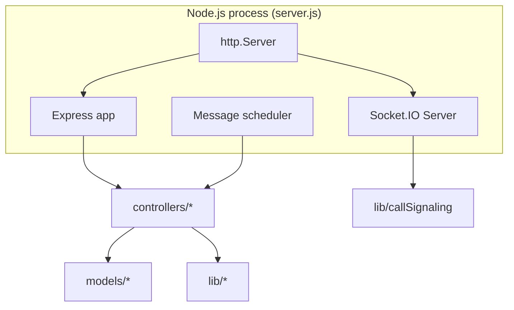
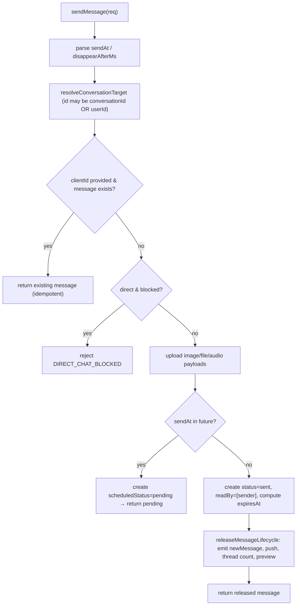

# 04 — Backend Reference

[← Back to index](./README.md) · Related: [Architecture](./02-architecture.md) · [Database](./05-database.md) · [API Reference](./06-api-reference.md) · [Real-Time & Calling](./08-realtime-and-calls.md) · [Security](./09-security.md)

This document explains the backend (`server/`) module-by-module: the service architecture, the layered request pipeline, every controller and route, the middleware, the helper libraries, the background scheduler, and the event-processing model. It assumes no prior knowledge.

---

## 1. Service architecture

The backend is a **single Node.js (ESM) process** that simultaneously serves:

- a **stateless REST API** (Express 5), and
- a **stateful realtime server** (Socket.IO), and
- an **in-process background scheduler** (`setInterval`).

All three share the same Mongoose models and `lib/` helpers. The entrypoint is [`server/server.js`](../server/server.js).



### Layered pipeline

```text
HTTP request
  → CORS (origin allowlist)
  → helmet (security headers)
  → cookieParser
  → express.json({ limit: "8mb" })
  → Router (/api/...)
  → Rate limiter (per route family)        [middleware/rateLimit.js]
  → protectRoute (JWT → req.user)           [middleware/auth.js]
  → Controller (validate → orchestrate)     [controllers/*]
  → Models + lib (Mongo, Cloudinary, push, unfurl, sockets)
  → JSON response { success, ... }
```

This layering keeps each concern isolated: transport/security in middleware, request/response shaping + business logic in controllers, persistence in models, and reusable cross-cutting logic in `lib/`.

---

## 2. Entrypoint — `server.js`

[`server/server.js`](../server/server.js) wires everything together. Responsibilities, in order:

1. **Create app + HTTP server.** `express()` wrapped by `http.createServer(app)` so that both Express and Socket.IO can share one port.
2. **Compute the CORS allowlist.** `DEFAULT_CLIENT_ORIGINS` (localhost dev) plus `CLIENT_ORIGINS` (comma-separated env) plus a dynamic rule allowing any `https://*.vercel.app` origin (because Vercel mints a new hostname per deploy). The same `corsOriginHandler` is used for both Express CORS and Socket.IO CORS, with `credentials: true` so cookies flow.
3. **Initialize Socket.IO** with the CORS handler.
4. **Authenticate every socket** via `io.use(...)`: read `socket.handshake.auth.token`, `jwt.verify` it, and stash `socket.userId`. Unauthenticated handshakes are rejected. **This means no anonymous sockets ever connect.**
5. **Maintain presence** in `userSocketMap: Map<userId, Set<socketId>>` with helpers:
   - `addUserSocket` / `removeUserSocket` return whether the user *transitioned* online/offline (edge detection).
   - `getUserSocketIds`, `isUserOnline`, `emitToUserSockets` for fan-out.
   - Exported (`io`, `userSocketMap`, `getUserSocketIds`, `isUserOnline`) so controllers can emit realtime events after REST mutations.
6. **On connection:**
   - Register call-signaling handlers (`registerCallSignalingHandlers`).
   - Add the socket; broadcast `userPresenceUpdated{online:true}` only on the `0→1` transition; always broadcast `getOnlineUsers`.
   - `markPendingDelivered(userId)` — flip this user's inbound `sent` messages to `delivered` and notify senders (delivery-on-reconnect).
   - `joinSocketToUserConversationRooms` — join all the user's conversation rooms so room broadcasts reach them.
7. **Relay handlers** (`typing`, `stopTyping`, `messagesSeen`, `messageUpdated`, `messageDeleted`, `messageReaction`): each branches on `conversationId` (room relay, **verifying `socket.rooms.has(roomName)` first**) vs legacy `to` (direct user fan-out). This is both the realtime transport and an authorization gate.
8. **On disconnect:** remove the socket; let call-signaling clean up; on the `1→0` transition persist `User.lastSeen=now` and broadcast `userPresenceUpdated{online:false,lastSeen}`; re-broadcast `getOnlineUsers`.
9. **Mount middleware + routers** (`/api/auth`, `/api/messages`, `/api/conversations`, `/api/reports`, `/api/push`, `/api/upload`, `/api/calls`, `/api/status`).
10. **Connect to MongoDB**, **start the scheduler**, and log calling/TURN feature-flag status.
11. **Listen** only when `NODE_ENV !== "production"` (locally). In production on Vercel, the exported `server` is used by the serverless runtime instead of an explicit `listen`. See [DevOps](./10-devops-and-infrastructure.md).

> **Design note:** The socket relay handlers carry message *content* peer-to-peer for legacy DMs, but the **source of truth** for messages is always the REST `sendMessage` controller, which persists and then emits via `emitToConversation`. The client-emitted relays exist mostly to sync a user's *own* multiple devices and to support legacy direct paths.

---

## 3. Middleware

### 3.1 `middleware/auth.js` — `protectRoute`

Extracts the JWT (via `getTokenFromRequest`, which checks the `quickchat_token` cookie, then a `token` header, then an `Authorization: Bearer` header), verifies it, loads the user (minus password), and attaches `req.user`. Any failure returns **HTTP 401** so the client can clear stale credentials and redirect to login.

```12:21:server/middleware/auth.js
                const decoded = jwt.verify(token,process.env.JWT_SECRET)
                const user = await User.findById(decoded.userId).select("-password")
                if(!user){
                        return res.status(401).json({success:false , message:"User not found"});
                }

                req.user = user;
                next();
```

### 3.2 `middleware/rateLimit.js` — rate limiting {#rate-limiting}

A factory `createJsonRateLimiter` builds `express-rate-limit` instances that respond with a JSON `429` envelope. Each limit is env-overridable.

| Limiter | Window | Default max (env) | Applied to |
|---------|--------|-------------------|-----------|
| `authRateLimiter` | 15 min | 20 (`AUTH_RATE_LIMIT_MAX`) | signup, login, 2FA login verify |
| `twoFactorActionRateLimiter` | 15 min | 30 (`TWO_FACTOR_RATE_LIMIT_MAX`) | 2FA setup/enable/disable |
| `messageSendRateLimiter` | 1 min | 45 (`MESSAGE_SEND_RATE_LIMIT_MAX`) | send + forward |
| `unfurlRateLimiter` | 1 min | 25 (`UNFURL_RATE_LIMIT_MAX`) | link unfurl |
| `blockActionRateLimiter` | 1 hr | 80 (`BLOCK_ACTION_RATE_LIMIT_MAX`) | block/unblock |
| `reportActionRateLimiter` | 1 hr | 40 (`REPORT_ACTION_RATE_LIMIT_MAX`) | reports |
| `callIceRateLimiter` | 1 min | 30 (`CALL_ICE_CONFIG_RATE_LIMIT_MAX`) | ICE config |

**Why per-family limits:** auth and 2FA are brute-force targets (tight), messaging needs headroom for bursts (looser), unfurl/calls/reports/block are abuse vectors with their own thresholds. See [Security](./09-security.md#rate-limiting).

---

## 4. Controllers (business-logic layer)

Controllers validate input, enforce authorization, mutate models, trigger side effects (Cloudinary, push, sockets), and return a normalized JSON envelope. They live in `server/controllers/`.

### 4.1 `userControllers.js` — identity, 2FA, profile, block

| Function | Route | Summary |
|----------|-------|---------|
| `Signup` | `POST /api/auth/signup` | Validate fields, ensure unique email, bcrypt-hash password (salt 10), create user, issue JWT (cookie + body), return sanitized user. |
| `login` | `POST /api/auth/login` | Verify password; if `twoFactorEnabled`, return `requiresTwoFactor` + a short-lived `twoFactorToken` (purpose-scoped JWT) instead of a session. Else issue session. |
| `verifyTwoFactorLogin` | `POST /api/auth/2fa/login/verify` | Validate the `twoFactorToken` + 6-digit TOTP code against `twoFactorSecret`; issue session on success. |
| `checkAuth` | `GET /api/auth/check` | Return the authenticated `req.user` (sanitized). Used on app boot to restore session. |
| `logout` | `POST /api/auth/logout` | Clear the auth cookie. |
| `updateProfile` | `PUT /api/auth/update-profile` | Update name/bio; if a base64 `profilePic` is supplied, upload to Cloudinary and **destroy the previous avatar** by `public_id`. |
| `beginTwoFactorSetup` | `POST /api/auth/2fa/setup` | Generate a TOTP secret + `otpauth://` URI + QR data-URL; store as `twoFactorTempSecret`. |
| `enableTwoFactor` | `POST /api/auth/2fa/enable` | Verify a code against the temp secret, promote it to `twoFactorSecret`, set `twoFactorEnabled`. |
| `disableTwoFactor` | `POST /api/auth/2fa/disable` | Verify a code against the active secret, then clear all 2FA fields. |
| `blockUser` / `unblockUser` | `POST/DELETE /api/auth/block/:id` | `$addToSet`/`$pull` on `blockedUsers`; return refreshed blocked list. |
| `getBlockedUsers` | `GET /api/auth/blocked-users` | Return the user's blocked list (public fields only). |

**Key helpers:** `sanitizeUser` strips `password`, `pushSubscriptions`, `profilePicPublicId/ResourceType`, and both 2FA secrets from any response. `createTwoFactorLoginToken`/`verifyTwoFactorLoginToken` implement the **two-step login** with a `purpose: "2fa-login"` JWT (TTL `TWO_FACTOR_LOGIN_TTL_SECONDS`, default 300s) so the password step and the code step are bound together without holding a full session.

> **Why a separate 2FA token:** After the password check, the server must remember "this user passed step 1" without granting a session. A short-lived purpose-scoped JWT is stateless (no server session store) and self-expiring.

### 4.2 `messageController.js` — the messaging core

This is the largest controller. It owns the full message lifecycle. Notable exported handlers:

| Function | Route | Summary |
|----------|-------|---------|
| `getUserForSidebar` | `GET /api/messages/users` | Legacy: users + per-peer unseen counts + block state for the sidebar. |
| `getMessages` | `GET /api/messages/:id`, `/conversation/:id`, `/conversations/:id/messages` | **Cursor pagination** (`before`), **around mode** (`aroundMessageId`), auto mark-as-read on the latest page, returns `messages`, `hasMore`, `nextCursor`, `markedReadMessageIds`. |
| `sendMessage` | `POST /api/messages/send/:id` (+ aliases) | Idempotent send (by `clientId`), block check, media upload payloads, replies/threads/mentions resolution, scheduling vs immediate release, preview enrichment queue. |
| `markMessageAsSeen` | `PUT /api/messages/mark/:id` | Add `readBy` receipt; for direct, set `seen`+`status:read`; update participant `lastReadAt`; emit `messagesSeen`. |
| `editMessage` | `PUT /api/messages/edit/:id` | Patch `text` and/or `sendAt`/`disappearAfterMs` (for pending scheduled messages); set `editedAt`; emit `messageUpdated`. |
| `deleteMessage` | `DELETE /api/messages/:id` | Soft delete (`isDeleted:true`, blank content), destroy media in Cloudinary, emit `messageDeleted`. |
| `reactToMessage` | `POST /api/messages/react/:id` | Toggle the caller's emoji reaction; emit `messageReaction`. |
| `toggleMessageStar` | `POST /api/messages/star/:id` | Toggle the message in the caller's `starredBy`. |
| `getStarredMessages` | `GET /api/messages/starred` | List the caller's starred messages. |
| `forwardMessage` | `POST /api/messages/forward/:id` | Copy a message into one or more target conversations/users. |
| `getThreadMessages` | `GET /api/messages/thread/:id` | Fetch replies under a thread root. |
| `searchMessages` | `GET /api/messages/search/:id` (+ conv aliases) | In-conversation search. |
| `searchMessagesGlobal` | `GET /api/messages/search` | Cross-conversation search (text index). |
| `unfurlMessageLink` | `GET /api/messages/unfurl` | On-demand link preview fetch (SSRF-guarded). |

**Scheduler-facing functions** (called by `lib/messageScheduler.js`, not HTTP-routed):
- `releaseDueScheduledMessages({limit})` — claim+release due `pending` messages.
- `resetStaleScheduledMessages({staleAfterMs})` — reclaim crashed `processing` claims.
- `expireDueMessages({limit})` — soft-delete due disappearing messages.

#### Send flow internals (the important bits)



The controller heavily relies on internal helpers (not exported): `resolveConversationTarget`, `buildConversationQuery`, `withViewerMessageVisibility` (hides deleted/expired/not-yet-released messages from the wrong viewers), `normalizeConversationMessage`, `releaseMessageLifecycle`, `queueMessagePreviewEnrichment`, `toUploadedImagePayload/FilePayload/AudioPayload`, `toComputedExpiresAt`, and cursor helpers (`getBeforeCursorValues`, `createMessagesCursor`, `buildOlderMessagesFilter`, `buildNewerMessagesFilter`).

#### Read receipts in `getMessages`

On the **latest** page (not when loading older), the controller computes unread messages for the viewer (direct → `seen:false`; group → `readBy.userId != me`), adds a `readBy` receipt, sets `seen`/`status:read` for direct, and updates the participant's `lastReadAt`. The response includes `markedReadMessageIds` so the client can emit `messagesSeen` to notify senders. See [Database §Receipts](./05-database.md) and [Real-Time](./08-realtime-and-calls.md).

### 4.3 `conversationController.js` — conversations & membership {#conversation-controller}

| Function | Route | Summary |
|----------|-------|---------|
| `getConversationContacts` | `GET /api/conversations/contacts` | All other users + block state, for the "new chat"/group pickers. |
| `getConversations` | `GET /api/conversations` | The user's conversations with last-message preview (aggregation), unseen counts (aggregation), and direct block state; also returns an `unseenMessages` map. |
| `getConversationById` | `GET /api/conversations/:id` | A single conversation summary (participant-guarded). |
| `getOrCreateDirectConversationByUser` | `POST /api/conversations/direct/:id` | Idempotently get/create the 1:1 conversation with a peer; join sockets to the room. |
| `createGroupConversation` | `POST /api/conversations/group` | Create a group (creator = admin); join member sockets; emit `conversationCreated`. |
| `addConversationMembers` | `POST /api/conversations/:id/members` | Admin-only add to a group. |
| `removeConversationMember` | `DELETE /api/conversations/:id/members/:userId` | Admin-only remove. |
| `leaveConversation` | `POST /api/conversations/:id/leave` | Remove self from a group. |
| `updateConversation` | `PATCH /api/conversations/:id` | Update group name/avatar (admin). |
| `updateConversationPreferences` | `PATCH /api/conversations/:id/preferences` | Per-user pin/archive/mute on the participant subdocument. |

**Last-message + unseen via aggregation:** `getConversations` runs two `Message.aggregate` pipelines — one `$group`-ing the latest message per conversation (excluding others' still-`pending` scheduled messages), one counting unseen messages (no `readBy` receipt for the viewer). This computes the entire sidebar in two queries instead of N. See [Database §Query optimization](./05-database.md#query-optimization).

### 4.4 `uploadController.js` — signed direct upload

`getUploadSignature` validates the requested `folder` (allowlist: `quickchat/{images,files,audio,avatars}`) and `resourceType` (`image|video|raw|auto`), then returns a Cloudinary upload URL + signature + timestamp + apiKey. The browser uploads bytes directly to Cloudinary. See [Architecture §7.3](./02-architecture.md#73-media-upload-direct-signed).

### 4.5 `pushController.js` — Web Push subscriptions

| Function | Route | Summary |
|----------|-------|---------|
| `getPublicVapidKey` | `GET /api/push/vapid-public-key` | Return the VAPID public key (or a "not configured" message). |
| `subscribeToPush` | `POST /api/push/subscribe` | Validate the subscription, dedupe by endpoint (`$pull` then `$addToSet`). |
| `unsubscribeFromPush` | `DELETE /api/push/subscribe` | Remove a subscription by endpoint. |

### 4.6 `reportController.js` — trust & safety

`createReport` validates `targetType` (`user|message`) and `reason` (enum), verifies the reporter is allowed to report the target (for messages: a participant of the conversation or legacy sender/receiver; cannot report self), and stores a `Report` with status `open`.

### 4.7 `callController.js` — calling REST surface

| Function | Route | Summary |
|----------|-------|---------|
| `getIceServers` | `GET /api/calls/ice-servers` | Returns Twilio TURN ICE servers (with TTL), or a STUN-only **degraded fallback**, or `503` if calling is disabled. |
| `getCallTelemetry` | `GET /api/calls/telemetry` | Returns calling feature flag + an in-memory stats snapshot. |

See [Real-Time & Calling](./08-realtime-and-calls.md) for the signaling half (in `lib/callSignaling.js`).

---

## 5. Library modules (`lib/`)

Reusable, controller-agnostic logic.

| Module | Purpose | Key exports |
|--------|---------|-------------|
| `db.js` | MongoDB connection | `connectDB` |
| `utils.js` | Auth tokens & cookies | `generateToken` (7d), `getTokenFromRequest` (cookie→header→bearer), `setAuthCookie`/`clearAuthCookie`, `AUTH_COOKIE_NAME` |
| `cloudinary.js` | Media SDK wrapper | `isCloudinaryConfigured`, `uploadBase64ToCloudinary`, `destroyCloudinaryAsset` (tries image/video/raw), `createCloudinaryUploadSignature` |
| `conversationHelpers.js` | Conversation logic | `getConversationRoomName`, `buildDirectKey` (sorted ids), `getOrCreateDirectConversation` (11000-safe), `assertParticipant`, `resolveConversationFromParam`, `emitToConversation`, room-join helpers |
| `blockHelpers.js` | Block state | `getUserBlockedSet`, `getBlockedSetMap` (batch), `createBlockState`, `isBlockedByEitherSide`, `isMessagingBlocked`, `getConversationBlockState`, `toBlockMessageForSender` |
| `pushService.js` | Web Push fan-out | `getVapidPublicKey`, `isPushConfigured`, `sendPushToUsers`/`sendPushToUser` (prunes stale 404/410 subs) |
| `linkUnfurl.js` | Link previews | `extractUrlsFromText`, `fetchLinkPreview` (SSRF-guarded) |
| `messageScheduler.js` | Background job | `startMessageScheduler`, `stopMessageScheduler` |
| `callSignaling.js` | WebRTC signaling | `registerCallSignalingHandlers`, `isCallsFeatureEnabled`, `getCallTelemetrySnapshot` |
| `callContract.js` | Call constants | `CALL_TYPES`, `CALL_SOCKET_EVENTS`, `CALL_STATES`, `CALL_ERROR_CODES`, `CALL_END_REASONS`, `isValidCallType` |
| `twilioTurn.js` | TURN credentials | `hasTwilioTurnConfig`, `getFallbackIceServers`, `fetchTwilioIceServers` |

### 5.1 `conversationHelpers.getOrCreateDirectConversation` (concurrency-safe)

```56:73:server/lib/conversationHelpers.js
  try {
    conversation = await Conversation.create({
      type: "direct",
      directKey,
      participants: [ ... ],
      createdBy: normalizedUserA,
    });
    return conversation;
  } catch (error) {
    // Another request may create the same direct conversation concurrently.
    if (error?.code === 11000) {
      return Conversation.findOne({ directKey });
    }
    throw error;
  }
```

`directKey` is the sorted pair of user ids and is **unique** in the DB. Two concurrent requests can race to create the same direct conversation; the loser catches the duplicate-key error (`11000`) and reads the winner's document. This is an optimistic, lock-free "create-or-get".

### 5.2 `pushService.sendPushToUsers` (self-healing subscriptions)

It loads `pushSubscriptions` (a `select:false` field), sends to each, and **prunes** any subscription that returns `404`/`410` (gone). Returns `{success, sentCount}`. If VAPID is unconfigured it no-ops gracefully — push is optional.

### 5.3 `twilioTurn` (degrade, don't fail)

`fetchTwilioIceServers` mints short-lived TURN credentials via Twilio's Tokens API and **prepends STUN fallbacks**. If Twilio is unconfigured or the lookup fails, callers fall back to STUN-only ICE so calls remain best-effort instead of breaking.

---

## 6. Background jobs & event processing

### 6.1 The message scheduler {#scheduler}

[`lib/messageScheduler.js`](../server/lib/messageScheduler.js) runs a single `setInterval` tick every `MESSAGE_SCHEDULER_POLL_MS` (default 5000ms), guarded by a `tickInFlight` boolean so ticks never overlap. Each tick runs three phases (all env-tunable, all batched):

```34:59:server/lib/messageScheduler.js
const runSchedulerTick = async () => {
  if (tickInFlight) return;
  tickInFlight = true;
  try {
    const resetCount = await resetStaleScheduledMessages({ staleAfterMs: STALE_CLAIM_MS });
    const releasedCount = await releaseDueScheduledMessages({ limit: RELEASE_BATCH_SIZE });
    const expiredCount = await expireDueMessages({ limit: EXPIRE_BATCH_SIZE });
    if (resetCount || releasedCount || expiredCount) {
      console.log(`[message-scheduler] reset=${resetCount} released=${releasedCount} expired=${expiredCount}`);
    }
  } catch (error) {
    console.log(`[message-scheduler] ${error.message}`);
  } finally {
    tickInFlight = false;
  }
};
```

| Env var | Default | Meaning |
|---------|---------|---------|
| `MESSAGE_SCHEDULER_ENABLED` | `true` | Master on/off. |
| `MESSAGE_SCHEDULER_POLL_MS` | `5000` | Tick interval. |
| `MESSAGE_SCHEDULER_RELEASE_BATCH` | `25` | Max scheduled messages released per tick. |
| `MESSAGE_SCHEDULER_EXPIRE_BATCH` | `50` | Max disappearing messages expired per tick. |
| `MESSAGE_SCHEDULER_STALE_CLAIM_MS` | `120000` | How long a `processing` claim can sit before being reclaimed. |

See the [claim/lease design](./03-system-design.md#c5-scheduled--disappearing-messages-claimlease-worker) for why this is safe against crashes.

> **Production caveat:** on serverless/multi-instance hosting, multiple instances could each run a scheduler. The claim/lease transitions reduce double-processing risk, but the recommended scale-out is a single scheduler owner. See [DevOps](./10-devops-and-infrastructure.md) and [Maintenance](./13-maintenance-guide.md#known-limitations).

### 6.2 Realtime event processing

Two producers emit Socket.IO events:

1. **Client-emitted relays** (`typing`, `stopTyping`, `messagesSeen`, `messageUpdated`, `messageDeleted`, `messageReaction`) — handled in `server.js`, relayed to the conversation room (membership-checked) or to a peer's sockets.
2. **Server-emitted events after REST mutations** — controllers call `emitToConversation(io, userSocketMap, conversationId, event, payload, {excludeUserId})` to broadcast `newMessage`, `messagesSeen`, `messageUpdated`, `messageDeleted`, `messageReaction`, `conversationCreated`, etc.

The full event catalogue and payloads are in [Real-Time & Calling](./08-realtime-and-calls.md).

---

## 7. Error-handling strategy

- **Controllers** wrap logic in `try/catch`, `console.log(error.message)`, and return `{ success: false, message }`. Most domain/validation errors are returned with HTTP 200 + `success:false` (a deliberate convention the client checks via `data.success`), while **auth failures** and **rate limits** use proper status codes (`401`, `429`). Calling endpoints use `503` for disabled/unconfigured.
- **Idempotency & concurrency**: `clientId` for sends, `11000` handling for direct-conversation races.
- **Graceful degradation**: push, unfurl, and calls all no-op or fall back when unconfigured rather than throwing.
- **Client mapping**: the frontend's `getErrorMessage` normalizes both `{success:false}` bodies and thrown HTTP errors into user-facing toasts.

> **Note / improvement opportunity:** there is no centralized Express error-handling middleware; each controller handles its own errors. The mixed convention (200 + `success:false` vs status codes) is documented in [API §Error codes](./06-api-reference.md#error-codes) and flagged in [Maintenance §Technical debt](./13-maintenance-guide.md#technical-debt).

---

## 8. Dependency rationale (backend)

| Dependency | Why |
|------------|-----|
| `express` 5 | HTTP framework; mature, ubiquitous. |
| `socket.io` 4 | Robust realtime with reconnection, rooms, fallbacks. |
| `mongoose` 8 | Schema modeling + indexing over MongoDB. |
| `jsonwebtoken` | Stateless sessions + purpose-scoped 2FA tokens. |
| `bcryptjs` | Pure-JS password hashing (no native build). |
| `cloudinary` | Media storage/CDN + signed uploads + deletion. |
| `web-push` | VAPID Web Push protocol. |
| `otplib` + `qrcode` | TOTP 2FA + enrollment QR. |
| `helmet` | Sensible security headers by default. |
| `express-rate-limit` | Abuse throttling. |
| `cookie-parser` | Read the auth cookie. |
| `cors` | Cross-origin with credentials. |
| `dotenv` | Env loading. |

---

## 9. Where to go next

- The persistence layer those controllers write to: [Database](./05-database.md).
- The exact HTTP contracts: [API Reference](./06-api-reference.md).
- The realtime/calling protocol: [Real-Time & Calling](./08-realtime-and-calls.md).
- File-by-file annotations: [Code Reference](./14-code-reference.md).
