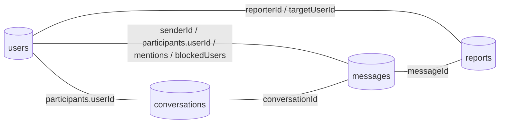
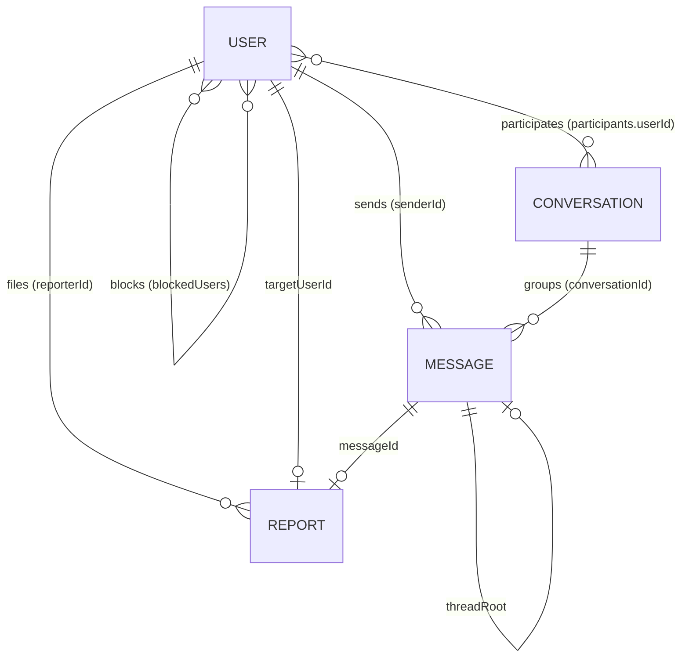
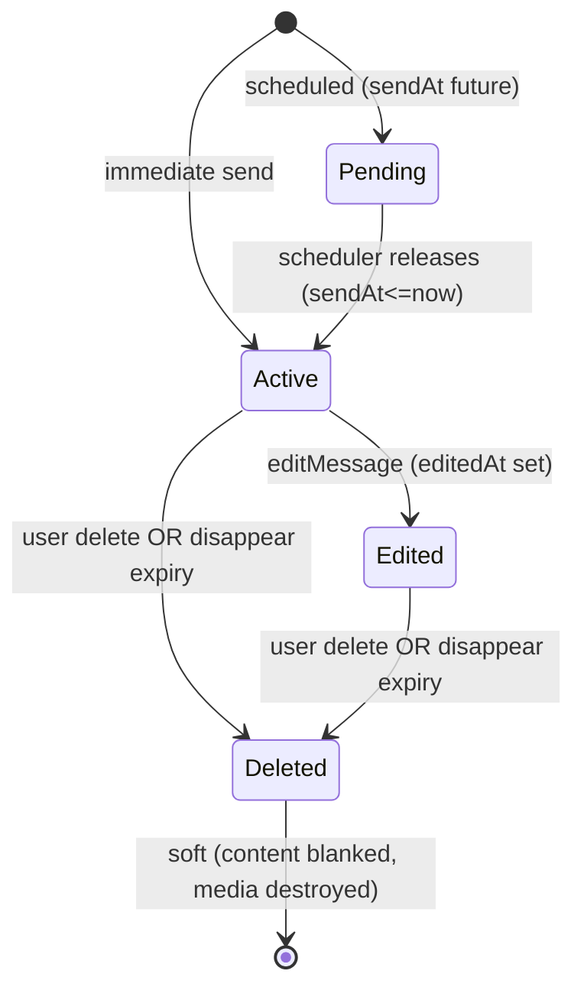

# 05 — Database

[← Back to index](./README.md) · Related: [System Design](./03-system-design.md) · [Backend](./04-backend.md) · [API Reference](./06-api-reference.md)

This document describes quickCHAT's data layer: the database choice and architecture, every collection's schema (field-by-field), entity relationships, the full indexing strategy and **why** each index exists, the migration approach, query-optimization techniques, and data-lifecycle rules.

---

## 1. Database architecture

quickCHAT uses **MongoDB** (a document database) via **Mongoose 8** (ODM). The connection is established once at boot in [`lib/db.js`](../server/lib/db.js):

```4:10:server/lib/db.js
export const connectDB = async () => {
    try {
        mongoose.connection.on('connected', () => console.log("Database connected"));
        await mongoose.connect(`${process.env.MONGODB_URI}/chat-app`)
    } catch (error) {
        console.log(error)
    }
}
```

The database name is fixed to **`chat-app`** (appended to `MONGODB_URI`). In production this is **MongoDB Atlas** (a managed replica set with backups). There are **four collections**:

| Collection | Model file | Purpose |
|------------|-----------|---------|
| `users` | `models/User.js` | Accounts, credentials, 2FA, social graph, push subs, presence |
| `conversations` | `models/Conversation.js` | Direct & group threads, participants, per-user prefs |
| `messages` | `models/message.js` | All message content + lifecycle + receipts |
| `reports` | `models/Report.js` | Trust & safety reports |

### Why a document database?

- **Messages and conversations are naturally documents** with embedded sub-arrays: a message embeds `reactions[]`, `readBy[]`, `deliveredTo[]`, `mentions[]`, `file`, `audio`, `preview`; a conversation embeds `participants[]` (each with its own prefs). Embedding avoids joins on the read-hot paths.
- **Flexible evolution**: the schema evolved (1:1 → conversations) without rigid migrations; the dual-key bridge (see below) coexists comfortably in a document model.
- **References where cardinality is unbounded**: messages reference `senderId`/`conversationId` (and optionally `receiverId`, `replyTo`, `threadRoot`) by `ObjectId` rather than embedding, because those relationships are one-to-many/unbounded.



---

## 2. Entity relationships



- A **User** sends many Messages, participates in many Conversations, and may block many Users.
- A **Conversation** has 2+ participant Users and groups many Messages.
- A **Message** belongs to one Conversation, has one sender, optionally one receiver (legacy direct), and may reference another Message via `replyTo`/`threadRoot`.
- A **Report** is filed by one User against a User or a Message.

---

## 3. Schema documentation (field-by-field)

### 3.1 `users` collection — `User`

| Field | Type | Default | Notes |
|-------|------|---------|-------|
| `email` | String | — | **required, unique**. Login identifier. |
| `fullName` | String | — | required. Display name. |
| `password` | String | — | required, `minlength:6`. **bcrypt hash** (never returned to clients). |
| `profilePic` | String | `""` | Cloudinary secure URL. |
| `profilePicPublicId` | String | `""` | `select:false`. Cloudinary id for deletion. |
| `profilePicResourceType` | String | `"image"` | `select:false`. |
| `bio` | String | — | Optional. |
| `lastSeen` | Date | `null` | Updated on last-socket disconnect. |
| `blockedUsers` | [ObjectId→User] | `[]` | Users this user has blocked. |
| `twoFactorEnabled` | Boolean | `false` | Whether TOTP 2FA is active. |
| `twoFactorSecret` | String | `""` | `select:false`. Active TOTP secret. |
| `twoFactorTempSecret` | String | `""` | `select:false`. Pending enrollment secret. |
| `twoFactorEnabledAt` | Date | `null` | When 2FA was enabled. |
| `pushSubscriptions` | [subdoc] | `[]` | `select:false`. Web Push subscriptions: `{endpoint, keys:{p256dh,auth}, expirationTime}`. |
| `createdAt`/`updatedAt` | Date | auto | `timestamps:true`. |

**Why `select:false` on secrets & push subs:** these must never leak in ordinary reads. They are only loaded with explicit `.select("+field")` where needed (2FA verification, push send). `sanitizeUser` in the controller strips them defensively too. See [Security](./09-security.md#data-protection).

### 3.2 `conversations` collection — `Conversation`

| Field | Type | Default | Notes |
|-------|------|---------|-------|
| `type` | String enum `direct\|group` | — | required. |
| `participants` | [participantSchema] | `[]` | **validated: length ≥ 2**. Embedded. |
| `name` | String | `""` | Group name. |
| `avatar` | String | `""` | Group avatar URL. |
| `createdBy` | ObjectId→User | `null` | Owner/creator. |
| `lastMessageAt` | Date | `null` | Drives sidebar sort. |
| `directKey` | String | `undefined` | **unique+sparse**. Only set for direct; `undefined` (not `null`) for groups to avoid sparse-unique collisions. |
| `createdAt`/`updatedAt` | Date | auto | `timestamps:true`. |

**`participantSchema` (embedded, `_id:false`):**

| Field | Type | Default | Notes |
|-------|------|---------|-------|
| `userId` | ObjectId→User | — | required. |
| `role` | String enum `member\|admin` | `member` | Group permissions. |
| `joinedAt` | Date | now | |
| `lastReadAt` | Date | `null` | Per-user read cursor (drives unseen logic). |
| `isPinned` | Boolean | `false` | Per-user pin. |
| `isArchived` | Boolean | `false` | Per-user archive. |
| `mutedUntil` | Date | `null` | Per-user mute expiry (suppresses push). |

**Why per-user prefs are embedded in the participant:** pin/archive/mute/lastRead are properties of *a membership*, not the conversation. Embedding keeps them atomic with the participant and avoids a separate join collection.

### 3.3 `messages` collection — `Message`

The richest schema. Grouped by concern.

**Identity & routing**

| Field | Type | Default | Notes |
|-------|------|---------|-------|
| `conversationId` | ObjectId→Conversation | `null` | `index:true`. Primary grouping key. |
| `senderId` | ObjectId→User | — | required. |
| `receiverId` | ObjectId→User | `null` | Legacy direct routing. |

**Content**

| Field | Type | Default | Notes |
|-------|------|---------|-------|
| `text` | String | `""` | Markdown-capable. |
| `image` | String | `""` | Cloudinary URL. |
| `imagePublicId` / `imageResourceType` | String | `""` | For deletion. |
| `file` | fileSchema | `null` | `{url,name,type,size,publicId,resourceType}`. |
| `audio` | audioSchema | `null` | `{url,duration,publicId,resourceType}`. |

**Relationships & enrichment**

| Field | Type | Default | Notes |
|-------|------|---------|-------|
| `replyTo` | ObjectId→Message | `null` | The replied-to message. |
| `threadRoot` | ObjectId→Message | `null` | Root of a thread. |
| `replyCount` | Number | `0` | Cached thread size (`min:0`). |
| `mentions` | [ObjectId→User] | `[]` | @-mentioned users. |
| `preview` | previewSchema | `null` | Link unfurl: `{url,title,description,image,siteName,status(pending\|ready\|failed),fetchedAt,error}`. |

**Timing / scheduling** {#scheduling-fields}

| Field | Type | Default | Notes |
|-------|------|---------|-------|
| `sendAt` | Date | `null` | Future release time (scheduled). |
| `releasedAt` | Date | `null` | When actually released. |
| `expiresAt` | Date | `null` | Computed disappear time. |
| `disappearAfterMs` | Number | `null` | TTL after release (`min:0`). |
| `scheduledStatus` | String enum `pending\|processing\|released` | `released` | Claim/lease state for the scheduler. |

**Engagement**

| Field | Type | Default | Notes |
|-------|------|---------|-------|
| `starredBy` | [ObjectId→User] | `[]` | Per-user stars. |
| `reactions` | [reactionSchema] | `[]` | `{userId, emoji}` (`_id:false`). |

**Lifecycle & receipts**

| Field | Type | Default | Notes |
|-------|------|---------|-------|
| `status` | String enum `sent\|delivered\|read` | `sent` | Coarse status (ticks). |
| `clientId` | String | `null` | Idempotency key for optimistic sends. |
| `readBy` | [readReceiptSchema] | `[]` | `{userId, readAt}`. Sender auto-added on create. |
| `deliveredTo` | [deliveredReceiptSchema] | `[]` | `{userId, deliveredAt}`. |
| `seen` | Boolean | `false` | Legacy 1:1 read flag. |
| `isDeleted` | Boolean | `false` | Soft delete. |
| `editedAt` | Date | `null` | Last edit time. |
| `createdAt`/`updatedAt` | Date | auto | `timestamps:true`. |

> **The dual-key bridge** (`conversationId` + `senderId/receiverId/seen`) is intentional transitional design — see [System Design §B.3](./03-system-design.md#b3-dual-model-legacy-bridge-important). New code keys on `conversationId`/`readBy`; legacy 1:1 paths still use `receiverId`/`seen`.

### 3.4 `reports` collection — `Report`

| Field | Type | Default | Notes |
|-------|------|---------|-------|
| `reporterId` | ObjectId→User | — | required, indexed. |
| `targetType` | enum `user\|message` | — | required. |
| `targetUserId` | ObjectId→User | `null` | The reported user (or the message's sender). |
| `messageId` | ObjectId→Message | `null` | Set for message reports. |
| `conversationId` | ObjectId→Conversation | `null` | Context. |
| `reason` | enum | — | `spam,harassment,hate,violence,impersonation,scam,self_harm,other`. |
| `details` | String | `""` | `maxlength:2000`. |
| `status` | enum `open\|reviewing\|resolved\|dismissed` | `open` | Moderation workflow. |
| `reviewedBy` / `reviewedAt` / `resolutionNote` | — | `null`/`""` | Moderator fields (no admin UI yet). |
| `createdAt`/`updatedAt` | Date | auto | `timestamps:true`. |

---

## 4. Indexing strategy {#indexing-strategy}

Indexes are chosen to make **every hot query an index scan**. Below, each index is mapped to the query it serves.

### 4.1 `messages` indexes

| Index | Serves |
|-------|--------|
| `{ text: "text" }` | Global full-text search (`searchMessagesGlobal`). |
| `{ senderId:1, receiverId:1, createdAt:-1 }` | Legacy direct history (sender→receiver). |
| `{ receiverId:1, senderId:1, createdAt:-1 }` | Legacy direct history (reverse direction). |
| `{ receiverId:1, seen:1 }` | Legacy unseen-count aggregation. |
| `{ senderId:1, clientId:1 }` (sparse) | Idempotency lookup for optimistic send retries. |
| `{ conversationId:1, createdAt:-1, _id:-1 }` | **Primary** conversation history + cursor pagination (with `_id` tie-breaker). |
| `{ conversationId:1, senderId:1, clientId:1 }` (sparse) | Conversation-scoped idempotency. |
| `{ conversationId:1, threadRoot:1, createdAt:1, _id:1 }` | Thread message retrieval in order. |
| `{ mentions:1, createdAt:-1 }` | "Messages that mention me" lookups. |
| `{ starredBy:1, createdAt:-1 }` | Starred-messages list. |
| `{ scheduledStatus:1, sendAt:1, _id:1 }` **partial** (`pending` + date) | Scheduler "find due scheduled" — index only covers pending rows. |
| `{ isDeleted:1, expiresAt:1, _id:1 }` **partial** (`!isDeleted` + date) | Scheduler "find due to expire" — index only covers live, expiring rows. |

**Why partial indexes for scheduling:** the vast majority of messages are neither scheduled nor disappearing. Partial indexes keep the index tiny (only rows matching the filter) so the scheduler's frequent polling is cheap and the index doesn't bloat write throughput.

**Why `_id` tie-breakers:** `createdAt` collisions (same millisecond) would make pagination skip/duplicate rows; adding `_id` yields a total order. See [System Design §C.2](./03-system-design.md#c2-cursor-pagination--jump-to-message-around-mode).

### 4.2 `conversations` indexes

| Index | Serves |
|-------|--------|
| `{ "participants.userId":1, lastMessageAt:-1 }` | "My conversations, newest first" (sidebar). |
| `{ type:1, lastMessageAt:-1 }` | Type-filtered listings/maintenance. |
| `{ directKey:1 }` (unique, sparse) | Direct-conversation dedupe + concurrency-safe get-or-create. |

### 4.3 `users` indexes

| Index | Serves |
|-------|--------|
| `email` unique (from schema) | Login/signup uniqueness. |
| `{ blockedUsers:1 }` | Block-state lookups. |

### 4.4 `reports` indexes

| Index | Serves |
|-------|--------|
| `{ reporterId:1, targetType:1, targetUserId:1, messageId:1, createdAt:-1 }` (named `reporter_target_lookup`) | "Reports I filed against X." |
| `{ status:1, createdAt:-1 }` | Moderation queue by status. |

---

## 5. Migration strategy

Migrations are **one-off Node scripts** in `server/scripts/`, run manually against the target database (they load `dotenv` and call `connectDB`).

### 5.1 `migrate-dm-to-conversations.js`

Backfills the conversation-centric model from legacy 1:1 messages:

1. **Create direct conversations** for every distinct sender/receiver pair (idempotent `findOneAndUpdate` upsert on `directKey`, `$max` on `lastMessageAt`).
2. **Attach `conversationId`** to legacy messages lacking one.
3. **Backfill `readBy`** from the legacy `seen` flag (`seen:true` + empty `readBy` → add the receiver as a reader).

It processes in batches (`BATCH_SIZE = 200`) and is safe to re-run (idempotent upserts + `$or` guards on already-migrated rows).

```15:31:server/scripts/migrate-dm-to-conversations.js
  return Conversation.findOneAndUpdate(
    { directKey },
    {
      $setOnInsert: { type: "direct", directKey, participants: [...], createdBy: userAId },
      $max: { lastMessageAt: lastMessageAt || null },
    },
    { upsert: true, new: true }
  );
```

### 5.2 `cleanup-group-direct-keys.js`

Removes a stray `directKey` from any `group` conversation (`$unset`). This repairs documents created before the "groups must not carry `directKey`" rule, which would otherwise risk sparse-unique collisions. Exposed as an npm script:

```9:9:server/package.json
    "cleanup:group-direct-keys": "node scripts/cleanup-group-direct-keys.js"
```

### 5.3 Recommended migration practice

- **Back up first** (Atlas snapshot).
- **Run against staging**, verify counts (the scripts print before/after counts), then production.
- Scripts are **idempotent** by design — re-running is safe.
- See [DevOps §Migrations](./10-devops-and-infrastructure.md) and [Maintenance §Upgrades](./13-maintenance-guide.md#upgrade-procedures).

---

## 6. Query optimization considerations {#query-optimization}

| Technique | Where | Benefit |
|-----------|-------|---------|
| **Compound indexes matching sort order** | conversation history `{conversationId,createdAt:-1,_id:-1}` | Index-only scan, no in-memory sort. |
| **Cursor (keyset) pagination** | `getMessages` (`before`/`around`) | Stable + O(log n) seeks vs O(n) offset skips. |
| **Aggregation for sidebar** | `getConversations` (`$group` latest + unseen counts) | Two queries instead of N+1 per conversation. |
| **`.lean()` reads** | list/aggregate/helper paths | Skips Mongoose document hydration → less CPU/memory. |
| **Field projection** | `.select(...)` everywhere | Smaller payloads; `select:false` for secrets/large arrays. |
| **Partial indexes** | scheduling/expiry | Tiny indexes, cheap polling. |
| **Sparse unique** | `directKey`, `clientId` | Uniqueness only where the field exists. |
| **Batch writes** | scheduler, migrations (`updateMany`, `bulkWrite`) | Fewer round-trips. |
| **`$addToSet`/`$pull`** | block list, push subs, reactions, readBy | Atomic array mutation without read-modify-write races. |

---

## 7. Data lifecycle management {#data-lifecycle}



| Concern | Policy |
|---------|--------|
| **Creation** | Immediate (`released`) or scheduled (`pending`); sender auto-added to `readBy`. |
| **Release** | Scheduler flips `pending → released`, sets `releasedAt`, computes `expiresAt`. |
| **Editing** | Text (and pending scheduled timing) editable; `editedAt` stamped. |
| **Deletion** | **Soft**: `isDeleted:true`, content blanked, Cloudinary asset destroyed by `public_id`. The row remains so threads/receipts stay consistent. |
| **Disappearing** | `expiresAt<=now` → scheduler soft-deletes + destroys media. |
| **Media** | Stored in Cloudinary; deleted via `destroyCloudinaryAsset` (tries image/video/raw). |
| **Avatars** | Replaced avatars are destroyed on profile update. |
| **Push subs** | Stale (404/410) subscriptions pruned on send. |
| **Presence** | `lastSeen` updated on last disconnect (no historical log retained). |
| **Reports** | Retained with moderation status; no automatic purge. |
| **Backups/durability** | Provided by MongoDB Atlas (snapshots, replica set). |

> There is currently **no TTL index** for hard-deleting soft-deleted/expired messages; they are blanked but retained. A TTL index on `expiresAt` (or a periodic purge) is a future optimization — see [Maintenance §Future improvements](./13-maintenance-guide.md#future-improvement-opportunities).

---

## 8. Where to go next

- How controllers query these collections: [Backend Reference](./04-backend.md).
- The HTTP shapes returned from these documents: [API Reference](./06-api-reference.md).
- The reasoning behind the schema design: [System Design](./03-system-design.md).
