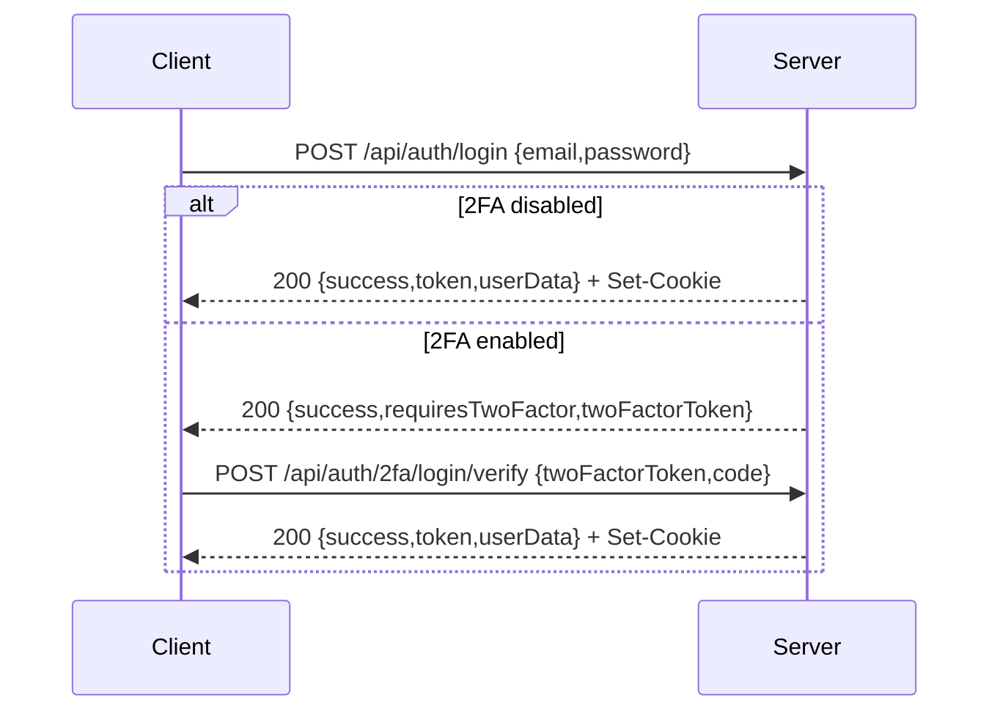
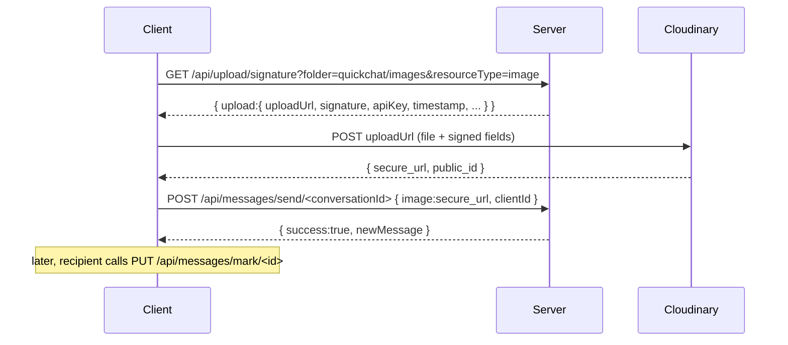

# 06 — API Reference

[← Back to index](./README.md) · Related: [Backend](./04-backend.md) · [Database](./05-database.md) · [Security](./09-security.md) · [Real-Time & Calling](./08-realtime-and-calls.md)

This is the complete REST API reference. For the realtime (Socket.IO) protocol, see [Real-Time & Calling](./08-realtime-and-calls.md).

---

## 1. Conventions

- **Base URL:** the backend origin (e.g. `http://localhost:5000` in dev, the Vercel URL in prod). All routes are prefixed with `/api`.
- **Content type:** `application/json` for request/response bodies (the JSON body limit is **8 MB** to accommodate base64 avatars).
- **Response envelope:** almost every endpoint returns `{ "success": boolean, ... }`. On failure: `{ "success": false, "message": string }` (sometimes with a `code`).
- **HTTP status convention (important):** most **domain/validation failures return HTTP `200` with `success:false`** (the client branches on `data.success`, not the status). True transport-level failures use real codes: `401` (auth), `429` (rate limit), `503` (calling disabled/unconfigured). This convention is discussed in [Error codes](#error-codes).
- **IDs** are MongoDB `ObjectId` strings (24 hex chars).

---

## 2. Authentication & authorization {#auth}

quickCHAT uses **JWT**. After signup/login the server:
1. sets an **HTTP-only cookie** `quickchat_token` (7-day expiry), and
2. returns the same JWT in the response body (`token`) so the client can also set it on the `axios` default header and the Socket.IO handshake.

A request is authenticated if it presents the token by **any** of (checked in this order):
1. Cookie `quickchat_token`
2. Header `token: <jwt>`
3. Header `Authorization: Bearer <jwt>`

Protected routes run `protectRoute`, which verifies the JWT and loads `req.user`. Missing/invalid tokens → **HTTP 401**. See [Security §Authentication](./09-security.md#authentication).



---

## 3. Rate limits

See [Backend §Rate limiting](./04-backend.md#rate-limiting) for the full table. Summary of limited routes:

| Route family | Window / default max |
|--------------|----------------------|
| Auth (signup/login/2fa-login) | 15 min / 20 |
| 2FA actions (setup/enable/disable) | 15 min / 30 |
| Message send + forward | 1 min / 45 |
| Link unfurl | 1 min / 25 |
| Block/unblock | 1 hr / 80 |
| Reports | 1 hr / 40 |
| Call ICE config | 1 min / 30 |

Exceeding a limit returns **HTTP 429** `{success:false, message}`.

---

## 4. Endpoints

Legend: 🔒 = requires authentication.

### 4.1 Auth & account — `/api/auth`

#### `POST /api/auth/signup`
Create an account. Rate-limited (auth).

Request:
```json
{ "fullName": "Ada Lovelace", "email": "ada@example.com", "password": "secret123", "bio": "Hello" }
```
Response `200`:
```json
{ "success": true, "userData": { "_id": "...", "fullName": "Ada Lovelace", "email": "ada@example.com", "bio": "Hello", "profilePic": "" }, "token": "<jwt>", "message": "Account created successfully" }
```
Validation: all four fields required; `email` must be unique; `password` ≥ 6 chars. Sets `quickchat_token` cookie.

#### `POST /api/auth/login`
Authenticate. Rate-limited (auth).
Request: `{ "email": "...", "password": "..." }`
Response (no 2FA): `{ success, userData, token, message }` + cookie.
Response (2FA on): `{ success:true, requiresTwoFactor:true, twoFactorToken, message }` — **no session yet**.

#### `POST /api/auth/2fa/login/verify`
Complete a 2FA login. Rate-limited (auth).
Request: `{ "twoFactorToken": "<from login>", "code": "123456" }`
Response: `{ success, userData, token, message }` + cookie. `code` must be 6 digits and valid; `twoFactorToken` must be unexpired.

#### `POST /api/auth/logout`
Clear the auth cookie. Response: `{ success:true, message }`.

#### `GET /api/auth/check` 🔒
Return the current session user. Response: `{ success:true, user }`. Used on app boot to restore session.

#### `PUT /api/auth/update-profile` 🔒
Update profile. Request: `{ fullName, bio, profilePic? }` where `profilePic` is a base64 data URL (uploaded to Cloudinary; previous avatar destroyed). Response: `{ success:true, user }`.

#### `POST /api/auth/2fa/setup` 🔒
Begin TOTP enrollment. Rate-limited (2FA). Response:
```json
{ "success": true, "message": "...", "setup": { "issuer": "quickCHAT", "accountName": "ada@example.com", "manualEntryKey": "BASE32SECRET", "otpauthUrl": "otpauth://totp/...", "qrCodeDataUrl": "data:image/png;base64,..." } }
```

#### `POST /api/auth/2fa/enable` 🔒
Confirm enrollment. Rate-limited (2FA). Request: `{ "code": "123456" }`. Response: `{ success:true, user, message }`.

#### `POST /api/auth/2fa/disable` 🔒
Disable 2FA. Rate-limited (2FA). Request: `{ "code": "123456" }`. Response: `{ success:true, user, message }`.

#### `GET /api/auth/blocked-users` 🔒
List blocked users. Response: `{ success:true, blockedUserIds:[...], blockedUsers:[{_id,fullName,profilePic,bio,lastSeen}] }`.

#### `POST /api/auth/block/:id` 🔒  /  `DELETE /api/auth/block/:id` 🔒
Block / unblock user `:id`. Rate-limited (block). Response: `{ success:true, message, blockedUserIds, blockedUsers }`. Cannot block self; target must exist.

### 4.2 Conversations — `/api/conversations`

#### `GET /api/conversations` 🔒
List the caller's conversations with last-message preview, unseen counts, and direct block state. Response:
```json
{ "success": true, "conversations": [ { "_id":"...", "type":"direct", "participants":[...], "lastMessage":{...}, "unseenCount":2, "isPinned":false, "isArchived":false, "mutedUntil":null, "blockState":{...} } ], "unseenMessages": { "<conversationId>": 2 } }
```

#### `GET /api/conversations/contacts` 🔒
All other users (for "new chat"/group picker) with block flags. Response: `{ success:true, contacts:[{_id,fullName,profilePic,bio,lastSeen,isBlocked,blockedByMe,blockedByOther}] }`.

#### `GET /api/conversations/:id` 🔒
One conversation summary (caller must be a participant). Response: `{ success:true, conversation }`.

#### `POST /api/conversations/direct/:id` 🔒
Get-or-create a 1:1 conversation with user `:id`. Response: `{ success:true, conversation }`. Cannot target self.

#### `POST /api/conversations/group` 🔒
Create a group. Request: `{ "name":"Team", "avatar":"", "participantIds":["id1","id2"] }` (≥ 2 participants incl. others). Creator becomes `admin`. Response: `{ success:true, conversation }`. Emits `conversationCreated`.

#### `PATCH /api/conversations/:id` 🔒
Update group `name`/`avatar` (admin). Response: `{ success:true, conversation }`.

#### `PATCH /api/conversations/:id/preferences` 🔒
Update the caller's per-conversation prefs. Request (any subset): `{ "isPinned":true, "isArchived":false, "mutedUntil":"2026-01-01T00:00:00.000Z" }`. Response: `{ success:true, conversation }` (or preference payload).

#### `POST /api/conversations/:id/members` 🔒
Admin-only add members. Request: `{ "participantIds":["..."] }`. Response: `{ success:true, conversation }`.

#### `DELETE /api/conversations/:id/members/:userId` 🔒
Admin-only remove member. Response: `{ success:true, conversation }`.

#### `POST /api/conversations/:id/leave` 🔒
Leave a group. Response: `{ success:true }`.

#### Conversation-first message aliases 🔒
- `GET /api/conversations/:id/messages` → same as `getMessages`.
- `GET /api/conversations/:id/search` → in-conversation search.
- `POST /api/conversations/:id/messages` → send (rate-limited).

### 4.3 Messages — `/api/messages`

> `:id` accepts **either** a `conversationId` **or** a peer `userId` (legacy). For a userId, the direct conversation is auto-created.

#### `GET /api/messages/:id` 🔒  (aliases: `/conversation/:id`)
Fetch messages with pagination. Query params:

| Param | Type | Meaning |
|-------|------|---------|
| `limit` | number | Page size (clamped). |
| `before` | cursor | Load older than this cursor (keyset). |
| `aroundMessageId` | ObjectId | "Jump to message": returns a window centered on this id. |

Response:
```json
{ "success": true, "messages": [ ... ], "hasMore": true, "nextCursor": "<cursor>", "markedReadMessageIds": ["..."], "conversationId": "...", "conversationType": "direct", "anchorMessageId": null }
```
Side effect: on the latest page, unread messages for the caller are marked read (and senders are notified via socket).

#### `POST /api/messages/send/:id` 🔒  (aliases: `/conversation/:id/send`)
Send a message. Rate-limited (send). Request (all fields optional except some content):
```json
{
  "text": "Hello **world** https://example.com",
  "image": "data:image/png;base64,...",
  "file": { "url":"...", "name":"a.pdf", "type":"application/pdf", "size":12345, "publicId":"...", "resourceType":"raw" },
  "audio": { "url":"...", "duration":12, "publicId":"...", "resourceType":"video" },
  "replyTo": "<messageId>",
  "threadRoot": "<messageId>",
  "mentions": ["<userId>"],
  "clientId": "client-uuid-for-idempotency",
  "sendAt": "2026-07-01T10:00:00.000Z",
  "disappearAfterMs": 30000
}
```
Rules:
- Must have at least text or one attachment.
- If `clientId` matches an existing message → returns that message (idempotent, no duplicate).
- If direct & blocked → `{ success:false, code:"DIRECT_CHAT_BLOCKED", message, blockState }`.
- If `sendAt` is in the future → message stored as `pending` (returned with scheduled status); released later by the scheduler.
- Media `image` can be a base64 string (server uploads) or already-uploaded `file`/`audio` objects (from signed direct upload).

Response: `{ success:true, newMessage:{...} }`.

#### `PUT /api/messages/mark/:id` 🔒
Mark a single message read. Adds `readBy` receipt; for direct sets `seen`/`status:read`; updates `lastReadAt`; emits `messagesSeen`. Response: `{ success:true }` (or `{success:true, skipped:true}` for a still-pending message).

#### `PUT /api/messages/edit/:id` 🔒
Edit message `text` and/or pending-scheduled timing (`sendAt`, `disappearAfterMs`). Only the sender may edit. Sets `editedAt`; emits `messageUpdated`. Response: `{ success:true, message }`.

#### `DELETE /api/messages/:id` 🔒
Soft-delete (sender only). Blanks content, destroys media, emits `messageDeleted`. Response: `{ success:true }`.

#### `POST /api/messages/react/:id` 🔒
Toggle the caller's emoji reaction. Request: `{ "emoji":"👍" }`. Emits `messageReaction`. Response: `{ success:true, reactions:[...] }`.

#### `POST /api/messages/star/:id` 🔒
Toggle star for the caller. Response: `{ success:true, starred:boolean }`.

#### `GET /api/messages/starred` 🔒
List the caller's starred messages. Response: `{ success:true, messages:[...] }`.

#### `POST /api/messages/forward/:id` 🔒
Forward a message to one or more targets. Rate-limited (send). Request: `{ "targetConversationIds":["..."], "targetUserIds":["..."] }`. Response: `{ success:true, results:[...] }`.

#### `GET /api/messages/thread/:id` 🔒
Fetch messages in a thread rooted at `:id`. Response: `{ success:true, messages:[...] }`.

#### `GET /api/messages/search/:id` 🔒  (alias: `/conversation/:id/search`)
Search within one conversation. Query: `?q=term`. Response: `{ success:true, messages:[...] }`.

#### `GET /api/messages/search` 🔒
Global search across the caller's conversations (text index). Query: `?q=term`. Response: `{ success:true, results:[...] }`.

#### `GET /api/messages/unfurl` 🔒
On-demand link preview. Rate-limited (unfurl). Query: `?url=https://...`. Response: `{ success:true, preview:{ url,title,description,image,siteName } }`. SSRF-guarded — see [Security](./09-security.md#threat-mitigation).

#### `GET /api/messages/users` 🔒
Legacy sidebar: users + unseen counts + block state. Response: `{ success:true, users:[...], unseenMessages:{...} }`.

### 4.4 Upload — `/api/upload`

#### `GET /api/upload/signature` 🔒
Mint a Cloudinary direct-upload signature. Query: `?folder=quickchat/images&resourceType=image` (folder allowlist: `quickchat/{images,files,audio,avatars}`; resourceType: `image|video|raw|auto`). Response:
```json
{ "success": true, "upload": { "uploadUrl":"https://api.cloudinary.com/v1_1/<cloud>/<type>/upload", "apiKey":"...", "timestamp":1710000000, "signature":"...", "folder":"quickchat/images", "cloudName":"...", "resourceType":"image" } }
```
The browser then POSTs the file bytes directly to `uploadUrl` with these fields. See [Architecture §7.3](./02-architecture.md#73-media-upload-direct-signed).

### 4.5 Push — `/api/push`

#### `GET /api/push/vapid-public-key`
Public VAPID key (no auth). Response: `{ success:true, publicKey }` or `{ success:false, message }` if push unconfigured.

#### `POST /api/push/subscribe` 🔒
Register a Web Push subscription. Request: `{ "subscription": { "endpoint":"...", "keys":{ "p256dh":"...", "auth":"..." }, "expirationTime":null } }` (the raw subscription is also accepted at the top level). Deduped by endpoint. Response: `{ success:true }`.

#### `DELETE /api/push/subscribe` 🔒
Remove a subscription. Request: `{ "endpoint":"..." }` (or `{ subscription:{endpoint} }`). Response: `{ success:true }`.

### 4.6 Reports — `/api/reports`

#### `POST /api/reports` 🔒
File a report. Rate-limited (report). Request:
```json
{ "targetType": "message", "messageId": "<id>", "reason": "harassment", "details": "..." }
```
or
```json
{ "targetType": "user", "targetUserId": "<id>", "reason": "spam", "details": "..." }
```
`reason` ∈ `spam,harassment,hate,violence,impersonation,scam,self_harm,other`; `details` ≤ 2000 chars. Cannot report self; for messages the reporter must be a participant/sender/receiver. Response: `{ success:true, message:"Report submitted", report:{...} }`.

### 4.7 Calls — `/api/calls`

#### `GET /api/calls/ice-servers` 🔒
ICE servers for WebRTC. Rate-limited (call ICE). Responses:
- Calls disabled → `503 { success:false, code:"CALLS_DISABLED" }`.
- TURN unconfigured or lookup failed → `200 { success:true, degraded:true, provider:"fallback-stun", iceServers:[...], ttlSeconds }`.
- Normal → `200 { success:true, degraded:false, provider:"twilio-turn", iceServers:[...], ttlSeconds }`.

#### `GET /api/calls/telemetry` 🔒
Calling stats snapshot. Response: `{ success:true, callsEnabled:boolean, stats:{...} }`.

### 4.8 Status

#### `GET /api/status`
Liveness probe. Returns `"Server is live"` (plain text).

---

## 5. Error codes {#error-codes}

| Situation | HTTP | Body |
|-----------|------|------|
| Validation/domain failure | `200` | `{ success:false, message }` (sometimes `code`) |
| Not authenticated / bad token | `401` | `{ success:false, message }` |
| Rate limit exceeded | `429` | `{ success:false, message }` |
| Calling disabled/unconfigured | `503` | `{ success:false, code:"CALLS_DISABLED" }` (ICE) |
| Direct chat blocked | `200` | `{ success:false, code:"DIRECT_CHAT_BLOCKED", blockState }` |

Application-specific `code` values seen in responses: `DIRECT_CHAT_BLOCKED`, `CALLS_DISABLED`. Call-signaling (socket) error codes are in [Real-Time & Calling](./08-realtime-and-calls.md): `INVALID_PAYLOAD`, `NOT_AUTHORIZED`, `NOT_DIRECT`, `BLOCKED`, `INVALID_CALL`, `RATE_LIMITED`.

> **Client guidance:** always branch on `data.success` first, then on `data.code` for special handling (e.g. show the 2FA step, show "blocked"), and treat `401` as "clear credentials and go to login". The frontend's `getErrorMessage` centralizes this.

---

## 6. End-to-end API flow examples

### 6.1 Send an image message (signed upload + send + receipts)



> Note: the `image` field also accepts a base64 string (server-side upload). The signed-upload path is preferred for large files.

### 6.2 Group creation + first message

```text
POST /api/conversations/group { name, participantIds }      → { conversation }
POST /api/conversations/<id>/messages { text, clientId }    → { newMessage }   (emits newMessage to room)
GET  /api/conversations/<id>/messages?limit=30              → { messages, hasMore, nextCursor }
```

### 6.3 Two-factor login

```text
POST /api/auth/login { email, password }                    → { requiresTwoFactor, twoFactorToken }
POST /api/auth/2fa/login/verify { twoFactorToken, code }    → { token, userData } + cookie
```

---

## 7. Where to go next

- The realtime protocol (events + payloads): [Real-Time & Calling](./08-realtime-and-calls.md).
- How the client consumes these endpoints: [Frontend Reference](./07-frontend.md).
- Security details behind auth/validation: [Security](./09-security.md).
