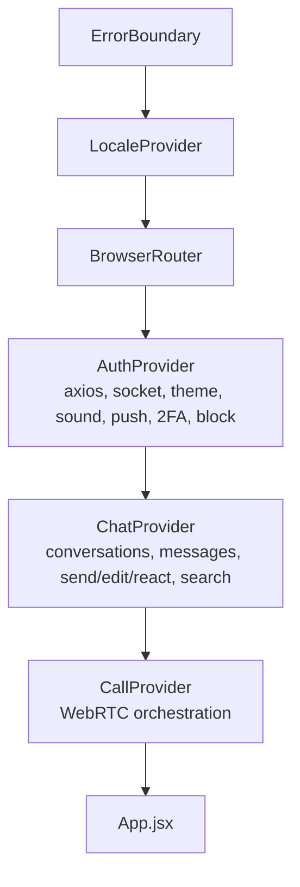
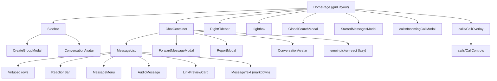
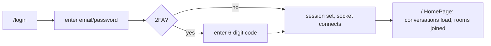
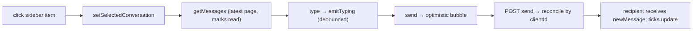
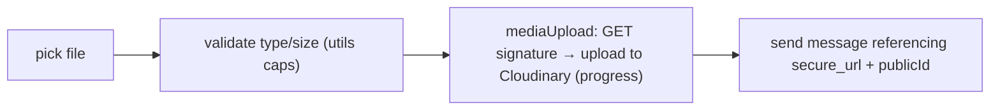
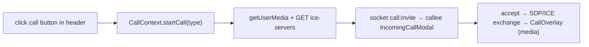

# 07 — Frontend Reference

[← Back to index](./README.md) · Related: [Architecture](./02-architecture.md) · [API Reference](./06-api-reference.md) · [Real-Time & Calling](./08-realtime-and-calls.md)

This document explains the React client (`client/`): the UI architecture, state management (the four React contexts), routing, the component hierarchy, the styling/design system, internationalization, the service worker / PWA, and the principal user flows. It assumes no prior knowledge.

---

## 1. Tech stack & tooling

| Tool | Version | Role |
|------|---------|------|
| **React** | 19 | UI library (function components + hooks). |
| **Vite** | 7 | Dev server + build (`@vitejs/plugin-react`). |
| **React Router** | 7 | Client-side routing. |
| **Tailwind CSS** | 4 | Utility-first styling via `@tailwindcss/vite` + a tokenized theme in `index.css`. |
| **axios** | 1 | HTTP client (configured with base URL + auth header). |
| **socket.io-client** | 4 | Realtime transport. |
| **react-hot-toast** | 2 | Toast notifications. |
| **react-markdown** + **remark-gfm** + **rehype-sanitize** | — | Safe markdown rendering in messages. |
| **react-virtuoso** | 4 | Virtualized message list. |
| **emoji-picker-react** | 4 | Emoji picker (lazy-loaded). |
| **ESLint** | 9 | Linting (`eslint.config.js`). |

`package.json` scripts: `dev` (Vite dev server), `build` (production build), `preview` (serve build), `lint` (ESLint). `vite.config.js` is minimal — just the React + Tailwind plugins.

---

## 2. Bootstrap & provider tree

The app boots in [`src/main.jsx`](../client/src/main.jsx), which mounts a **nested provider tree** and registers the service worker:

```12:28:client/src/main.jsx
createRoot(document.getElementById("root")).render(
  <ErrorBoundary>
    <LocaleProvider>
      <BrowserRouter>
        <AuthProvider>
          <ChatProvider>
            <CallProvider>
              <App />
            </CallProvider>
          </ChatProvider>
        </AuthProvider>
      </BrowserRouter>
    </LocaleProvider>
  </ErrorBoundary>
);

void registerServiceWorker();
```

**Why this order:**
- `ErrorBoundary` is outermost so it can catch any render error anywhere below.
- `LocaleProvider` next so even the router/auth UI can be translated and direction-aware.
- `BrowserRouter` before auth so navigation is available.
- `AuthProvider` owns the socket + axios; `ChatProvider` consumes the socket; `CallProvider` consumes both auth and chat → strict dependency order.



---

## 3. Routing structure

[`src/App.jsx`](../client/src/App.jsx) defines routes with **lazy-loaded pages** (route-level code splitting) and an **auth gate**:

| Path | Component | Guard |
|------|-----------|-------|
| `/` | `HomePage` | requires `authUser`, else redirect `/login` |
| `/login` | `LoginPage` | redirect to `/` if already authed |
| `/profile` | `ProfilePage` | requires `authUser` |
| `*` | redirect to `/` | — |

App-level chrome rendered around routes:
- **Ambient background** layers (`app-ambient`, `app-texture`).
- A **connection-status banner** shown when authed but the socket is `connecting`/`reconnecting`.
- The global **`<Toaster>`** (theme- and RTL-aware).
- An **`AppSplash`** during `isAuthLoading` (session restore) and as the `Suspense` fallback.

> **Why lazy routes:** a logged-out user only downloads the login screen, not the entire chat workspace + emoji picker. See `App.jsx` comment.

---

## 4. State management — the four contexts

quickCHAT uses **React Context** as its state-management layer (no Redux). Each context is a cohesive domain store exposing state + actions. Components read them with `useContext`/custom hooks.

### 4.1 `AuthContext` ([`context/AuthContext.jsx`](../client/context/AuthContext.jsx))

The session + connectivity + device-preferences hub. It owns the **axios instance** and the **Socket.IO connection**.

**Exposed value (selected):**

| Key | Type | Purpose |
|-----|------|---------|
| `axios` | instance | Pre-configured HTTP client (base URL + auth header). |
| `token` / `setToken` | string | JWT (mirrored to `localStorage`). |
| `authUser` / `setAuthUser` | object | Current user. |
| `socket` / `setSocket` | Socket | Live Socket.IO connection. |
| `onlineUsers` | string[] | Online user ids (from `getOnlineUsers`). |
| `connectionStatus` | `connected\|connecting\|disconnected` | Drives the banner. |
| `isAuthLoading` | boolean | Session-restore in progress. |
| `theme` / `toggleTheme` | `dark\|light` | Theme (persisted, sets `data-theme`). |
| `soundEnabled` / `toggleSound`, `playSendCue`, `playReceiveCue` | — | Sound cues. |
| `notificationPermission` / `requestNotificationPermission` | — | Browser notifications + push sync. |
| `showNotification` | fn | Show a notification when tab hidden. |
| `login`, `verifyTwoFactorLogin`, `logout`, `updateProfile` | fns | Auth flows. |
| `beginTwoFactorSetup`, `enableTwoFactor`, `disableTwoFactor` | fns | 2FA. |
| `blockedUsers`, `blockedUserIds`, `blockUser`, `unblockUser`, `fetchBlockedUsers` | — | Block graph. |
| `registerCallTeardownHandler` | fn | Lets `CallContext` hook into logout. |

**Socket lifecycle** (`connectSocket`): on login/session-restore it creates `io(backendUrl, { auth:{token}, reconnection:true, reconnectionAttempts:8, reconnectionDelay:800 })`, wires `connect`/`disconnect`/`connect_error`/`getOnlineUsers`, and on a `"not authorized"` connect error it **clears the stale token** and forces re-login.

```311:342:client/context/AuthContext.jsx
        const newSocket = io(backendUrl, {
          auth: { token: socketToken },
          transports: getSocketTransports(backendUrl),
          reconnection: true,
          reconnectionAttempts: 8,
          reconnectionDelay: 800,
        });
        ...
        newSocket.on("connect_error", (error) => {
          setConnectionStatus("disconnected");
          const errorMessage = String(error?.message || "").toLowerCase();
          if (errorMessage.includes("not authorized")) {
            localStorage.removeItem("token");
            setToken(null);
          }
        });
```

### 4.2 `ChatContext` ([`context/ChatContext.jsx`](../client/context/ChatContext.jsx))

The largest store — all conversation/message state and actions, plus **all inbound socket subscriptions**.

**State (selected):** `conversations`, `messages`, `selectedConversation`, `selectedConversationBlockState`, `contacts`, `users`, `unseenMessages`, `typingUsers`, `replyTo`, loading flags (`usersLoading`, `messagesLoading`, `loadingOlderMessages`, `hasMoreMessages`), and jump targets for "open at message".

**Actions (selected):**

| Group | Functions |
|-------|-----------|
| Loading | `getConversations`, `getContacts`, `getUsers`, `getMessages`, `loadOlderMessages`, `openConversationAtMessage` |
| Sending | `sendMessage` (optimistic), `retryMessage`, `discardFailedMessage` |
| Mutating | `editMessage`, `deleteMessage`, `reactToMessage`, `toggleStarMessage`, `forwardMessage` |
| Search | `searchMessages`, `globalSearch`, `getStarredMessages`, `getThreadMessages` |
| Conversations | `createOrOpenDirectConversation`, `createGroupConversation`, `addGroupMembers`, `removeGroupMember`, `leaveConversation`, `updateConversationPreferences` |
| Safety | `blockUser`, `unblockUser`, `reportUser`, `reportMessage` |
| Realtime | `emitTyping`, `emitStopTyping` |

**Inbound socket subscriptions** (`subscribeToMessages` registers, returns a cleanup that `off`s them all):

```text
newMessage · typing · stopTyping · messagesSeen · messageDelivered ·
messageUpdated · messageDeleted · messageReaction · messageStarred ·
mentionedInMessage · conversationCreated · conversationUpdated · userPresenceUpdated
```

Each handler patches local state immutably (e.g. `newMessage` appends to the open conversation or bumps an unseen count; `messageDelivered` flips optimistic `sent → delivered`; `userPresenceUpdated` patches `lastSeen`). Subscriptions are re-bound whenever the `socket` changes.

> **Optimistic send** lives here: `sendMessage` inserts a temp message (`clientId`, `status:"sending"`), POSTs, and reconciles the server message by `clientId`; on error it marks `failed` and surfaces `retryMessage`/`discardFailedMessage`. See [System Design §C.1](./03-system-design.md#c1-optimistic-send--reconciliation--retry).

### 4.3 `CallContext` ([`context/CallContext.jsx`](../client/context/CallContext.jsx))

WebRTC orchestration. Exposes `callsEnabled`, `callState` (phase machine), `localStream`, `remoteStream`, `isMuted`, `isCameraEnabled`, `hasActiveCall`, `isIncoming`, `canToggleCamera`, and actions `startCall`, `acceptIncomingCall`, `rejectIncomingCall`, `endCall`, `toggleMute`, `toggleCamera`. It consumes the socket from `AuthContext`, fetches ICE servers from the API, and manages the `RTCPeerConnection`. Detailed in [Real-Time & Calling](./08-realtime-and-calls.md).

### 4.4 `LocaleContext` ([`context/LocaleContext.jsx`](../client/context/LocaleContext.jsx))

i18n. Exposes `locale`, `direction`, `isRtl`, `setLocale`, `toggleLocale`, `t(key, params)`, `localeOptions`. Applying a locale sets `<html dir>` and `lang`. See [Internationalization](#internationalization).

---

## 5. Component hierarchy



### Page/component responsibilities

| Component | File | Responsibility |
|-----------|------|----------------|
| `HomePage` | `pages/HomePage.jsx` | Responsive 1–3 column grid (Sidebar / Chat / RightSidebar); hosts modals, lightbox, and call UI; manages lightbox + modal open state. |
| `LoginPage` | `pages/LoginPage.jsx` | Sign up / log in / 2FA challenge UI. |
| `ProfilePage` | `pages/ProfilePage.jsx` | Edit name/bio/avatar; enroll/disable 2FA (QR + code). |
| `Sidebar` | `components/Sidebar.jsx` | Conversation list (filtered/searched, pinned/archived/muted), presence, unseen counts, "new chat"/group creation, settings menu (theme/sound/notifications/logout). |
| `ChatContainer` | `components/ChatContainer.jsx` | The conversation pane: header (peer/group, call buttons), composer (text, mentions autocomplete, attachments, scheduling, disappearing presets, emoji), reply bar; orchestrates send/edit/forward/report. |
| `MessageList` | `components/MessageList.jsx` | Virtualized message rendering (Virtuoso), date dividers, scheduled/disappearing badges, reply snippets, reaction grouping, "load older". |
| `RightSidebar` | `components/RightSidebar.jsx` | Conversation details: shared media, members, actions. |
| `MessageMenu` | `components/MessageMenu.jsx` | Per-message actions (reply, edit, delete, star, forward, react, report, copy). |
| `ReactionBar` | `components/ReactionBar.jsx` | Quick-react emoji row + reaction chips. |
| `AudioMessage` | `components/AudioMessage.jsx` | Voice-note player. |
| `LinkPreviewCard` | `components/LinkPreviewCard.jsx` | Renders message `preview` unfurl data. |
| `MessageText` | `lib/messageText.jsx` | Sanitized markdown + search-term highlight + safe links. |
| `ConversationAvatar` | `components/ConversationAvatar.jsx` | Avatar with presence dot / group icon. |
| `CreateGroupModal` | `components/CreateGroupModal.jsx` | Group creation (name + member picker). |
| `ForwardMessageModal` | `components/ForwardMessageModal.jsx` | Pick targets to forward to. |
| `GlobalSearchModal` | `components/GlobalSearchModal.jsx` | Cross-conversation search UI. |
| `StarredMessagesModal` | `components/StarredMessagesModal.jsx` | Starred-message list. |
| `ReportModal` | `components/ReportModal.jsx` | Report a user/message (reason + details). |
| `Lightbox` | `components/Lightbox.jsx` | Full-screen media viewer with navigation. |
| `AppSplash` | `components/AppSplash.jsx` | Branded loading screen. |
| `ErrorBoundary` | `components/ErrorBoundary.jsx` | Class component; catches render errors, offers reload. |
| `calls/CallOverlay` | `components/calls/CallOverlay.jsx` | Active-call UI (video tiles, duration). |
| `calls/CallControls` | `components/calls/CallControls.jsx` | Mute/camera/hang-up buttons. |
| `calls/IncomingCallModal` | `components/calls/IncomingCallModal.jsx` | Ringing/accept/reject UI. |

### Client libraries (`src/lib/`)

| File | Purpose |
|------|---------|
| `conversations.js` | Normalize conversations; derive title/avatar/peer/preview, block state, sort, expiry/pending helpers. |
| `utils.js` | Time/date/file-size formatting, `getErrorMessage`, client-id generation, upload size caps. |
| `messageText.jsx` | Markdown renderer (sanitized, highlight, safe-href). |
| `messageTextPreview.js` | Strip markdown for plain previews. |
| `mediaUpload.js` | Direct signed Cloudinary upload with progress. |
| `pushNotifications.js` | Register service worker; subscribe/unsubscribe Web Push. |
| `sound.js` | Web Audio cues for send/receive. |
| `webrtc/callSession.js` | `RTCPeerConnection` management (offer/answer/ICE). |
| `webrtc/mediaDevices.js` | `getUserMedia` access. |
| `webrtc/callContract.js` | Client mirror of call constants. |

### Hooks (`src/hooks/`)

`useKeyboardShortcuts.js` — global keyboard shortcuts (e.g. search, navigation).

---

## 6. Styling system {#styling-system}

quickCHAT uses **Tailwind CSS v4** with a **design-token theme** defined in [`src/index.css`](../client/src/index.css) via `@theme` and CSS custom properties.

- **Tokens**: brand palette (`--color-brand-*`), surfaces (`--color-surface-*`), glass colors, borders, semantic `--color-success`/`--color-danger`, shadows, gradients, easing/duration, and animation keyframes (`fade-in`, `slide-up`, `message-in`, `typing-bounce`, `pulse-ring`, `shimmer`).
- **Theming**: `:root` defines dark defaults; `:root[data-theme="light"]` overrides them. `AuthContext.toggleTheme` flips `data-theme`. Everything is variable-driven, so the whole UI re-themes instantly.
- **Component classes** (`@layer components`): `glass-panel`, `glass-subtle`, `btn-gradient`, `icon-btn`, `menu-surface`, `field-shell`/`field-input`, `message-md*` (markdown), `skeleton`, `chat-column` (centers conversation on ultra-wide), and message-action hover/touch behaviors.
- **Accessibility & polish**: `prefers-reduced-motion` collapses animations; `:focus-visible` outlines; coarse-pointer inputs pinned to 16px to prevent iOS zoom; tap-highlight removed; media `max-width:100%` safety net.

**Why tokens + glassmorphism:** a single source of truth for color/spacing/motion makes consistent theming and dark/light parity trivial, and the glass aesthetic is achieved with reusable utility classes rather than ad-hoc styles.

---

## 7. Internationalization {#internationalization}

- **Runtime** (`src/i18n/runtime.js`): loads locale JSON (`src/i18n/locales/<locale>/common.json`), resolves dotted keys, interpolates `{params}`, formats localized numbers, and reports text direction.
- **Locale metadata** (`src/i18n/localeMeta.js`): supported locales — **English (`en`, LTR)** and **Arabic (`ar`, RTL)** — with labels and direction.
- **Context**: `LocaleContext` exposes `t(key, params)`, `isRtl`, `direction`, `setLocale`/`toggleLocale`. Applying a locale sets `<html dir>` + `lang`. `index.html` has an inline script to set the initial locale/theme before React mounts (avoids flash).
- **RTL** is handled both via `dir` and RTL-specific CSS (e.g. mirrored markdown lists/blockquotes, mirrored message action positioning).

---

## 8. Service worker & PWA

- [`public/sw.js`](../client/public/sw.js): handles `push` events (shows notifications) and `notificationclick` (focuses/opens the app). Registered by `pushNotifications.registerServiceWorker()` from `main.jsx`.
- [`public/manifest.webmanifest`](../client/public/manifest.webmanifest): PWA metadata (name, icons, theme color, display `standalone`) for "add to home screen".
- **Web Push subscription** flow: request permission → register SW → fetch VAPID public key → `pushManager.subscribe` → `POST /api/push/subscribe`. See [Real-Time & Calling](./08-realtime-and-calls.md) and [API §Push](./06-api-reference.md#45-push--apipush).

---

## 9. Principal user flows

### 9.1 Login → workspace



### 9.2 Open conversation & send



### 9.3 Attach media



### 9.4 Start a call



---

## 10. Error handling (client)

- **`ErrorBoundary`** wraps the whole app and renders a recovery UI (reload) instead of a blank screen on render exceptions.
- **`getErrorMessage`** (`lib/utils.js`) normalizes API failures (both `{success:false}` bodies and thrown HTTP errors) into human messages for `react-hot-toast`.
- **Connection status banner** keeps users informed during socket reconnects.
- **Optimistic failure affordances** (`failed` state + retry/discard) for sends.

---

## 11. Configuration

| File | Purpose |
|------|---------|
| `client/.env` | `VITE_BACKEND_URL` — backend origin for axios + socket. |
| `client/vite.config.js` | React + Tailwind plugins. |
| `client/eslint.config.js` | ESLint (react-hooks, react-refresh). |
| `client/index.html` | App shell; PWA `<link manifest>`, theme-color; inline locale/theme init. |
| `client/vercel.json` | SPA rewrite (all paths → `index.html`). |

See [Development Guide](./12-development-guide.md) for running it and [DevOps](./10-devops-and-infrastructure.md) for deploying it.

---

## 12. Where to go next

- The realtime events the client subscribes to + calling internals: [Real-Time & Calling](./08-realtime-and-calls.md).
- The API the client calls: [API Reference](./06-api-reference.md).
- File-by-file annotations: [Code Reference](./14-code-reference.md).
