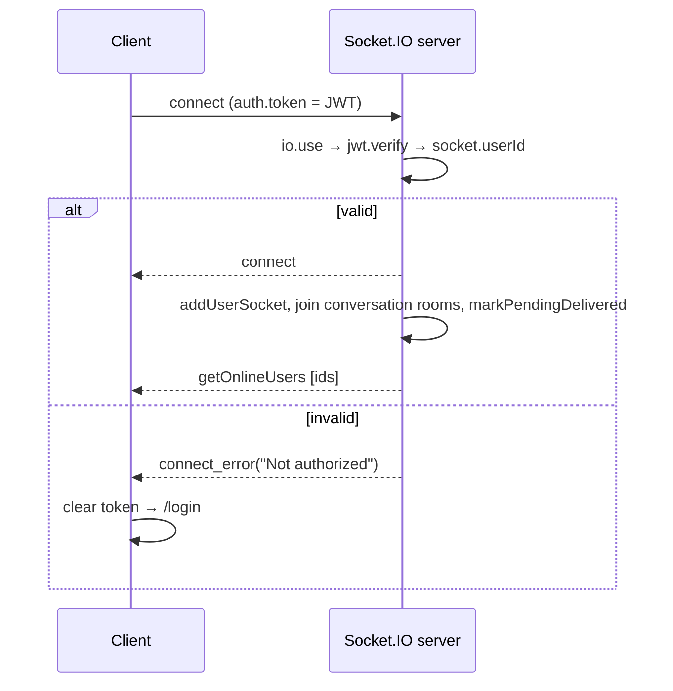
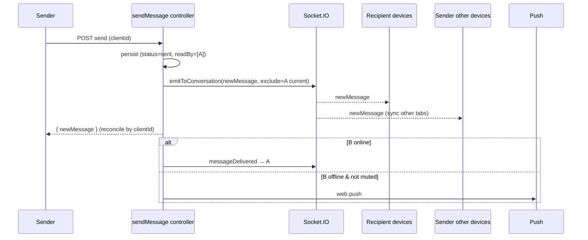
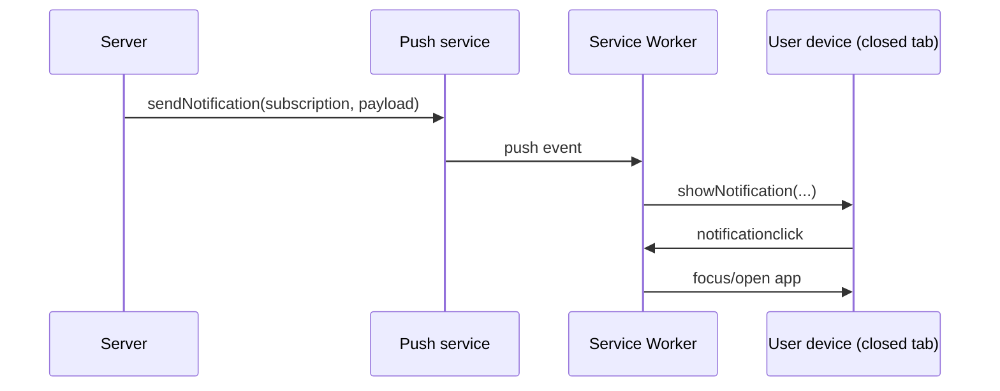
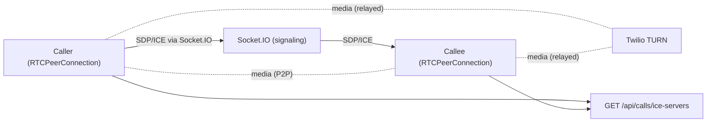
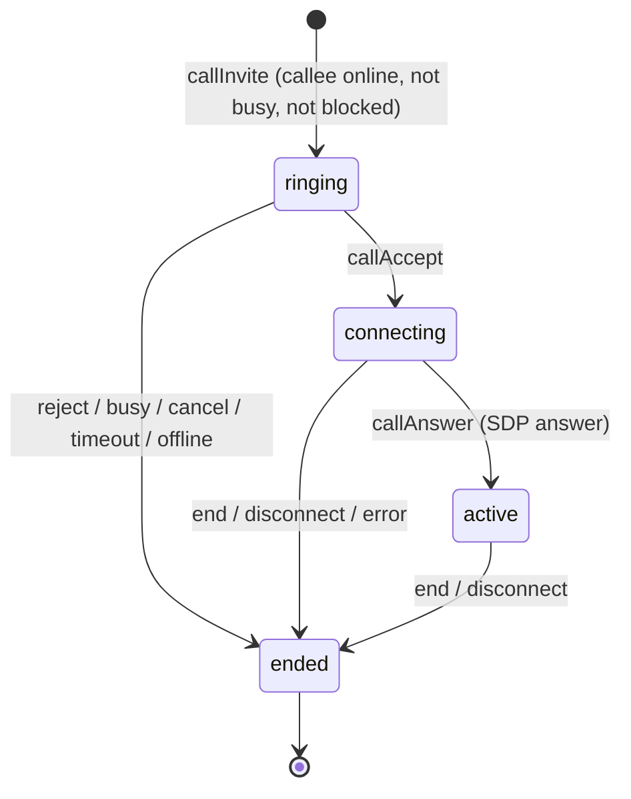
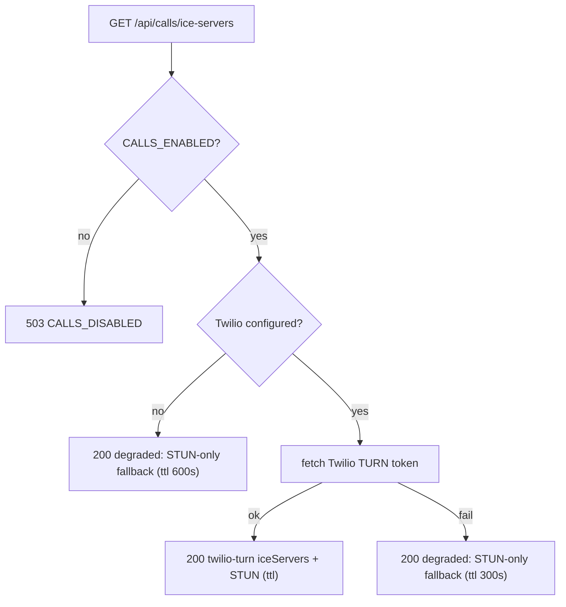

# 08 — Real-Time & Calling

[← Back to index](./README.md) · Related: [Backend](./04-backend.md) · [Frontend](./07-frontend.md) · [API Reference](./06-api-reference.md) · [Security](./09-security.md)

This document specifies the realtime protocol (Socket.IO) and the 1:1 calling subsystem (WebRTC). It covers the connection/handshake, presence, rooms, the full message-event catalogue, and the calling state machine with signaling, ICE, and failure handling.

---

## 1. Transport & handshake

quickCHAT's realtime layer is **Socket.IO 4**. The server is initialized in [`server.js`](../server/server.js) and shares the HTTP server with Express.

### Authenticated handshake

Every socket **must** present a valid JWT in the handshake; there are no anonymous sockets.

```73:91:server/server.js
io.use((socket, next) => {
        try {
                const token = socket.handshake?.auth?.token;
                if (typeof token !== "string" || !token.trim()) {
                        return next(new Error("Not authorized"));
                }
                const decoded = jwt.verify(token, process.env.JWT_SECRET);
                const userId = decoded?.userId;
                if (!userId) {
                        return next(new Error("Not authorized"));
                }
                socket.userId = userId.toString();
                next();
        } catch (error) {
                next(new Error("Not authorized"));
        }
});
```

The client (`AuthContext.connectSocket`) connects with `io(backendUrl, { auth: { token }, reconnection: true, reconnectionAttempts: 8, reconnectionDelay: 800 })`. On a `connect_error` containing "not authorized", the client clears the stale token and forces re-login.



---

## 2. Presence model

Presence is tracked **in memory** as `userSocketMap: Map<userId, Set<socketId>>` (multi-device aware).

- **Online** = the user has ≥ 1 connected socket.
- **Transition events** fire only on the edge: `userPresenceUpdated{online:true}` on the first connect (`0→1`); `userPresenceUpdated{online:false, lastSeen}` on the last disconnect (`1→0`), which also persists `User.lastSeen`.
- `getOnlineUsers` (array of online user ids) is broadcast on every connect/disconnect so clients can reconcile the full set.

See the [presence LLD](./03-system-design.md#c3-presence-with-multi-device-fan-out) for the state machine and rationale.

> **Scale note:** because presence is in process memory, horizontal scaling requires a Redis adapter + shared presence. See [DevOps](./10-devops-and-infrastructure.md) and [Maintenance](./13-maintenance-guide.md#known-limitations).

---

## 3. Rooms

Each conversation maps to a Socket.IO room named `conversation:<conversationId>` (`getConversationRoomName`). On connect, a socket joins **all** rooms for the conversations the user participates in (`joinSocketToUserConversationRooms`). New conversations join participants' sockets at creation time (`joinParticipantsToConversationRoom`).

Server-side broadcasts use `emitToConversation(io, userSocketMap, conversationId, event, payload, {excludeUserId})`, which can exclude the actor's own sockets (so the sender doesn't get a duplicate of their own action while still syncing their *other* devices via the REST response).

**Authorization on relays:** when a client emits a room-targeted event, the server verifies `socket.rooms.has(roomName)` before relaying — a client cannot inject events into a room it hasn't joined.

---

## 4. Message & conversation event catalogue

Events are emitted by **two producers**: (a) clients (relays for own-device sync / legacy DMs), and (b) the server after REST mutations. Clients subscribe in `ChatContext.subscribeToMessages`.

### 4.1 Client → Server (emitted by the client)

| Event | Payload | Meaning |
|-------|---------|---------|
| `typing` | `{ to?, conversationId? }` | User started typing. |
| `stopTyping` | `{ to?, conversationId? }` | User stopped typing. |
| `messagesSeen` | `{ to?, conversationId?, messageIds[] }` | User viewed messages. |
| `messageUpdated` | `{ to?, conversationId?, message }` | Relay an edit to peers/devices. |
| `messageDeleted` | `{ to?, conversationId?, messageId, message }` | Relay a delete. |
| `messageReaction` | `{ to?, conversationId?, messageId, reactions[] }` | Relay a reaction change. |

> Each handler branches: if `conversationId` is present → room relay (membership-checked); else if `to` is present → direct fan-out to that user's sockets (legacy DM). Source of truth for content is always the REST controller.

### 4.2 Server → Client (received by the client)

| Event | Payload (shape) | Client reaction (`ChatContext`) |
|-------|-----------------|---------------------------------|
| `getOnlineUsers` | `string[]` | Replace `onlineUsers`. |
| `userPresenceUpdated` | `{ userId, online, lastSeen }` | Patch presence + `lastSeen`. |
| `newMessage` | message object | Append to open conversation or bump unseen; play receive cue / notify. |
| `messageDelivered` | `{ messageIds[], status:"delivered" }` | Flip optimistic `sent → delivered`. |
| `messagesSeen` | `{ from, conversationId?, messageIds[] }` | Mark own messages `read`. |
| `messageUpdated` | `{ message, conversationId? }` | Replace message (edit/preview-ready). |
| `messageDeleted` | `{ messageId, message, conversationId? }` | Replace with tombstone. |
| `messageReaction` | `{ messageId, reactions[], conversationId? }` | Update reactions. |
| `messageStarred` | `{ messageId, starredBy[], conversationId? }` | Update star state. |
| `mentionedInMessage` | `{ message, conversationId, senderId }` | Mention notification. |
| `conversationCreated` | `{ conversation }` | Insert into sidebar. |
| `conversationUpdated` | `{ conversation }` | Update sidebar entry. |

### 4.3 Message send → fan-out (server-driven)



---

## 5. Web Push (offline notifications)

When a recipient is **offline** (no sockets) and not muted, the server sends a Web Push notification via `lib/pushService.sendPushToUsers`. The browser's service worker (`public/sw.js`) displays it. Stale subscriptions (HTTP 404/410) are pruned automatically.



Subscription lifecycle and endpoints are in [API §Push](./06-api-reference.md#45-push--apipush) and [Frontend §Service worker](./07-frontend.md#8-service-worker--pwa).

---

## 6. Calling (WebRTC) — overview

quickCHAT supports **1:1 audio/video calls** between participants of a **direct** conversation. The architecture is standard WebRTC:

- **Signaling** (exchange of session descriptions + ICE candidates) flows over Socket.IO, handled by [`lib/callSignaling.js`](../server/lib/callSignaling.js).
- **Media** flows **peer-to-peer** when possible, or is **relayed through Twilio TURN** when NAT/firewalls block a direct path.
- **ICE servers** (STUN/TURN) are fetched from `GET /api/calls/ice-servers` (Twilio creds minted server-side, STUN fallback).
- The whole subsystem is gated by `CALLS_ENABLED` (default on).



### Server-side state (in memory)

| Map | Shape | Purpose |
|-----|-------|---------|
| `activeCalls` | `Map<callId, CallSession>` | All live call sessions. |
| `userActiveCall` | `Map<userId, callId>` | "User is in a call" (busy detection). |
| `eventRateBuckets` | `Map<userId:event, ts[]>` | Per-event sliding-window rate limiting. |

A **CallSession** holds `callId`, `conversationId`, `callerId`, `calleeId`, `callType`, `state`, socket ids, timestamps, and a `ringTimeout`.

---

## 7. Call states & contract

Constants are in [`lib/callContract.js`](../server/lib/callContract.js) (mirrored client-side in `lib/webrtc/callContract.js`).

**States:** `ringing → connecting → active → ended` (client also models `idle`/`incoming`).



**Socket events (`CALL_SOCKET_EVENTS`):** `callInvite/Incoming/Initiated`, `callAccept/Accepted`, `callReject/Rejected`, `callBusy`, `callUnavailable`, `callCancel/Cancelled`, `callEnd/Ended`, `callOffer`, `callAnswer`, `callIceCandidate`, `callError`, `callTaken`.

**Error codes (`CALL_ERROR_CODES`):** `CALLS_DISABLED`, `INVALID_PAYLOAD`, `NOT_AUTHORIZED`, `NOT_DIRECT`, `BLOCKED`, `INVALID_CALL`, `RATE_LIMITED`.

**End reasons (`CALL_END_REASONS`):** `declined`, `cancelled`, `busy`, `offline`, `disconnected`, `timeout`, `hangup`, `error`, `taken`.

---

## 8. Call signaling — full sequence

```mermaid
sequenceDiagram
  autonumber
  participant Caller
  participant IO as callSignaling
  participant Callee
  participant ICE as /api/calls/ice-servers

  Caller->>IO: callInvite { to, conversationId, callType }
  IO->>IO: validate direct conv · block check · busy check · online check
  alt callee offline
    IO-->>Caller: callUnavailable (offline) + push("call-missed")
  else callee busy / self busy
    IO-->>Caller: callBusy
  else ok
    IO-->>Caller: callInitiated { callId, ringTimeoutMs }
    IO-->>Callee: callIncoming { callId, from, callType }
    Note over IO: ring timeout armed (CALL_RING_TIMEOUT_MS, default 45s)
  end

  Caller->>ICE: GET ice-servers
  Callee->>ICE: GET ice-servers

  Callee->>IO: callAccept { callId }
  IO->>IO: state ringing→connecting; clear ring timeout
  IO-->>Caller: callAccepted
  IO-->>Callee: callAccepted
  IO-->>Callee: callTaken (other devices of callee)

  Caller->>IO: callOffer { callId, sdp(offer) }
  IO->>IO: sanitize SDP; relay to peer endpoint
  IO-->>Callee: callOffer
  Callee->>IO: callAnswer { callId, sdp(answer) }
  IO->>IO: state connecting→active
  IO-->>Caller: callAnswer

  loop trickle ICE
    Caller->>IO: callIceCandidate { candidate }
    IO-->>Callee: callIceCandidate
    Callee->>IO: callIceCandidate { candidate }
    IO-->>Caller: callIceCandidate
  end

  Note over Caller,Callee: media established (P2P or via TURN)

  Caller->>IO: callEnd { callId, reason }
  IO-->>Caller: callEnded
  IO-->>Callee: callEnded
```

### Key server-side rules (from `callSignaling.js`)

- **Invite validation:** payload must have `to`, `conversationId`, valid `callType`, and `to !== self`. The conversation must exist, be **direct**, include the caller, and the peer must match (`getValidatedDirectConversation`).
- **Busy/blocked/offline:** if either user is already in a call → `callBusy`; if either side blocks the other → `callError(BLOCKED)`; if the callee has no sockets → `callUnavailable(offline)` + a `call-missed` push.
- **Ring timeout:** an unaccepted ringing call is auto-ended after `CALL_RING_TIMEOUT_MS` (default 45s) with reason `timeout`.
- **State gating of signaling:** offers/answers/ICE are only relayed when the session is `connecting` or `active` and the sender is a participant (`canRelaySignaling`, `isParticipantInSession`).
- **SDP/ICE sanitization:** SDP type allowlist + length cap (`CALL_MAX_SDP_LENGTH`, default 120k); ICE candidate length cap (`CALL_MAX_ICE_LENGTH`, default 8k); null bytes stripped. Oversized/invalid payloads → `INVALID_PAYLOAD`.
- **Per-event rate limits:** sliding-window limits per `(userId, event)` (e.g. invite 12/min, ICE 600/min). Exceeding → `callError(RATE_LIMITED, {retryAfterMs})`.
- **Disconnect handling:** if a participant's active endpoint disconnects (or the user goes fully offline, or a ringing caller drops), the session is terminated with reason `disconnected`; rate buckets are cleaned up.
- **Multi-device "taken":** when one of the callee's devices accepts, the others receive `callTaken` so they stop ringing.

### Telemetry

`telemetry` counts `invites`, `accepted`, `ended`, plus maps of error codes and end reasons. Exposed via `GET /api/calls/telemetry` (`getCallTelemetrySnapshot`). Useful for monitoring call health.

---

## 9. ICE / TURN

`GET /api/calls/ice-servers` ([`callController.getIceServers`](../server/controllers/callController.js)) returns ICE servers:



`lib/twilioTurn.fetchTwilioIceServers` POSTs to Twilio's Tokens API with `Ttl` (default 86400s), normalizes the returned `ice_servers`, and **prepends STUN fallbacks**. If unconfigured/failed, callers get STUN-only so calls remain best-effort. See [Backend §twilioTurn](./04-backend.md#53-twilioturn-degrade-dont-fail).

> **Why TURN matters:** STUN alone fails when both peers are behind symmetric NATs. TURN relays the media so the call still connects (at the cost of relay bandwidth). Twilio is the managed TURN provider here.

---

## 10. Client-side WebRTC (`CallContext` + `lib/webrtc/`)

- **`CallContext`** orchestrates the call lifecycle: it reacts to `callIncoming/Accepted/Ended/...` socket events, manages `callState` (phase machine), obtains local media (`mediaDevices.getUserMedia`), creates the `RTCPeerConnection` (`callSession`), wires `onicecandidate` → emit `callIceCandidate`, `ontrack` → `remoteStream`, and exposes `startCall/acceptIncomingCall/rejectIncomingCall/endCall/toggleMute/toggleCamera`.
- **`lib/webrtc/callSession.js`** encapsulates peer-connection creation, `createOffer`/`createAnswer`, `setLocal/RemoteDescription`, and ICE handling.
- **`lib/webrtc/mediaDevices.js`** wraps `navigator.mediaDevices.getUserMedia` (audio for audio calls, audio+video for video).
- **UI**: `IncomingCallModal` (ringing/accept/reject), `CallOverlay` (active call video tiles + duration), `CallControls` (mute/camera/hang-up). See [Frontend](./07-frontend.md#5-component-hierarchy).

Call teardown is also registered with `AuthContext.registerCallTeardownHandler` so logging out ends any active call cleanly.

---

## 11. Configuration reference (realtime & calls)

| Env var | Default | Purpose |
|---------|---------|---------|
| `CALLS_ENABLED` | `true` | Master switch for calling. |
| `CALL_RING_TIMEOUT_MS` | `45000` | Auto-end unanswered ringing calls. |
| `CALL_MAX_SDP_LENGTH` | `120000` | SDP size cap. |
| `CALL_MAX_ICE_LENGTH` | `8000` | ICE candidate size cap. |
| `CALL_RATE_LIMIT_WINDOW_MS` | `60000` | Sliding window for call event limits. |
| `CALL_INVITE/ACCEPT/REJECT/BUSY/CANCEL/END/OFFER/ANSWER/ICE_RATE_LIMIT_MAX` | 12/30/30/30/40/60/40/40/600 | Per-event caps. |
| `CALL_ICE_CONFIG_RATE_LIMIT_MAX` | `30` | HTTP ICE endpoint cap (per min). |
| `TWILIO_ACCOUNT_SID` / `TWILIO_AUTH_TOKEN` | — | TURN credentials. |
| `TWILIO_TURN_TTL_SECONDS` | `86400` | TURN token TTL. |

---

## 12. Where to go next

- The HTTP side of calling and push: [API Reference](./06-api-reference.md).
- The client orchestration: [Frontend Reference](./07-frontend.md).
- Security of the realtime/calling surfaces: [Security](./09-security.md).
