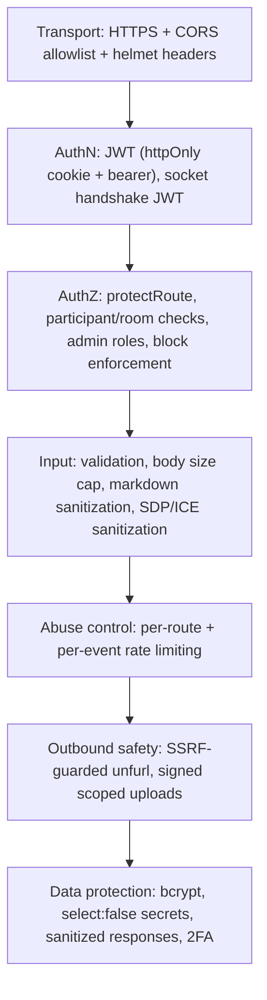
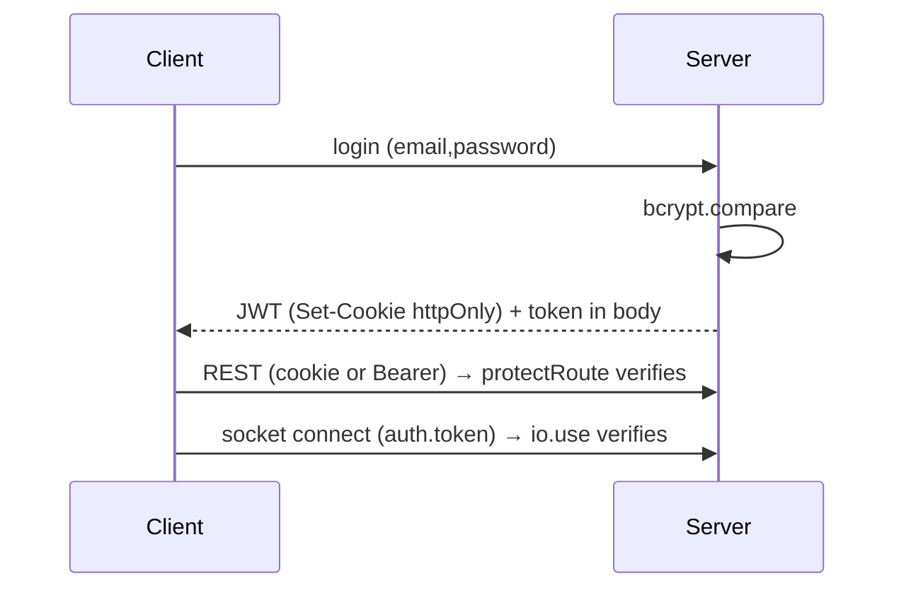
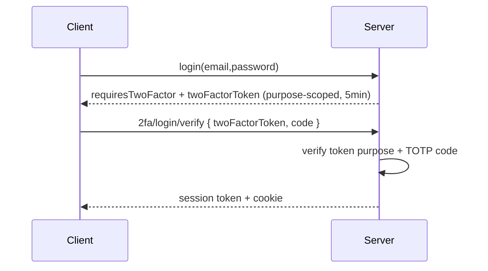
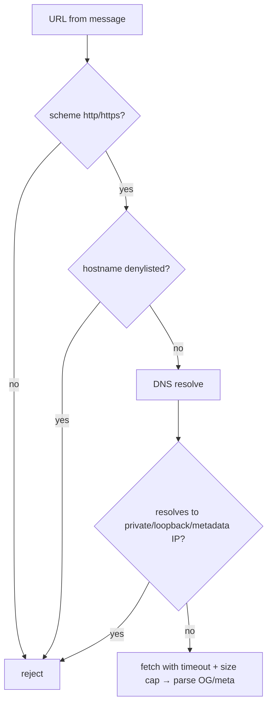

# 09 — Security

[← Back to index](./README.md) · Related: [Backend](./04-backend.md) · [API Reference](./06-api-reference.md) · [Real-Time & Calling](./08-realtime-and-calls.md) · [Maintenance](./13-maintenance-guide.md)

This document describes quickCHAT's security model: authentication, authorization, the hardening measures in place, data-protection practices, and the threats they mitigate. It also honestly notes residual risks and recommended hardening.

---

## 1. Security posture summary

quickCHAT applies **defense in depth**: multiple independent layers so that a single failure does not compromise the system.

---

## 2. Authentication {#authentication}

### 2.1 Password authentication

- Passwords are hashed with **bcrypt** (`bcryptjs`, salt rounds = 10) at signup and compared on login. Plaintext is never stored.
- The `password` field is **never returned** to clients — `sanitizeUser` strips it (and other secrets) from every auth response, and `protectRoute` loads the user with `.select("-password")`.

### 2.2 JWT sessions

- On signup/login the server issues a **JWT** (`jsonwebtoken`) signed with `JWT_SECRET`, **expiring in 7 days** (`generateToken`). Tokens previously never expired; scoping to 7 days limits the blast radius of a leaked token.
- The token is delivered **two ways**:
  1. an **HTTP-only cookie** `quickchat_token` (`httpOnly`, `secure` in prod, `sameSite:none` in prod / `lax` in dev, 7-day `maxAge`), and
  2. in the response body so the SPA can set the `axios` header and the **Socket.IO handshake** auth.
- `protectRoute` extracts the token via `getTokenFromRequest` (cookie → `token` header → `Authorization: Bearer`), verifies it, loads `req.user`, and returns **401** on any failure so clients can clear stale credentials.

### 2.3 Two-factor authentication (TOTP)

quickCHAT supports **time-based one-time passwords** (`otplib`) with QR enrollment (`qrcode`):

- **Enrollment** (`/2fa/setup`): generate a secret, return an `otpauth://` URI + QR data-URL; store as `twoFactorTempSecret` (`select:false`).
- **Enable** (`/2fa/enable`): verify a 6-digit code against the temp secret, promote it to `twoFactorSecret`, set `twoFactorEnabled`.
- **Login with 2FA**: `login` returns `requiresTwoFactor` + a short-lived **purpose-scoped JWT** (`purpose:"2fa-login"`, TTL `TWO_FACTOR_LOGIN_TTL_SECONDS`, default 300s) instead of a session. `/2fa/login/verify` validates that token + the code and only then issues a session.
- **Disable** (`/2fa/disable`): requires a valid current code, then clears all 2FA fields.

**Why a purpose-scoped intermediate token:** it cryptographically binds "passed password step" to "this user" without creating a server-side session store, and it self-expires so a stalled 2FA flow cannot be resumed indefinitely.

### 2.4 Socket authentication

Every Socket.IO connection must present a valid JWT in the handshake (`io.use` → `jwt.verify` → `socket.userId`). There are **no anonymous sockets**, so all realtime authorization can assume an authenticated `socket.userId`. See [Real-Time §1](./08-realtime-and-calls.md#1-transport--handshake).

---

## 3. Authorization model {#authorization}

Authorization is enforced at multiple layers:

| Layer | Check | Example |
|-------|-------|---------|
| **Route** | `protectRoute` requires a valid session | All `/api/*` except status, push public key, signup/login. |
| **Resource ownership** | Sender-only mutations | `editMessage`/`deleteMessage` only by the sender. |
| **Conversation membership** | Caller must be a participant | `getMessages`, `markMessageAsSeen`, `getConversationById`, message reports. |
| **Room membership (socket)** | `socket.rooms.has(roomName)` before relaying | typing/seen/edit/delete/reaction relays. |
| **Group roles** | Admin-only mutations | add/remove members, update group name/avatar. |
| **Call participation** | Direct-conversation participant + peer match | `getValidatedDirectConversation` before a call. |
| **Block enforcement** | Either-side block blocks messaging/calling | `isMessagingBlocked`, call invite `BLOCKED`. |
| **Self-action guards** | Cannot block/report self, call self | block/report/call validation. |

**Block enforcement** is bidirectional and centralized in `lib/blockHelpers.js`: a `blockState` (`blockedByMe`, `blockedByOther`, `blocked`) is computed from both users' `blockedUsers`. Send returns `DIRECT_CHAT_BLOCKED`; call invite returns `BLOCKED`. The UI disables the composer/call buttons accordingly.

---

## 4. Transport & headers

- **HTTPS** in production (Vercel-terminated TLS).
- **`helmet()`** sets secure HTTP response headers (e.g. `X-Content-Type-Options`, `X-Frame-Options`/frame-ancestors, `Strict-Transport-Security` family, etc.) by default.
- **CORS allowlist**: only `localhost:5173` (dev), explicit `CLIENT_ORIGINS`, and `https://*.vercel.app` origins are allowed, with `credentials:true` so cookies are scoped correctly. The same handler guards both Express and Socket.IO.
- **Body size cap**: `express.json({ limit: "8mb" })` bounds payloads (sized for base64 avatars; large media bypasses the API via signed upload).

---

## 5. Input validation & output sanitization

| Surface | Protection |
|---------|------------|
| **Markdown messages** | Rendered with `react-markdown` + **`rehype-sanitize`**; only safe link protocols (`http/https/mailto/tel`) via `toSafeHref`; links forced `rel="noopener noreferrer" target="_blank"`. Prevents stored XSS. |
| **Report content** | Enum-validated `targetType`/`reason`; `details` capped at 2000 chars. |
| **Upload signatures** | `folder` allowlist (`quickchat/{images,files,audio,avatars}`) + `resourceType` allowlist. Prevents arbitrary destination uploads. |
| **Call SDP/ICE** | Type allowlist + length caps + null-byte stripping (`sanitizeSdp`, `sanitizeIceCandidate`). |
| **IDs** | `mongoose.Types.ObjectId.isValid` checks before queries. |
| **Mentions** | Filtered to valid participant ids. |

---

## 6. Rate limiting {#rate-limiting}

Two complementary systems:

1. **HTTP** (`express-rate-limit`, [`middleware/rateLimit.js`](../server/middleware/rateLimit.js)) — per-route-family windows (auth, 2FA, send, unfurl, block, report, call ICE). Returns `429`. See [Backend §Rate limiting](./04-backend.md#rate-limiting).
2. **Socket call events** (sliding-window buckets in `callSignaling.js`) — per `(userId, event)` caps (invite/accept/offer/ice/...). Returns `callError(RATE_LIMITED)`.

These throttle brute-force (auth/2FA), spam (send), SSRF probing (unfurl), and call-signaling floods.

---

## 7. Threat mitigation {#threat-mitigation}

### 7.1 SSRF (Server-Side Request Forgery) — link unfurling

The unfurl feature fetches **user-supplied URLs server-side**, a classic SSRF vector. [`lib/linkUnfurl.js`](../server/lib/linkUnfurl.js) hardens it:

- **Scheme allowlist**: only `http`/`https`.
- **Hostname denylist**: `localhost`, `*.local`, `*.internal`, `*.localhost`, and cloud metadata hosts (`metadata.google.internal`).
- **DNS resolution + IP checks**: resolves the hostname and **rejects private/loopback/link-local/CGNAT/multicast** ranges for both IPv4 (`10/8`, `127/8`, `0/8`, `169.254/16`, `172.16-31`, `192.168/16`, `100.64-127`, `>=224`) and IPv6 (`::1`, `fc/fd`, `fe8-feb`, IPv4-mapped). Blocks `169.254.169.254` (the cloud metadata IP).
- **Resource limits**: timeout (`UNFURL_TIMEOUT_MS`, 5s), max response size (`UNFURL_MAX_RESPONSE_BYTES`, 512KB), max URLs per message (`UNFURL_MAX_URLS`, 3).
- **Rate limited** (`unfurlRateLimiter`).

### 7.2 XSS

- Messages are markdown-sanitized (`rehype-sanitize`) and links are protocol-restricted. React escapes by default elsewhere.
- The auth token is also stored in `localStorage` (needed for the socket handshake / cross-origin bearer). This is a **known trade-off**: the HTTP-only cookie protects REST even if `localStorage` is read, but a successful XSS could still exfiltrate the `localStorage` token. The primary mitigation is preventing XSS in the first place (sanitization). See [Residual risks](#9-residual-risks--recommended-hardening).

### 7.3 CSRF

- The cookie is `sameSite:none; secure` in production (required for the cross-origin SPA↔API setup) and `lax` in dev. Because the API also accepts a **Bearer token** that the SPA sets explicitly, the practical CSRF surface is limited (an attacker site cannot read the token to set the header). Adding an explicit anti-CSRF token or `sameSite:strict` where feasible is a recommended future hardening.

### 7.4 Brute force / credential stuffing

- Auth and 2FA endpoints are tightly rate-limited; bcrypt makes offline cracking expensive; 2FA blocks password-only compromise.

### 7.5 Injection (NoSQL)

- Queries use Mongoose with explicit field filters and `ObjectId` validation; user input is not interpolated into query operators.

### 7.6 Account takeover via stale tokens

- 7-day token expiry + clearing tokens on 401/"not authorized" socket errors limits stale-token reuse.

### 7.7 Abuse of media storage

- Signed uploads are folder/type-scoped and short-lived; the server retains deletion authority via `public_id`.

### 7.8 Call abuse

- Direct-only, participant-validated, block-checked, busy/offline-aware, ring-timeout-bounded, payload-sanitized, and per-event rate-limited. See [Real-Time §8](./08-realtime-and-calls.md#8-call-signaling--full-sequence).

---

## 8. Data protection {#data-protection}

| Data | Protection |
|------|------------|
| Passwords | bcrypt hash; never returned. |
| 2FA secrets (`twoFactorSecret`, `twoFactorTempSecret`) | `select:false`; stripped by `sanitizeUser`. |
| Push subscriptions | `select:false`; stripped from responses. |
| Avatar storage ids (`profilePicPublicId`) | `select:false`. |
| JWT secret, DB URI, API keys | Environment variables only; **never** committed (no secret values appear in this documentation). |
| Media | Cloudinary (access-controlled bucket); deleted on message delete. |
| Soft-deleted messages | Content blanked + media destroyed (no residual content). |
| Transport | HTTPS in production. |

> **Note:** message content is stored in plaintext in MongoDB (no end-to-end encryption). This is consistent with the product's server-side features (search, unfurl, push previews). E2EE would be a substantial architectural change. See [Maintenance §Future improvements](./13-maintenance-guide.md#future-improvement-opportunities).

---

## 9. Residual risks & recommended hardening

| Risk | Current state | Recommendation |
|------|---------------|----------------|
| **`localStorage` token + XSS** | Token in `localStorage` for socket/bearer | Strong CSP, keep sanitization strict; consider cookie-only + a separate short-lived socket ticket. |
| **CSRF** | `sameSite` + bearer reliance | Add anti-CSRF token for cookie-only flows; `sameSite:strict` where possible. |
| **No CSP header** | helmet defaults | Add a tailored `Content-Security-Policy`. |
| **No E2EE** | Plaintext at rest | Optional E2EE mode for sensitive deployments. |
| **Reports have no moderation UI** | Stored only | Build an admin/moderation surface. |
| **In-memory rate buckets / presence** | Per-instance | Move to Redis when scaling out (also closes multi-instance rate-limit gaps). |
| **Secret rotation** | Manual | Document/automate `JWT_SECRET`, Cloudinary, Twilio, VAPID rotation. |

See [Maintenance Guide](./13-maintenance-guide.md) for operational follow-through.

---

## 10. Secrets inventory (names only)

These environment variables hold secrets and must be configured securely (never committed):

`JWT_SECRET`, `MONGODB_URI`, `CLOUDINARY_CLOUD_NAME`/`CLOUDINARY_API_KEY`/`CLOUDINARY_API_SECRET`, `VAPID_PUBLIC_KEY`/`VAPID_PRIVATE_KEY`/`VAPID_SUBJECT`, `TWILIO_ACCOUNT_SID`/`TWILIO_AUTH_TOKEN`. See [DevOps §Environment configuration](./10-devops-and-infrastructure.md#environment-configuration) for the complete list including non-secret tunables.

---

## 11. Where to go next

- Operational security (env management, deploy): [DevOps & Infrastructure](./10-devops-and-infrastructure.md).
- The endpoints these controls protect: [API Reference](./06-api-reference.md).
