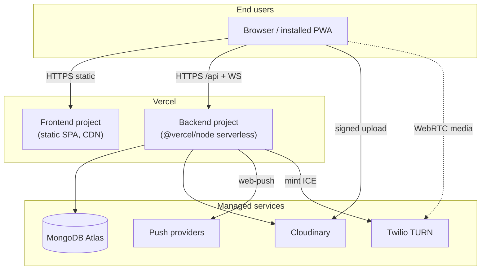
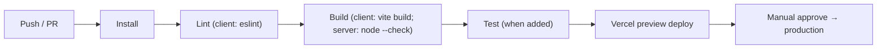
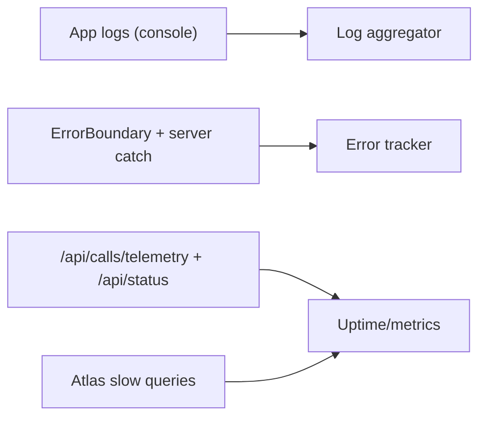

# 10 — DevOps & Infrastructure

[← Back to index](./README.md) · Related: [Architecture](./02-architecture.md) · [Backend](./04-backend.md) · [Security](./09-security.md) · [Maintenance](./13-maintenance-guide.md)

This document covers deployment architecture, environments, environment variables, CI/CD, containerization, monitoring/logging, and disaster-recovery considerations.

> **Secrets policy:** this document lists environment-variable **names** only. Never commit real secret values; the repository's `.env` files must be kept out of version control and rotated if ever exposed.

---

## 1. Deployment architecture

quickCHAT is designed to deploy as **two Vercel projects** (frontend SPA + backend serverless) backed by managed services (MongoDB Atlas, Cloudinary, Twilio, browser push providers).



### Vercel configuration

**Backend** ([`server/vercel.json`](../server/vercel.json)): builds `server.js` with `@vercel/node` and routes all paths to it.

```1:20:server/vercel.json
  {
    "version": 2,
    "builds": [ { "src": "server.js", "use": "@vercel/node", "config": { "includeFiles": ["dist/**"] } } ],
    "routes": [ { "src": "/(.*)", "dest": "server.js" } ]
  }
```

**Frontend** ([`client/vercel.json`](../client/vercel.json)): SPA fallback — every path rewrites to `/` so React Router handles client-side routing (deep links don't 404).

```1:8:client/vercel.json
  {
    "rewrites": [ { "source": "/(.*)", "destination": "/" } ]
  }
```

> **Important serverless caveat (read this):** `server.js` only calls `server.listen()` when `NODE_ENV !== "production"`; in production Vercel invokes the exported `server`. Two backend features rely on **in-process, long-lived state** that does not fit the serverless/multi-instance model cleanly:
> 1. **Socket.IO presence** (`userSocketMap`) and rooms live in memory.
> 2. **The message scheduler** (`setInterval`) needs a persistent process.
>
> For a robust production deployment of realtime + scheduler, run the backend on a **persistent Node host** (a long-running container/VM, e.g. Render/Railway/Fly/EC2) rather than ephemeral serverless, **or** scale out with a Redis Socket.IO adapter + a dedicated scheduler worker. See [Scalability](./02-architecture.md#9-scalability-considerations) and [Known limitations](./13-maintenance-guide.md#known-limitations). The Vercel config is suitable for the REST API and the SPA; the realtime/scheduler concerns are the deciding factor for the backend host choice.

---

## 2. Environments

| Environment | Frontend | Backend | Database |
|-------------|----------|---------|----------|
| **Local dev** | Vite dev server (`http://localhost:5173`) | `nodemon`/`node` (`http://localhost:5000`) | Atlas (shared) or local MongoDB |
| **Preview** | Vercel preview deploy (`*.vercel.app`) | Vercel preview deploy | Atlas (staging recommended) |
| **Production** | Vercel production | Vercel production / persistent host | Atlas production |

The backend CORS allowlist automatically accepts `localhost:5173` and any `https://*.vercel.app`, plus anything in `CLIENT_ORIGINS`. See [`server.js`](../server/server.js).

---

## 3. Environment configuration {#environment-configuration}

### 3.1 Backend (`server/.env`)

| Variable | Required | Default | Purpose |
|----------|----------|---------|---------|
| `MONGODB_URI` | ✅ | — | MongoDB connection string (db `chat-app` is appended). **Secret.** |
| `JWT_SECRET` | ✅ | — | JWT signing secret. **Secret.** |
| `PORT` | — | `5000` | Local listen port. |
| `NODE_ENV` | — | — | `production` toggles secure cookies + skips `listen`. |
| `CLIENT_ORIGINS` | — | — | Comma-separated extra allowed origins. |
| `CLOUDINARY_CLOUD_NAME` | ✅ (media) | — | Cloudinary cloud. |
| `CLOUDINARY_API_KEY` | ✅ (media) | — | **Secret.** |
| `CLOUDINARY_API_SECRET` | ✅ (media) | — | **Secret.** |
| `VAPID_PUBLIC_KEY` | — (push) | — | Web Push public key. |
| `VAPID_PRIVATE_KEY` | — (push) | — | **Secret.** |
| `VAPID_SUBJECT` | — (push) | `mailto:quickchat@example.com` | VAPID subject. |
| `TWILIO_ACCOUNT_SID` | — (calls TURN) | — | Twilio SID. |
| `TWILIO_AUTH_TOKEN` | — (calls TURN) | — | **Secret.** |
| `TWILIO_TURN_TTL_SECONDS` | — | `86400` | TURN token TTL. |
| `CALLS_ENABLED` | — | `true` | Calling master switch. |
| `MESSAGE_SCHEDULER_ENABLED` | — | `true` | Scheduler on/off. |
| `MESSAGE_SCHEDULER_POLL_MS` | — | `5000` | Scheduler tick interval. |
| `MESSAGE_SCHEDULER_RELEASE_BATCH` | — | `25` | Scheduled-release batch size. |
| `MESSAGE_SCHEDULER_EXPIRE_BATCH` | — | `50` | Expiry batch size. |
| `MESSAGE_SCHEDULER_STALE_CLAIM_MS` | — | `120000` | Stale-claim reset window. |
| Rate-limit maxes | — | see [Backend](./04-backend.md#rate-limiting) | `AUTH_/TWO_FACTOR_/MESSAGE_SEND_/UNFURL_/BLOCK_ACTION_/REPORT_ACTION_/CALL_ICE_CONFIG_RATE_LIMIT_MAX`. |
| Call event limits | — | see [Real-Time](./08-realtime-and-calls.md#11-configuration-reference-realtime--calls) | `CALL_*_RATE_LIMIT_MAX`, `CALL_RING_TIMEOUT_MS`, `CALL_MAX_SDP_LENGTH`, `CALL_MAX_ICE_LENGTH`. |
| `UNFURL_TIMEOUT_MS` / `UNFURL_MAX_RESPONSE_BYTES` / `UNFURL_MAX_URLS` | — | `5000`/`524288`/`3` | Unfurl limits. |
| `TWO_FACTOR_LOGIN_TTL_SECONDS` | — | `300` | 2FA challenge TTL. |
| `TOTP_ISSUER` | — | `quickCHAT` | TOTP issuer label. |

### 3.2 Frontend (`client/.env`)

| Variable | Required | Purpose |
|----------|----------|---------|
| `VITE_BACKEND_URL` | ✅ | Backend origin for axios + Socket.IO (e.g. `http://localhost:5000` in dev, backend URL in prod). |

> Vite only exposes variables prefixed `VITE_` to the client bundle. Never put secrets in `client/.env` — they ship to browsers.

### 3.3 Generating VAPID keys

```bash
npx web-push generate-vapid-keys
```
Set the resulting public/private keys as `VAPID_PUBLIC_KEY`/`VAPID_PRIVATE_KEY`.

---

## 4. Build & run

### Backend
```bash
cd server
npm install
npm run server   # dev: nodemon server.js
npm start        # prod-style: node server.js
```

### Frontend
```bash
cd client
npm install
npm run dev      # Vite dev server
npm run build    # production build → client/dist
npm run preview  # serve the build locally
```

Full local setup in the [Development Guide](./12-development-guide.md).

---

## 5. CI/CD

The repository does **not** currently include a CI pipeline (no `.github/workflows`). Deployment is via **Vercel's Git integration** (push-to-deploy): each push builds a preview; merges to the production branch deploy production.

### Recommended pipeline



A minimal GitHub Actions starter:

```yaml
name: ci
on: [push, pull_request]
jobs:
  client:
    runs-on: ubuntu-latest
    steps:
      - uses: actions/checkout@v4
      - uses: actions/setup-node@v4
        with: { node-version: 20, cache: npm, cache-dependency-path: client/package-lock.json }
      - run: npm ci
        working-directory: client
      - run: npm run lint
        working-directory: client
      - run: npm run build
        working-directory: client
  server:
    runs-on: ubuntu-latest
    steps:
      - uses: actions/checkout@v4
      - uses: actions/setup-node@v4
        with: { node-version: 20 }
      - run: npm ci
        working-directory: server
      - run: node --check server.js
        working-directory: server
```

See [Testing](./11-testing.md) for where automated tests would slot in.

---

## 6. Containerization

There is no Dockerfile in the repo today. If deploying to a container platform (recommended for the realtime backend), a minimal backend image:

```dockerfile
# server/Dockerfile
FROM node:20-alpine
WORKDIR /app
COPY package*.json ./
RUN npm ci --omit=dev
COPY . .
ENV NODE_ENV=production
EXPOSE 5000
CMD ["node", "server.js"]
```

> Because `server.listen()` is skipped when `NODE_ENV=production`, set the host platform to invoke the process appropriately, **or** adjust the guard so a container always listens. For a persistent container host you typically want `server.listen()` to run — confirm/patch the `NODE_ENV` guard in `server.js` for your platform. See [Maintenance](./13-maintenance-guide.md#troubleshooting).

The frontend is static (`client/dist`) and can be served by any CDN/static host or an `nginx:alpine` image.

---

## 7. Infrastructure components

| Component | Provider | Role | Notes |
|-----------|----------|------|-------|
| App hosting | Vercel | SPA + serverless backend | Realtime/scheduler caveats above. |
| Database | MongoDB Atlas | System of record | Replica set + backups; IP allowlist; least-priv DB user. |
| Media | Cloudinary | Storage + CDN | Signed uploads; deletion by `public_id`. |
| TURN/STUN | Twilio | NAT traversal for calls | Short-lived ICE tokens. |
| Push | Browser push services (FCM/APNs/Mozilla) | Offline notifications | Via VAPID. |
| (Recommended) Cache/broker | Redis | Socket.IO adapter + presence + rate buckets | For horizontal scale. |

---

## 8. Monitoring & logging {#monitoring--logging}

**Current state:** structured-ish `console.log` throughout — scheduler ticks (`[message-scheduler] ...`), call events (`[calls] ...`), socket connect/disconnect, and controller error messages. On Vercel these surface in the function logs; on a container host they go to stdout.

**Health checks:**
- `GET /api/status` → `"Server is live"` (liveness).
- `GET /api/calls/telemetry` → call stats snapshot.

**Recommended additions:**
- Centralized logging (e.g. Logtail/Datadog/Sentry) with request ids.
- Error tracking (Sentry) on both client (`ErrorBoundary`) and server.
- Metrics: message throughput, socket connection count, scheduler lag, call success/error rates (telemetry already counts these in memory).
- Atlas performance advisor / slow-query logs for index tuning.



---

## 9. Disaster recovery

| Scenario | Mitigation / procedure |
|----------|------------------------|
| **Database loss/corruption** | Atlas continuous backups + point-in-time restore; test restores periodically. |
| **Backend instance crash** | Stateless REST recovers on restart; in-memory presence/calls reset (clients reconnect; scheduler resumes and reclaims stale claims). |
| **Bad deploy** | Vercel instant rollback to a previous deployment. |
| **Secret leak** | Rotate the affected secret (`JWT_SECRET` invalidates all sessions; rotate Cloudinary/Twilio/VAPID), redeploy. |
| **Media provider outage** | Messaging continues; media unavailable until restored. |
| **TURN outage** | Calls fall back to STUN (degraded), or fail for symmetric-NAT peers; messaging unaffected. |
| **Push outage** | Realtime/in-app notifications continue; only offline push affected. |

**Recovery objectives (suggested targets):** RPO ≈ minutes (Atlas continuous backup), RTO ≈ minutes (redeploy/rollback). Adjust to your SLA.

---

## 10. Operational runbook (quick reference)

| Task | Action |
|------|--------|
| Deploy | Push to the production branch (Vercel) or `docker build && deploy`. |
| Rollback | Vercel → Deployments → Promote previous; or redeploy prior image. |
| Rotate JWT secret | Update `JWT_SECRET`, redeploy (logs everyone out). |
| Toggle calling | Set `CALLS_ENABLED=false`, redeploy. |
| Tune scheduler | Adjust `MESSAGE_SCHEDULER_*`, redeploy. |
| Run a migration | `node scripts/<script>.js` against the target DB (back up first). |
| Cleanup group keys | `npm run cleanup:group-direct-keys`. |
| Check health | `GET /api/status`, `GET /api/calls/telemetry`. |

---

## 11. Where to go next

- Day-2 operations & troubleshooting: [Maintenance Guide](./13-maintenance-guide.md).
- Local setup specifics: [Development Guide](./12-development-guide.md).
- Security/secrets handling: [Security](./09-security.md).
