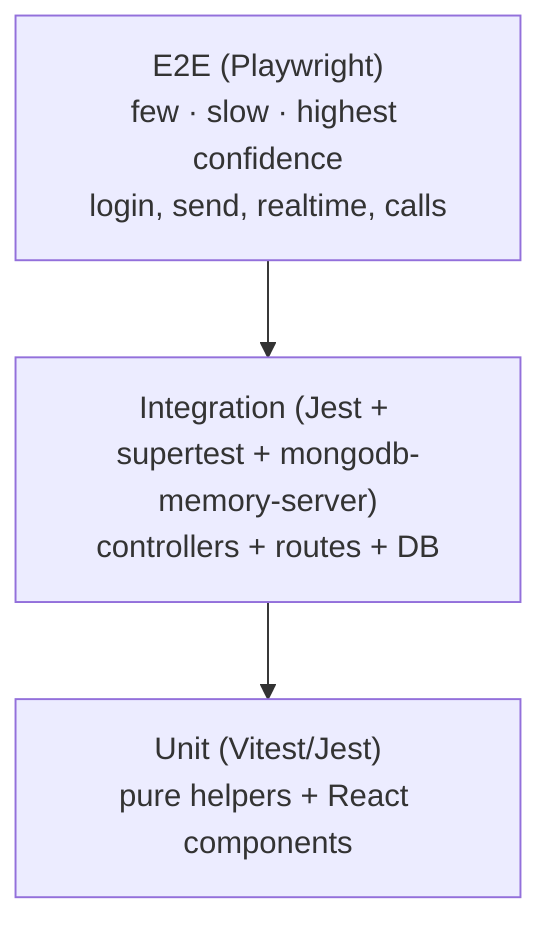

# 11 — Testing

[← Back to index](./README.md) · Related: [Backend](./04-backend.md) · [Frontend](./07-frontend.md) · [Development Guide](./12-development-guide.md)

This document defines the testing strategy for quickCHAT: what exists today, the recommended test pyramid, concrete examples for unit/integration/E2E tests, coverage expectations, and the mocking strategy for the project's external dependencies.

---

## 1. Current state (honest baseline)

> **There is currently no automated test suite in the repository.** No test runner is configured, and there are no `*.test.js`/`*.spec.js` files. Quality today relies on ESLint (`client`), manual testing, and the resilience patterns baked into the code (optimistic retry, idempotency, claim/lease scheduler, graceful degradation).

This chapter therefore documents (a) how to verify behavior **manually** today, and (b) the **recommended** automated testing strategy to adopt, with examples tailored to this codebase. Treat the recommended sections as the target state.

---

## 2. Testing strategy & philosophy

Adopt a standard **test pyramid**: many fast unit tests, fewer integration tests, a small number of high-value end-to-end tests.



Priorities, by risk:
1. **Pure logic** with tricky correctness: cursor pagination, `buildDirectKey`, block-state computation, scheduler claim/lease, SSRF IP checks, message normalization, markdown sanitization, time/format utils.
2. **Controllers** (auth, send, getMessages, conversations) against an in-memory Mongo.
3. **Realtime & calls** signaling (state machine transitions, authorization, rate limiting).
4. **Critical user journeys** end-to-end.

---

## 3. Recommended tooling

| Layer | Tool | Why |
|-------|------|-----|
| Backend unit/integration | **Jest** (or Vitest) + **supertest** + **mongodb-memory-server** | Run controllers/routes against a real-but-ephemeral Mongo. |
| Socket tests | **socket.io-client** in tests + a test server | Exercise handshake/relays/calls. |
| Frontend unit/component | **Vitest** + **@testing-library/react** + **jsdom** | Fast component tests aligned with Vite. |
| E2E | **Playwright** | Cross-browser, network/WS interception, PWA support. |
| Mocks | **nock**/**msw**, Jest mocks | Stub Cloudinary/Twilio/web-push/fetch. |
| Coverage | Jest/Vitest `--coverage` (Istanbul) | Track coverage. |

---

## 4. Unit tests

### 4.1 High-value pure functions to cover

| Function | File | What to assert |
|----------|------|----------------|
| `buildDirectKey` | `server/lib/conversationHelpers.js` | Order-independent, sorted, stable key. |
| `createBlockState` / `isBlockedByEitherSide` | `server/lib/blockHelpers.js` | `blockedByMe`/`blockedByOther`/`blocked` combinations. |
| `isPrivateIpv4Address` / `isDisallowedIpAddress` | `server/lib/linkUnfurl.js` | All private/loopback/metadata ranges rejected; public allowed. |
| `isValidCallType` / call contract | `server/lib/callContract.js` | Valid/invalid call types. |
| `toSafeHref` / markdown sanitization | `client/src/lib/messageText.jsx` | Disallowed protocols stripped; safe links kept. |
| cursor helpers | `server/controllers/messageController.js` | `createMessagesCursor`/`getBeforeCursorValues` round-trip; older/newer filters. |
| time/format utils | `client/src/lib/utils.js` | `formatMessageTime`, `formatFileSize`, `getErrorMessage`, client id. |
| conversation derivations | `client/src/lib/conversations.js` | title/avatar/peer/preview, pending/expiry helpers. |

### 4.2 Example — backend pure-function unit test (Jest)

```js
// server/lib/__tests__/conversationHelpers.test.js
import { buildDirectKey } from "../conversationHelpers.js";

test("buildDirectKey is order-independent and sorted", () => {
  const a = "64f0000000000000000000a1";
  const b = "64f0000000000000000000b2";
  expect(buildDirectKey(a, b)).toBe(buildDirectKey(b, a));
  expect(buildDirectKey(a, b)).toBe([a, b].sort().join(":"));
});

test("buildDirectKey returns empty when an id is missing", () => {
  expect(buildDirectKey("", "x")).toBe("");
});
```

### 4.3 Example — SSRF guard unit test

```js
// server/lib/__tests__/linkUnfurl.ssrf.test.js
import { __test__ } from "../linkUnfurl.js"; // export internals for testing
const { isDisallowedIpAddress } = __test__;

test.each(["127.0.0.1","10.0.0.5","169.254.169.254","192.168.1.1","::1"])(
  "blocks private/metadata IP %s",
  (ip) => expect(isDisallowedIpAddress(ip)).toBe(true)
);
test("allows a public IP", () => expect(isDisallowedIpAddress("93.184.216.34")).toBe(false));
```
*(Requires exporting the internal helper for tests.)*

### 4.4 Example — React component test (Vitest + Testing Library)

```jsx
// client/src/lib/__tests__/messageText.test.jsx
import { render, screen } from "@testing-library/react";
import MessageText from "../messageText.jsx";

test("renders markdown but strips javascript: links", () => {
  render(<MessageText text="[x](javascript:alert(1)) **bold**" />);
  expect(screen.getByText("bold")).toBeInTheDocument();
  expect(screen.queryByRole("link")).toBeNull(); // unsafe href dropped
});
```

---

## 5. Integration tests

Run controllers + routes + middleware against an **in-memory MongoDB**, mocking only true externals (Cloudinary/Twilio/push).

### 5.1 Setup pattern

```js
// server/test/setup.js
import { MongoMemoryServer } from "mongodb-memory-server";
import mongoose from "mongoose";

let mongo;
beforeAll(async () => {
  mongo = await MongoMemoryServer.create();
  await mongoose.connect(mongo.getUri());
});
afterEach(async () => {
  for (const c of Object.values(mongoose.connection.collections)) await c.deleteMany({});
});
afterAll(async () => { await mongoose.disconnect(); await mongo.stop(); });
```

### 5.2 Example — auth + protected route (supertest)

```js
// server/test/auth.int.test.js
import request from "supertest";
import app from "../app.js"; // (recommended: export the Express app separately from server.js)

test("signup → check returns the user; password never leaks", async () => {
  const signup = await request(app).post("/api/auth/signup")
    .send({ fullName: "Ada", email: "ada@x.com", password: "secret1", bio: "hi" });
  expect(signup.body.success).toBe(true);
  expect(signup.body.userData.password).toBeUndefined();

  const token = signup.body.token;
  const check = await request(app).get("/api/auth/check").set("Authorization", `Bearer ${token}`);
  expect(check.body.user.email).toBe("ada@x.com");
});

test("protected route rejects missing token with 401", async () => {
  const res = await request(app).get("/api/auth/check");
  expect(res.status).toBe(401);
});
```

> **Testability note:** `server.js` currently mixes app construction, Socket.IO, DB connect, and scheduler start. To make integration tests clean, factor the Express `app` into its own module (e.g. `app.js`) that `server.js` imports. This is the single most valuable testability refactor. See [Maintenance §Technical debt](./13-maintenance-guide.md#technical-debt).

### 5.3 Example — idempotent send

```js
test("sending twice with the same clientId creates one message", async () => {
  // ...create two users + a direct conversation, get a token...
  const body = { text: "hi", clientId: "c-123" };
  const a = await request(app).post(`/api/messages/send/${conversationId}`).set(authHeader).send(body);
  const b = await request(app).post(`/api/messages/send/${conversationId}`).set(authHeader).send(body);
  expect(a.body.newMessage._id).toBe(b.body.newMessage._id); // idempotent
});
```

### 5.4 Example — pagination correctness

Insert 50 messages, fetch with `limit=20`, assert `hasMore=true`, then page with `before=nextCursor` and assert no overlaps/gaps (the `_id` tie-breaker prevents both).

### 5.5 Scheduler integration

Create a `pending` message with `sendAt` in the past; invoke `releaseDueScheduledMessages({limit:25})`; assert it becomes `released`/`sent`. Create a message with `expiresAt` in the past; invoke `expireDueMessages`; assert `isDeleted`.

---

## 6. Realtime & call tests

Use a test Socket.IO server + `socket.io-client`:

- **Handshake:** connecting without a token rejects; with a valid token connects and emits `getOnlineUsers`.
- **Relay authorization:** emitting a `conversationId`-targeted event without having joined the room is not relayed.
- **Presence:** two sockets for one user → only one `userPresenceUpdated{online:true}`; closing one keeps the user online.
- **Call state machine:** `callInvite` to an offline user → `callUnavailable`; invite while busy → `callBusy`; accept → `callAccepted` + state `connecting`; answer → `active`; ring timeout → `ended(timeout)`; blocked pair → `callError(BLOCKED)`.

---

## 7. End-to-end tests (Playwright)

High-value journeys to automate:

```mermaid
graph LR
  A["Sign up / log in (+2FA)"] --> B["Start a DM, send text"]
  B --> C["Two browser contexts: realtime delivery + read receipts"]
  C --> D["Send image (mock Cloudinary) + lightbox"]
  D --> E["Create group, add member, send"]
  E --> F["Reactions / edit / delete / reply / star / forward"]
  F --> G["Search (in-convo + global)"]
  G --> H["Block → composer disabled"]
  H --> I["Audio/video call connect (two contexts)"]
```



Playwright can drive two browser contexts simultaneously to assert that a message sent in context A appears in context B and that the read receipt flips the sender's ticks — the core realtime guarantee.

---

## 8. Coverage expectations

| Area | Target | Rationale |
|------|--------|-----------|
| `lib/` pure helpers (both apps) | **90%+** | Cheap, high-value, correctness-critical. |
| Controllers | **80%+** | Core business logic. |
| Realtime/call signaling | **70%+** | Stateful; cover transitions + authz. |
| React components | **60%+** | Focus on logic-bearing components (ChatContainer, MessageList, contexts). |
| Overall | **75%+** | Reasonable starting bar. |

Gate PRs on coverage not regressing once a baseline exists.

---

## 9. Mocking strategy

| Dependency | Strategy |
|------------|----------|
| **MongoDB** | `mongodb-memory-server` (real driver, ephemeral data) — prefer over mocking Mongoose. |
| **Cloudinary** | Mock `lib/cloudinary.js` exports (`uploadBase64ToCloudinary`, `destroyCloudinaryAsset`, `createCloudinaryUploadSignature`) to return deterministic fakes. |
| **Twilio TURN** | `nock` the Twilio Tokens API, or mock `lib/twilioTurn.js`. |
| **web-push** | Mock `lib/pushService.js` / `web-push.sendNotification`; assert it's called for offline recipients. |
| **Outbound `fetch` (unfurl)** | `nock`/`msw`; also unit-test the IP/host guards directly. |
| **Socket.IO (frontend)** | Inject a mock socket into `AuthContext`, or use `mock-socket`. |
| **Browser APIs** (Notification, getUserMedia, RTCPeerConnection, Audio) | jsdom stubs / manual mocks. |
| **Time** | Fake timers (`vi.useFakeTimers()`/Jest) for scheduler, ring timeout, disappearing messages. |

---

## 10. Suggested scripts to add

`server/package.json`:
```json
{ "scripts": { "test": "jest", "test:watch": "jest --watch", "test:cov": "jest --coverage" } }
```
`client/package.json`:
```json
{ "scripts": { "test": "vitest", "test:cov": "vitest run --coverage", "e2e": "playwright test" } }
```
Wire these into CI ([DevOps §CI/CD](./10-devops-and-infrastructure.md#5-cicd)).

---

## 11. Manual test checklist (use today)

Until automation exists, run this before releases:

- [ ] Sign up, log out, log in; enable 2FA, log in with code, disable 2FA.
- [ ] Send text/image/file/voice; verify ticks (sent→delivered→read) across two browsers.
- [ ] Kill the network mid-send → message goes `failed` → retry succeeds (no duplicate).
- [ ] Reply, thread, @mention (notification), react, edit, delete (media gone), star, forward.
- [ ] Schedule a message (releases later); set disappearing (auto-expires).
- [ ] Create a group; add/remove member (admin only); leave; pin/archive/mute.
- [ ] In-conversation + global search; jump-to-message highlights.
- [ ] Block a user → composer + call disabled, bidirectional.
- [ ] Offline recipient receives a push notification; clicking it focuses the app.
- [ ] Audio + video call: ring, accept, mute/camera toggle, hang up; reject/busy/timeout paths.
- [ ] Light/dark theme, RTL locale, reduced motion.
- [ ] Reload deep links (SPA fallback), reconnect banner during socket drop.

---

## 12. Where to go next

- Where tests run in the pipeline: [DevOps & Infrastructure](./10-devops-and-infrastructure.md#5-cicd).
- Local environment for running tests: [Development Guide](./12-development-guide.md).
