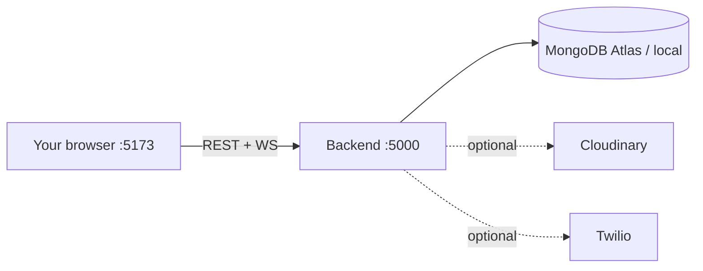
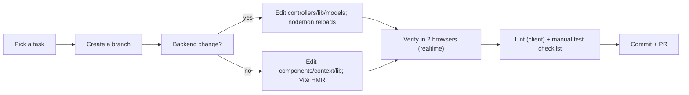

# 12 — Development Guide

[← Back to index](./README.md) · Related: [DevOps](./10-devops-and-infrastructure.md) · [Backend](./04-backend.md) · [Frontend](./07-frontend.md) · [Testing](./11-testing.md)

This guide gets a brand-new developer from zero to a running quickCHAT on their machine, and explains the day-to-day workflow.

---

## 1. Prerequisites

| Tool | Version | Notes |
|------|---------|-------|
| **Node.js** | ≥ 18 (20 LTS recommended) | Backend is ESM; uses global `fetch` (Node 18+). |
| **npm** | ≥ 9 | Comes with Node. |
| **MongoDB** | Atlas account or local `mongod` | DB name `chat-app` is used automatically. |
| **Git** | any | Version control. |
| **(Optional) Cloudinary account** | — | For media uploads. |
| **(Optional) Twilio account** | — | For TURN (reliable calls behind NAT). |
| **(Optional) VAPID keys** | — | For Web Push. |

Without the optional services, the app still runs: media upload, calls (TURN), and push will degrade gracefully (see [Architecture §10](./02-architecture.md#10-reliability--fault-tolerance)).

---

## 2. Repository layout

```text
quickCHAT/
├── client/   # React SPA (frontend)
├── server/   # Node/Express + Socket.IO (backend)
├── docs/     # this documentation
└── ROADMAP.md
```

The frontend and backend are **separate npm packages** with their own `package.json`. You run two dev processes.

---

## 3. First-time setup

### 3.1 Clone & install

```bash
git clone <repo-url> quickCHAT
cd quickCHAT

# backend deps
cd server && npm install

# frontend deps
cd ../client && npm install
```

### 3.2 Configure environment variables

Create `server/.env`:

```bash
# --- required ---
MONGODB_URI="mongodb+srv://<user>:<pass>@<cluster>/"   # db "chat-app" is appended automatically
JWT_SECRET="<a-long-random-string>"
PORT=5000

# --- media (optional but recommended) ---
CLOUDINARY_CLOUD_NAME="<cloud>"
CLOUDINARY_API_KEY="<key>"
CLOUDINARY_API_SECRET="<secret>"

# --- web push (optional) ---  npx web-push generate-vapid-keys
VAPID_PUBLIC_KEY="<public>"
VAPID_PRIVATE_KEY="<private>"
VAPID_SUBJECT="mailto:you@example.com"

# --- calls TURN (optional) ---
TWILIO_ACCOUNT_SID="<sid>"
TWILIO_AUTH_TOKEN="<token>"

# --- optional tuning (see DevOps for full list) ---
# CALLS_ENABLED=true
# MESSAGE_SCHEDULER_ENABLED=true
# CLIENT_ORIGINS=http://localhost:5173
```

Create `client/.env`:

```bash
VITE_BACKEND_URL='http://localhost:5000'
```

> See the full variable reference in [DevOps §Environment configuration](./10-devops-and-infrastructure.md#environment-configuration). **Never commit `.env` files.**

### 3.3 Run both apps

In two terminals:

```bash
# Terminal 1 — backend (auto-restarts on change)
cd server
npm run server      # → http://localhost:5000  ("Database connected", scheduler started)

# Terminal 2 — frontend
cd client
npm run dev         # → http://localhost:5173
```

Open `http://localhost:5173`, sign up, and you're in. Open a second browser (or incognito) and sign up as another user to test realtime, presence, and calls.



---

## 4. Useful commands

### Backend (`server/`)
| Command | Effect |
|---------|--------|
| `npm run server` | Dev server with `nodemon` (auto-restart). |
| `npm start` | Run once with `node`. |
| `npm run cleanup:group-direct-keys` | Maintenance script (remove stray group `directKey`). |
| `node scripts/migrate-dm-to-conversations.js` | Backfill conversations/receipts from legacy DMs. |

### Frontend (`client/`)
| Command | Effect |
|---------|--------|
| `npm run dev` | Vite dev server (HMR). |
| `npm run build` | Production build → `client/dist`. |
| `npm run preview` | Serve the production build. |
| `npm run lint` | ESLint. |

---

## 5. Development workflow



### Where to make common changes

| You want to… | Touch |
|--------------|-------|
| Add/modify an API endpoint | `server/routes/*` + `server/controllers/*` (+ rate limiter if abuse-prone) |
| Change the data shape | `server/models/*` (+ a migration script if backfilling) |
| Add a realtime event | emit in controller via `emitToConversation` (+ relay in `server.js` if client-emitted); subscribe in `client/context/ChatContext.jsx` |
| Add UI | `client/src/components/*`; wire state via the relevant context |
| Add a setting/preference | `Conversation.participants` (per-user) or `User` (account); expose via controller + context |
| Add a translation string | `client/src/i18n/locales/<locale>/common.json`; use `t("key")` |
| Add a design token | `client/src/index.css` `@theme`/`:root` |

---

## 6. Debugging workflows

### Backend
- **Logs:** the server logs DB connection, scheduler ticks (`[message-scheduler] ...`), call events (`[calls] ...`), socket connect/disconnect, and controller errors to the console.
- **Node inspector:** `node --inspect server.js` (or add `--inspect` to the nodemon command) and attach Chrome DevTools / VS Code.
- **DB inspection:** MongoDB Compass / `mongosh` against your `MONGODB_URI` (collections: `users`, `conversations`, `messages`, `reports`).
- **Health:** `GET http://localhost:5000/api/status` and `GET /api/calls/telemetry`.

### Frontend
- **React DevTools** for component/context state.
- **Network tab:** inspect `/api/*` calls and the **WS** frame stream (Socket.IO events) under the WS connection.
- **Application tab:** Service Worker status, `localStorage.token`, push subscription, manifest.
- **Connection banner:** the in-app banner shows socket `connecting`/`reconnecting` states.

### Realtime issues checklist
- Socket not connecting? Check the JWT in `localStorage`, `VITE_BACKEND_URL`, and CORS (`CLIENT_ORIGINS`).
- Events not arriving? Confirm both clients joined the conversation room (server logs) and that the emitting path uses `conversationId`.
- Presence wrong? Remember it's in-memory per backend instance.

### Calls issues checklist
- `CALLS_ENABLED` set? `GET /api/calls/ice-servers` returning servers (or degraded STUN)?
- Behind strict NAT? You likely need Twilio TURN configured.
- Check `[calls]` logs and `/api/calls/telemetry` for error/end-reason counts.

---

## 7. Coding conventions

- **Language:** modern JS (ESM). Backend uses `import`/`export`; React function components + hooks.
- **Naming:** descriptive, full-word identifiers (the codebase favors clarity, e.g. `normalizedParticipantIds`, `releaseDueScheduledMessages`).
- **Comments:** explain **why**, not what (see existing comments around the JSON body cap, token expiry, `directKey` for groups). Don't add narrating comments.
- **Errors:** controllers `try/catch` → `{ success:false, message }`; use proper status codes for auth/limits. Client uses `getErrorMessage` + toasts.
- **State:** keep cross-cutting state in the appropriate context; update immutably.
- **Lint:** run `npm run lint` in `client/` before committing.
- **Secrets:** never hardcode or commit; use env vars.

---

## 8. Contribution guidelines

1. **Branch** from the default branch with a descriptive name (`feature/...`, `fix/...`).
2. **Keep changes scoped**; update related docs in `docs/` when behavior changes.
3. **Run** the [manual test checklist](./11-testing.md#11-manual-test-checklist-use-today) for affected areas; lint the client.
4. **Write clear commits** describing the *why*.
5. **Open a PR** with a summary, screenshots/clips for UI, and any migration notes.
6. **Don't commit** `.env`, `node_modules`, or build output.

> If you add automated tests (encouraged — see [Testing](./11-testing.md)), wire them into CI and gate PRs on them.

---

## 9. Common gotchas

| Symptom | Likely cause / fix |
|---------|--------------------|
| `head`/`cat` "not recognized" on Windows | Use PowerShell-native tools; the repo is developed on Windows. |
| Login works but socket won't connect | `VITE_BACKEND_URL` mismatch or CORS; ensure origin is allowed. |
| Image upload fails | Cloudinary env vars missing/incorrect, or file exceeds the client cap. |
| No push notifications | VAPID not configured, permission not granted, or no service worker (HTTPS/localhost required). |
| Calls never connect | `CALLS_ENABLED=false`, no TURN behind strict NAT, or ICE endpoint 503. |
| Scheduled message never sends | Scheduler disabled, or running multiple instances (see [Maintenance](./13-maintenance-guide.md)). |
| Production cookie not set | `NODE_ENV=production` needed for `secure`/`sameSite:none`; requires HTTPS. |

---

## 10. Where to go next

- Deploy it: [DevOps & Infrastructure](./10-devops-and-infrastructure.md).
- Operate/troubleshoot it: [Maintenance Guide](./13-maintenance-guide.md).
- Understand the internals: [Backend](./04-backend.md) · [Frontend](./07-frontend.md) · [Real-Time & Calling](./08-realtime-and-calls.md).
