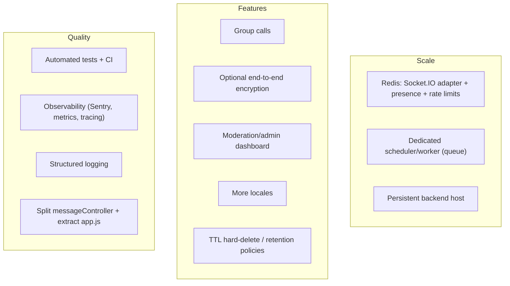

# 13 — Maintenance Guide

[← Back to index](./README.md) · Related: [DevOps](./10-devops-and-infrastructure.md) · [Architecture](./02-architecture.md) · [Database](./05-database.md) · [Security](./09-security.md)

This guide is for whoever operates and maintains quickCHAT after it's built: troubleshooting, known limitations, upgrade procedures, technical-debt areas, and future improvements.

---

## 1. Troubleshooting {#troubleshooting}

### 1.1 Symptom → cause → fix

| Symptom | Likely cause | Fix |
|---------|--------------|-----|
| **Users can't log in** | `JWT_SECRET` changed (invalidates tokens), DB unreachable, rate limit hit | Verify env; check Atlas connectivity/IP allowlist; wait out 429; check `[auth]`/error logs. |
| **"Database connected" never logs** | Bad `MONGODB_URI`, IP not allowlisted in Atlas | Fix URI; add server IP to Atlas Network Access. |
| **Realtime not working (no live messages)** | Socket not connected; CORS; multi-instance presence | Check WS in DevTools; confirm origin allowed (`CLIENT_ORIGINS`/`*.vercel.app`); ensure single backend instance or Redis adapter. |
| **Presence/online dots wrong** | In-memory presence per instance | Single instance, or add Redis adapter + shared presence. |
| **Messages stuck "sending"/"failed"** | Send POST failing (network, rate limit, validation) | Inspect `/api/messages/send` response; retry uses same `clientId` (no dupes). |
| **Image/file upload fails** | Cloudinary misconfig or oversized file | Verify Cloudinary env; check client size caps; check `/api/upload/signature` response. |
| **Scheduled messages never release** | Scheduler disabled or not running (serverless) | Set `MESSAGE_SCHEDULER_ENABLED=true`; run backend on a persistent host; check `[message-scheduler]` logs. |
| **Disappearing messages don't expire** | Same as above (expire phase) | Same fix; confirm `expiresAt` set on the message. |
| **Push notifications not delivered** | VAPID unconfigured, permission denied, stale subscription, recipient online (push only when offline) | Configure VAPID; re-grant permission; stale subs auto-prune; remember push is offline-only. |
| **Calls won't connect** | `CALLS_ENABLED=false`, no TURN behind NAT, ICE 503 | Enable calls; configure Twilio; check `/api/calls/ice-servers` + `[calls]` logs + `/api/calls/telemetry`. |
| **Calls drop immediately** | One side disconnected, ring timeout, busy | Check end-reason in `callEnded` payload / telemetry. |
| **Cookie not set in production** | `NODE_ENV` not `production`, or not HTTPS | Set `NODE_ENV=production`; serve over HTTPS (required for `secure`/`sameSite:none`). |
| **Deep link 404 on frontend** | SPA fallback missing | Ensure `client/vercel.json` rewrite (all → `/`). |
| **Group creation fails with "legacy conversation key conflict"** | Stray `directKey` on a group | Run `npm run cleanup:group-direct-keys`. |
| **CORS errors** | Origin not allowed | Add to `CLIENT_ORIGINS`; verify protocol/host. |
| **High latency / slow lists** | Missing/cold indexes, large unvirtualized renders | Verify indexes exist (they're declared in models); Atlas Performance Advisor. |

### 1.2 Diagnostic toolbox

- **Liveness:** `GET /api/status`.
- **Call health:** `GET /api/calls/telemetry` (invites/accepted/ended + error/end-reason maps).
- **Logs:** scheduler (`[message-scheduler]`), calls (`[calls]`), socket connect/disconnect, controller errors.
- **DB:** Compass/`mongosh`; check indexes with `db.messages.getIndexes()`.
- **Client:** DevTools Network (REST + WS frames), Application (SW, `localStorage`, push), React DevTools.

---

## 2. Known limitations {#known-limitations}

| Limitation | Impact | Workaround / path |
|------------|--------|-------------------|
| **In-memory presence & Socket.IO rooms** | Breaks across multiple backend instances | Single instance, or Redis Socket.IO adapter + shared presence. |
| **In-process scheduler** | Needs a persistent process; multiple instances could double-run | Run on a persistent host; designate one scheduler owner; claim/lease reduces (not eliminates) double-processing. |
| **Serverless + WebSockets** | Vercel serverless isn't ideal for long-lived sockets/scheduler | Host the realtime backend on a persistent platform (see [DevOps](./10-devops-and-infrastructure.md#1-deployment-architecture)). |
| **In-memory rate limits & call buckets** | Limits are per-instance | Move to Redis-backed limiter when scaling out. |
| **No end-to-end encryption** | Messages stored plaintext at rest | Acceptable for current features (search/unfurl/push); E2EE is a future option. |
| **No moderation/admin UI** | Reports stored but not actioned in-app | Build an admin surface; reports have `status`/`reviewedBy` fields ready. |
| **No automated tests** | Regression risk | Adopt the [testing strategy](./11-testing.md). |
| **Dual message keys** | Schema carries legacy `senderId/receiverId/seen` + `conversationId` | Finish migration, then drop legacy fields. |
| **Calls are 1:1 only** | No group calls | Future enhancement. |
| **`NODE_ENV=production` skips `listen()`** | Container hosts may not bind a port | Patch the guard for non-serverless hosts. |
| **No TTL hard-delete** | Soft-deleted/expired messages retained (blanked) | Add a TTL index or periodic purge. |

---

## 3. Upgrade procedures {#upgrade-procedures}

### 3.1 Dependencies

```bash
# inspect outdated
cd server && npm outdated
cd ../client && npm outdated
```

- **Patch/minor:** update, run lint/build, run the [manual checklist](./11-testing.md#11-manual-test-checklist-use-today).
- **Majors (watch list):** Express 5, React 19, React Router 7, Tailwind 4, Socket.IO 4, Mongoose 8 — read their migration guides; these are framework-level and can introduce breaking changes. Bump one major at a time and test.
- Keep client and server **Socket.IO** versions compatible.

### 3.2 Node runtime

Target Node 20 LTS. The backend relies on global `fetch` (Node 18+) for Twilio/unfurl; don't drop below 18.

### 3.3 Database/schema changes

1. **Back up** (Atlas snapshot).
2. Add the schema/index change in `models/*`.
3. Write an **idempotent** migration script in `server/scripts/` (model the existing ones).
4. Run against **staging**, verify printed before/after counts, then **production**.
5. New indexes build in the background on Atlas; verify with `getIndexes()`.

### 3.4 Secret rotation

| Secret | Effect of rotation | Procedure |
|--------|--------------------|-----------|
| `JWT_SECRET` | Logs out all users | Rotate, redeploy; users re-login. |
| Cloudinary keys | New uploads/deletes use new creds | Rotate in Cloudinary + env, redeploy. |
| Twilio token | New ICE tokens | Rotate in Twilio + env. |
| VAPID keys | **Invalidates existing push subscriptions** | Rotate carefully; clients re-subscribe. |

---

## 4. Technical debt {#technical-debt}

| Item | Why it's debt | Suggested remediation |
|------|---------------|----------------------|
| **Monolithic `server.js`** | App + Socket.IO + DB + scheduler in one file; hard to unit-test | Extract `app.js` (Express app) and a socket module; import into `server.js`. Highest-leverage testability win. |
| **Dual message model** | `senderId/receiverId/seen` alongside `conversationId/readBy` | Complete migration, then remove legacy fields + their indexes. |
| **Mixed error convention** | Domain errors as `200 + success:false`; transport errors as real codes | Standardize (centralized error middleware + consistent status codes). |
| **`console.log` everywhere** | No levels, no structure, no correlation ids | Adopt a logger (pino/winston) + request ids. |
| **In-memory state** | Presence, scheduler, rate buckets, call sessions | Externalize to Redis for horizontal scale. |
| **`messageController.js` size** | Very large (~2.7k lines) | Split into submodules (send, history, scheduling, search, reactions). |
| **No tests / no CI** | Regression risk | Add Jest/Vitest/Playwright + CI ([Testing](./11-testing.md)). |
| **No CSP** | XSS surface | Add a tailored Content-Security-Policy via helmet. |
| **Reports unactioned** | No moderation flow | Build admin moderation UI. |

---

## 5. Future improvement opportunities {#future-improvement-opportunities}



Prioritized shortlist:
1. **Extract `app.js` + add tests + CI** (unblocks safe iteration).
2. **Persistent backend host (or Redis adapter + worker)** (makes realtime/scheduler production-grade).
3. **Structured logging + error tracking** (operability).
4. **Finish the conversation migration** (remove dual-key debt).
5. **Moderation UI** (close the trust-and-safety loop).
6. Feature growth: group calls, E2EE option, more locales, retention/TTL.

---

## 6. Routine maintenance calendar (suggested)

| Cadence | Task |
|---------|------|
| Weekly | Review error logs / call telemetry; check Atlas alerts. |
| Monthly | `npm outdated` review; dependency patches; verify backups restore. |
| Quarterly | Rotate secrets; review rate-limit thresholds; index/perf review (Atlas advisor). |
| As needed | Run migrations (back up first); prune/retention review. |

---

## 7. Where to go next

- Deployment topology & env: [DevOps & Infrastructure](./10-devops-and-infrastructure.md).
- Data/migration specifics: [Database](./05-database.md).
- Security follow-through: [Security](./09-security.md).
